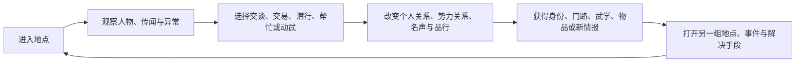

# 《大侠立志传》系统设计拆解与《大曜江湖》适配参考

> 文档用途：作为后续开放江湖、人物关系、势力身份、事件条件、武学成长、战斗、生活能力与多周目设计的参考，不作为剧情、人物或数值仿写依据。
>
> 核对日期：2026-07-18。
>
> 资料口径：可核对事实优先采用官方商店页、开发者日志、正式版 FAQ 与官方更新公告；具体机制补充参考官方社区汇总。文中的“设计判断”“风险”和“适配建议”均为项目推断。

## 1. 结论先行

《大侠立志传》最有价值的设计不是“地图很大”或“武学很多”，而是把江湖拆成一张由条件驱动的关系网：



它的核心不是任务链，而是：

> **玩家用自己的身份、关系和本事，在同一座江湖里不断获得新的办事资格。**

最值得《大曜江湖》采用的有六点：

1. **事件由多种条件共同决定。** 能力、关系、身份、物品、时间和既有选择可以通向同一目标。
2. **人物同时是剧情对象和玩法入口。** 认识谁会直接改变能学什么、去哪儿、怎样办事。
3. **门派是一段可晋升的身份生活。** 入门、贡献、位阶、传承和立场形成完整成长线，而不是一次选职业。
4. **非战斗行动能真实改写战局。** 暗取、点穴、下毒、潜入与交易不是装饰选项。
5. **世界信息使用江湖内载体表达。** 地图、秘闻、人物介绍、排行榜和武功盘点可以包装成江湖小报、传闻或图志。
6. **周目继承服务于减少重复劳动。** 成就特征和家园收藏让下一次人生更快进入新路线。

不应直接照搬的部分：

- 用大量隐藏前置制造自由度；
- 让送礼成为几乎所有人物收益的最优解；
- 用数百武学、二十五种生活能力和大量材料堆出内容规模；
- 允许关键人物死亡，却不给玩家足够清楚的长期后果预警；
- 让多周目从角色扮演变成成就、属性和稀有物品清单；
- 在移动端保留高密度地图、背包、队伍与养成菜单。

一句话归纳：

> **学习它的“条件江湖”和“身份江湖”，不要学习它的攻略江湖与收集规模。**

---

## 2. 可核对的产品骨架

官方将游戏定位为开放世界武侠 RPG 与像素江湖生存模拟器，强调市井小人物起步、多分支、人物关系、不同解决方式、自然时间和 NPC 行为。官方公开资料可确认以下结构：

| 层面 | 可核对事实 | 设计意义 |
| --- | --- | --- |
| 玩家身份 | 从江湖底层的无名小人物起步，可体验不同身份 | 成长不只表现为等级，也表现为社会位置变化 |
| 剧情结构 | 官方强调没有单一意义上的主线，选择形成多分支 | 世界提供矛盾，玩家自行决定哪条人生是主线 |
| 人物与势力 | 人物关系和多方势力会记录玩家的结交、得罪与介入 | 行为后果通过关系网络传播，而非只写进任务日志 |
| 世界时间 | 时间自然流逝，NPC 有各自的行为安排 | 地点、人物和事件可以随时辰与日期变化 |
| 武学 | 百余种功法，覆盖多种兵器、内功与外功 | 长期构筑依靠招式、兵器和被动效果组合 |
| 门派 | 门派拥有独立事件、结构生态、位阶与传承 | 门派不是标签，而是一套身份晋升与资源循环 |
| 潜行 | 暗取、偷袭、点穴、下毒可用于任务与战斗前准备 | 非战斗技能可以成为正式解决路线 |
| 战斗 | 走格、行动范围、侧击和背击，多种触发效果共同作用 | 位置和招式效果为数值成长提供操作出口 |
| 长线成长 | 武道领悟、内外功、品格、丹药和生活能力并行 | 玩家可以从战斗、行为和江湖生活多路成长 |
| 多周目 | 成就可解锁开局特征，家园可跨存档保留部分珍品 | 重玩用新起点换取新路线，而非完全清零 |

需要注意：正式版和后续资料片不断扩展事件、伙伴、门派、家园、宠物和自创武学。本文拆解的是稳定的设计骨架，不追求逐项列出当前全部内容。

---

## 3. 真正的核心系统：条件江湖

### 3.1 传统任务链与条件江湖的区别

传统任务链通常是：

```text
接任务 → 到地点 → 击败目标／取得物品 → 交任务
```

《大侠立志传》的典型事件更接近：

```text
发现人物或异常
  ├─ 关系足够：对方主动透露
  ├─ 身份符合：进入内部区域
  ├─ 名声足够：获得公开委托
  ├─ 品行符合：取得信任或遭到排斥
  ├─ 有特定人物同行：改变对话和立场
  ├─ 有特定物品：交换、证明或触发旧事
  ├─ 能力足够：医治、鉴定、开锁、潜行
  └─ 实力足够：切磋、威慑或直接战斗
```

玩家感受到的自由，不主要来自地图上能往任何方向走，而是来自：

> **同一个目的可以用不同人生经历积累出的条件完成。**

### 3.2 一个事件的七类条件

后续设计《大曜江湖》事件时，可统一检查以下七类条件：

| 条件层 | 回答的问题 | 当前项目示例 |
| --- | --- | --- |
| 能力 | 玩家会不会做？ | 医术、炼丹、春风针、钓鱼、潜行 |
| 实力 | 玩家扛不扛得住？ | 境界、气血、武学熟练、伤势 |
| 关系 | 谁愿意相信或帮助玩家？ | 曹青信任、燕惊鸿信任、王五关系 |
| 身份 | 玩家以什么资格进入？ | 沈家丹房杂役、曹青弟子、巡检房协力者 |
| 物证 | 玩家能证明什么？ | 沈字铜钱、鱼鳞铜签、蛇纹铜牌 |
| 时间 | 现在是否仍有机会？ | 丹房时段、紫金河钓鱼窗、八月十五贡品 |
| 因果 | 玩家此前把世界变成了什么样？ | 刀客被杀／制伏／逃走、是否接管回报渠道 |

每个关键事件应至少读取其中三类，但不应要求七类全部满足。条件越多，越必须向玩家展示已知缺口和关闭风险。

### 3.3 条件江湖的主要风险

条件网越密，越容易产生四个问题：

1. 玩家不知道为什么事件没有发生；
2. 某个早期小动作无预警关闭数小时后的内容；
3. 攻略要求固定顺序，实际自由度退化为“完美路线”；
4. 每增加一名人物或资料片，旧条件组合都可能发生冲突。

《大曜江湖》必须坚持：

- 条件可以隐藏，**缺口不能毫无迹象**；
- 结果可以永久，**不可逆前必须预警**；
- 路线可以错过，**错过后世界必须给出结果**；
- 不要求玩家靠读档试出唯一正确顺序。

---

## 4. 开局与人物车卡：先决定“这次是谁”，再决定数值

### 4.1 开局的设计作用

《大侠立志传》的创角包含属性、天赋与难度选择；部分强力开局内容通过成就解锁。它让多周目开局同时承担三件事：

- 选择本轮擅长的解决方式；
- 用已有成就缩短重复成长；
- 为新的身份和路线提供明确理由。

真正有效的不是刷出最高数值，而是让开局决定玩家更容易成为哪种人：

| 开局方向 | 早期优势 | 自然吸引的玩法 |
| --- | --- | --- |
| 武力 | 正面战斗、切磋 | 武馆、门派、擂台、护送 |
| 悟性 | 学武与领悟 | 秘籍、师承、特殊传承 |
| 交游 | 送礼、交易、关系 | 人物心愿、门路、队伍 |
| 市井 | 暗取、机关、潜行 | 禁地、黑市、盗门、秘密 |
| 生存 | 采集、制造、恢复 | 野外、家园、长期旅行 |

### 4.2 对《大曜江湖》的适配

当前“出身＋初心＋五维重分”已经比随机刷天赋更适合叙事游戏。后续应强化的是身份差异，而不是继续增加初始数值：

- 出身改变别人如何看待玩家；
- 初心改变重要选择的叙事语气与命痕；
- 五维改变行动深度；
- 第一段经历形成第一个真正的江湖身份。

例如同样进入沈家：

| 角色起点 | 沈家最先提供的机会 | 最先承担的代价 |
| --- | --- | --- |
| 身世成谜 | 铜钱旧诺、丹房观察 | 被曹青验血与试探 |
| 市井求生 | 跑腿、药材与下人消息 | 身份低、容易被牺牲 |
| 习武求名 | 护院、切磋与武馆门路 | 实力不足会公开丢脸 |
| 行医求道 | 病例、药铺与病人关系 | 医治失败留下人命债 |

---

## 5. 开放世界：不是地图面积，而是“随时能做一件像江湖人的事”

### 5.1 世界自由度由动词构成

官方资料反复强调人物交互、自然时间和多种应对方式。其开放世界的核心不是无缝地图，而是玩家靠近一个人或地方时，通常拥有多个江湖动词：

- 交谈；
- 打听；
- 送礼；
- 易物；
- 请教；
- 切磋；
- 邀请；
- 暗取；
- 点穴；
- 下毒；
- 偷袭；
- 正面挑战。

这些动词复用于大量人物，低成本制造“我可以自己想办法”的感觉。

### 5.2 动词复用为什么有效

同一动词在不同对象上会产生不同目标：

| 动词 | 对普通商贩 | 对门派高手 | 对任务人物 | 对敌人 |
| --- | --- | --- | --- | --- |
| 交谈 | 获取地方消息 | 了解门规与武学 | 推进人物事件 | 试探立场 |
| 易物 | 获得资源 | 换取珍藏 | 取回关键物 | 赎买证据 |
| 请教 | 学生活能力 | 学武学或心得 | 建立师徒关系 | 不适用 |
| 切磋 | 验证实力 | 取得认可 | 改变关系 | 变成正式冲突 |
| 潜行 | 取物 | 进入禁地 | 偷看秘密 | 战前削弱 |

系统复用降低了内容制作成本；不同对象、条件与后果又让复用不显得完全相同。

### 5.3 对当前项目的关键转化

《大曜江湖》不需要自由移动的无缝地图，但需要稳定的场景动词。建议每个可视化地点至少提供：

1. 一个观察对象；
2. 一个可交谈人物；
3. 一个当前可做的实际行动；
4. 一个暂时缺条件的机会；
5. 一个可能改变时间或风险的离开方式。

右侧叙事栏负责故事和选择，左侧场景负责回答：

> **我现在在哪里，这里有谁，我能碰什么，我还能往哪儿走。**

---

## 6. 时间与 NPC 行为：让世界显得不只等玩家

### 6.1 原设计的价值

自然时间与 NPC 行为安排制造三种体验：

- 白天和夜晚遇见不同的人；
- 某人离开原地后，玩家必须追踪其生活路线；
- 事件窗口会开启、推迟或错过。

即使 NPC 的行为本质上只是时间表，玩家也会把它理解成“对方有自己的生活”。这是一种成本可控的世界模拟。

### 6.2 时间必须服务于选择

时间系统只有在以下情况下才有价值：

- 等待会改变人物位置；
- 赶路会错过别的机会；
- 夜间能潜入但更危险；
- 伤势和资源会随时间发展；
- 某些事件会在玩家不干预时自行产生结果。

如果时间只是让商店关门、任务消失或要求玩家睡觉，它只会制造摩擦。

### 6.3 《大曜江湖》的轻量方案

不模拟所有 NPC 的逐时移动，只为关键人物维护：

```text
当前地点
当前事务
下一次移动时间
被什么事件打断
玩家是否知道其去向
```

例如燕惊鸿：

```text
申时：柳巷调查失踪药船
酉时：经过临河门洞送证物
入夜：若无人护送，在东湖遭截
例外：若王卓回报渠道已被接管，她会提前改变路线
```

这样既能产生生活感，也不会建立难以维护的全城 AI。

---

## 7. 人物关系：每个人都是一组权限

### 7.1 人物不是任务发放器

《大侠立志传》中，人物可以连接多种收益：

- 私人消息；
- 心愿事件；
- 易物清单；
- 学艺与请教；
- 切磋；
- 邀请入队；
- 结缘；
- 门派或地点引荐。

所以人物即使完成一段事件后，仍然可能作为老师、队友、交易对象或社会关系继续存在。

### 7.2 单一关系值的高效率与低可信度

单一好感值非常高效：容易理解、容易调数值、容易复用。但它也会把关系变成“送礼解锁商店”，产生以下问题：

- 救命之恩与普通礼物可以互相折算；
- 背叛后继续送礼可能恢复一切；
- 玩家关心的是礼物偏好，不是人物处境；
- 全地图送礼成为高收益标准流程。

### 7.3 本项目应保留多维关系

《大曜江湖》已经使用情分、信任、人情债和疑心，应继续坚持：

| 维度 | 来自什么 | 决定什么 |
| --- | --- | --- |
| 情分 | 陪伴、照顾、共同经历 | 私下交流、同行意愿 |
| 信任 | 守约、诚实、承担风险 | 秘密、托付、合作深度 |
| 人情债 | 救命、替罪、付出稀缺资源 | 请求、引荐、替玩家担责 |
| 疑心 | 越界、隐瞒、异常先知 | 监视、试探、拒绝和反制 |

人物权限不应写成“好感达到四十”，而应写成：

```text
愿意传武 = 信任足够 + 见过玩家承担代价 + 不怀疑玩家盗取传承
愿意同行 = 情分足够 + 当前目标一致 + 没有必须留下处理的事务
愿意说秘密 = 信任足够 + 玩家已经知道一部分 + 说出秘密不会立即害死对方
```

---

## 8. 门派：把成长包装成组织内的人生

### 8.1 门派系统的完整循环

开发者日志明确描述了门派独立事件、结构生态和位阶晋升。其理想循环是：


门派由五种内容叠加而成：

1. **身份：** 弟子、核心成员、掌门等不同位置；
2. **生活：** 日常差事、内部人物和固定场所；
3. **成长：** 武学、装备、老师和贡献兑换；
4. **立场：** 与其他势力的敌友关系；
5. **命运：** 门派可能兴盛、衰败、被灭或改变方向。

### 8.2 门派贡献的优点与风险

贡献值能把日常行动转成稳定进度，但很容易退化为重复劳动。有效的贡献来源应分三层：

| 层级 | 内容 | 目的 |
| --- | --- | --- |
| 日常 | 低风险、可重复 | 保证玩家总能取得少量进展 |
| 职责 | 与位阶有关的差事 | 表达玩家在组织中的位置 |
| 大事 | 改变门派的人物和事件 | 提供主要晋升与路线分歧 |

大事应提供绝大部分关键进度，避免玩家靠重复跑腿刷成掌门。

### 8.3 沈家的适配价值

沈家不是传统门派，但可以用同一结构表达：

| 组织层 | 当前已有内容 | 可继续发展的方向 |
| --- | --- | --- |
| 入门资格 | 沈字铜钱、四项差事均不合门槛 | 旧诺既是门路也是被审视的原因 |
| 底层身份 | 丹房杂役 | 没有选择权，但能接触被忽视的信息 |
| 内部师承 | 曹青取血、考校、传医传丹 | 师徒关系与沈家忠诚并不一致 |
| 权限成长 | 取药、钓鱼、救治三夫人 | 能力越高，进入的家族秘密越深 |
| 组织矛盾 | 密会、药材、暗杀与巡检房 | 玩家开始决定为谁保存证据 |
| 高阶身份 | 尚未完成 | 药师、客卿、内应或制度破坏者 |

这比额外增加一个“门派贡献条”更适合当前剧情。

---

## 9. 名声、品行与势力关系：让行为产生社会解释

### 9.1 三者职责不同

| 系统 | 表达什么 | 谁会读取 |
| --- | --- | --- |
| 名声 | 有多少人听说过玩家 | 陌生人、公开活动、官面组织 |
| 品行 | 江湖怎样评价玩家的行为方式 | 重视道德、秩序或利益的人物 |
| 势力关系 | 玩家与某个组织的具体恩怨 | 门人、盟友、敌对组织、守卫 |

三者共同避免“所有人共享同一好感条”。玩家可能：

- 名声很高，但被某个门派通缉；
- 侠名很好，但被市井帮会认为不可信；
- 与一位人物交情深，却因其所属组织与玩家敌对而无法公开合作。

### 9.2 对当前项目的适配

第一版不需要完整六德或全势力声望。只增加两个轻量状态：

1. **江湖名号：** 陌生人听过玩家哪件事；
2. **组织身份：** 某个组织把玩家定义成什么。

当前可以使用：

```text
无名耗材 → 有用杂役 → 曹青门下 → 沈家可用之人 → 官面协力者／沈家疑犯
```

每次身份变化必须同时改变：

- 一项可进入区域；
- 一类人物的初始态度；
- 至少一个新行动；
- 一项新的责任或监控。

---

## 10. 潜行与非战斗解决：动词必须改变规则

### 10.1 四种潜行动词的分工

官方开发者日志介绍过暗取、偷袭、点穴和下毒。它们的价值在于目标明确：

| 动词 | 改变的核心资源 | 最适合的用途 |
| --- | --- | --- |
| 暗取 | 物品所有权 | 证据、钥匙、毒药、身份物 |
| 偷袭 | 敌我数量与先手 | 清除低位守卫、制造战前优势 |
| 点穴 | 人物位置和行动能力 | 绕过守卫、留活口、争取时间 |
| 下毒 | 战斗前状态 | 削弱强敌、逼人离场、伪造病症 |

这四者不是四种不同颜色的“成功按钮”，而是分别作用于物品、人数、行动和身体状态。

### 10.2 《大曜江湖》的动作协议

当前已有“动作＋对象”协议，后续可扩成：

```text
观察 + 人／物／路线
交谈 + 人／话题
交付 + 人／物证
借势 + 环境／制度
潜行 + 区域／守卫
施术 + 身体／机关
动武 + 目标／目的
离开 + 路线／时机
```

每个动词必须明确改变一种状态，禁止只更换旁白：

- 观察增加见闻或看见条件；
- 交谈改变关系、立场或情报可靠度；
- 交付改变物品所有权与承诺；
- 借势改变环境或制度状态；
- 潜行改变位置与警觉；
- 施术改变身体、机关或战斗初始条件；
- 动武改变生死、伤势与势力反应；
- 离开改变时间和机会窗口。

---

## 11. 武学成长：招式、内功、领悟与取得方式共同塑造流派

### 11.1 原作的多层成长

武学数量只是表面。真正支撑长期成长的是多层系统并行：

| 层次 | 主要作用 |
| --- | --- |
| 基础属性 | 决定角色的通用上限和成长倾向 |
| 兵器能力 | 决定某类武学的使用与伤害基础 |
| 外功招式 | 提供主动攻击、范围和特殊效果 |
| 内功 | 提供属性、内力与被动规则 |
| 武道领悟 | 用动、静、刚、柔等路线提供长期被动倾向 |
| 装备与丹药 | 修补缺口、强化特定流派 |
| 人物与门派 | 决定武学从哪里来、需要付出什么 |

最重要的不是每层都复杂，而是获得一门武学通常包含社会过程：拜师、入门、请教、切磋、易物、奇遇或夺取。

### 11.2 武学取得比武学数值更有江湖味

同一门武学因取得方式不同，会带来不同意义：

| 取得方式 | 玩家感受 | 应留下的长期状态 |
| --- | --- | --- |
| 正式传授 | 得到认可 | 师承、门规、责任 |
| 请教所得 | 人物关系兑现 | 人情债或学习承诺 |
| 秘籍发现 | 探索回报 | 来源谜团、残缺条件 |
| 切磋领悟 | 实力获得承认 | 对手关系、招式见闻 |
| 夺取秘籍 | 快速而危险 | 仇怨、追查、传承不全 |
| 自创融合 | 构筑完成 | 独门身份和命名权 |

### 11.3 当前项目的收束方案

不追求百余武学。每门正式武学至少回答：

1. 谁传的，为什么传？
2. 改变哪个已有行动？
3. 第一次学会后在哪两幕内使用？
4. 熟练后是数值加深，还是规则变化？
5. 使用它会不会表明师承或立场？

建议每门武学使用四层：

```text
得其形 → 能使用
知其意 → 看见特殊对象或时机
入其门 → 改变行动结果深度
成其势 → 形成独门解法或终结技
```

鱼跃龙门诀、春风化雨针、五禽戏、定海桩和打鱼杆法已经足够形成第一组互相区分的能力，不应急着继续加数量。

---

## 12. 战斗：空间、意图和构筑必须同时可读

### 12.1 原作战斗的设计组成

官方资料可确认其战斗重视行动范围、侧击与背击，并加入连击、反弹、分摊、溅射、免伤等效果。其策略感来自：

- 走格和攻击范围；
- 敌我行动顺序；
- 武学范围与冷却；
- 侧面、背面与地形；
- 内功、武道与装备形成的被动组合；
- 队友共同作战。

### 12.2 它提供的正确启发

战斗成长不能只表现为伤害数字增加。至少应影响：

- 能打到谁；
- 能移动到哪里；
- 一次能影响几个目标；
- 能否改变敌人下一步；
- 能否把环境变成优势；
- 能否选择杀、擒、逼退或护送。

### 12.3 不适合当前项目的部分

《大曜江湖》不需要：

- 大型方格棋盘；
- 大量主动武学栏位；
- 多名长期队友的逐个回合操作；
- 数十种触发率、抗性与伤害类型；
- 自动战斗和倍速刷取。

当前“三点气机＋少量身位节点＋敌人意图＋明确战果”已经更适合文字与手机。后续只需借鉴：

| 参考点 | 当前实现方向 |
| --- | --- |
| 行动范围 | 少量有意义的身位节点 |
| 侧击背击 | 看破、掩护、夹击与环境优势 |
| 武学差异 | 不同行动、对象、范围和战果 |
| 队友作用 | 每轮一次关键配合，不单独管理完整角色 |
| 战斗验证 | 擂台、伏击、护送和首领战承担不同目标 |

---

## 13. 生活能力与经济：让江湖不只有杀人升级

### 13.1 生活能力的作用

官方 FAQ 明确说明生活能力可以向对应 NPC 学艺，材料、门派贡献和实战经验有不同来源。生活系统的价值有三层：

1. **身份感：** 玩家可以成为药师、工匠、猎人或市井人物；
2. **资源循环：** 采集、制造、交易和使用互相供给；
3. **非战斗解法：** 医术、鉴定、机关和口才可以打开事件。

### 13.2 生活技能膨胀的风险

当能力数量过多时，容易出现：

- 每项能力只在少量地点使用；
- 为升级而重复采集或对 NPC 刷动作；
- 材料和工具占满背包；
- 玩家必须查攻略才能知道哪项能力值得练；
- 叙事奖励被制造效率取代。

### 13.3 当前项目只保留三条生产链

| 链条 | 输入 | 转化 | 事件用途 |
| --- | --- | --- | --- |
| 医毒 | 病例、药材、医术 | 诊断、制药、施针 | 救人、验毒、伪装病症 |
| 食与生存 | 食材、火、时间 | 恢复、诱饵、长期准备 | 赶路、灵猴、野外生存 |
| 证物与伪造 | 纸墨、印记、身份物 | 鉴定、复制、篡改 | 潜入、反制、制度漏洞 |

锻造、裁缝、烹饪、钓鱼、采矿等不全部独立升级；只有真正反复改变剧情解法的能力才成为正式系统。

---

## 14. 家园与多周目：减少重复，而不是把人生变成仓库

### 14.1 原设计的两个作用

正式版家园和跨存档珍品承担了：

- 收藏稀有物品与武学成果；
- 让新周目取回少量旧成果，减少重复获取。

成就解锁开局特征则让玩家在多周目中逐步获得更自由的起点。

这解决了开放式 RPG 的典型问题：玩家想体验新路线，却不想重新完成所有基础劳动。

### 14.2 风险

如果跨周目继承过强，会发生：

- 新路线开局失去生存压力；
- 稀有武学和物品失去获取故事；
- 玩家先刷“正确结局”再开始真正想玩的角色；
- 家园成为脱离世界的功能大厅。

### 14.3 《大曜江湖》的替代方案：人生余痕

当前命灯属于同一人生，不等于多周目。完整游戏若加入重开继承，只保留三类内容：

1. **已知传闻：** 更早知道某个地点或人物存在；
2. **人生特征：** 来自上一世重大行为的开局倾向；
3. **一件旧物：** 只改变入场门路，不直接提供终局战力。

不直接继承：

- 境界；
- 完整武学等级；
- 大量金钱；
- 关键剧情证物；
- 已建立的人物关系。

原则是：

> **继承应该让玩家更快抵达新选择，而不是更快碾过旧内容。**

---

## 15. 江湖内的信息界面：把复杂系统翻译成世界语言

### 15.1 江湖小报的启发

开发者日志将教程提示、综合实力、NPC、武功和秘闻包装为“江湖小报”。它的价值不是换皮，而是让玩家在不跳出角色的情况下理解复杂状态。

### 15.2 当前项目的信息载体

| 系统信息 | 江湖内表达 |
| --- | --- |
| 任务 | 人物托付、江湖传闻、将逝之机 |
| 人物百科 | 所识之人、亲历关系、江湖评语 |
| 条件 | 已知门槛、缺失资格、尚未看破 |
| 战斗教程 | 敌人意图、身位、伤势、招路 |
| 成就 | 江湖名号、死劫履历、人生余痕 |
| 地图 | 行路图、口述路线、所得图志 |
| 更新后的世界 | 江湖小报、飞鸽传书、路人口风 |

不要在游戏中出现“任务系统”“Build”“事件 ID”“P0”等产品词；复杂性必须通过人物、地点和因果解释。

### 15.3 条件透明度原则

《大侠立志传》的自由度很大一部分依赖玩家自己发现，代价是容易攻略化。《大曜江湖》应采用分层透明：

| 阶段 | 玩家看见什么 |
| --- | --- |
| 初见 | 自然能观察到的人、物和危险 |
| 打听后 | 可能的入口与明显资格 |
| 亲历失败 | 失败原因与下一次可改变之处 |
| 充分调查 | 关键条件、代价和可能关闭的路线 |

不提前公布完整结果，但不让玩家在无意义的信息黑箱里反复读档。

---

## 16. 它最成功的四个系统联动

### 16.1 人物关系 → 能力与门路

认识人物不只是看新对话，而是取得师承、物品、队友、地点和组织资格。

**适配：** 每个核心 NPC 至少提供一项长期门路，并在交出线索后继续有价值。

### 16.2 门派身份 → 地点权限与成长

加入组织同时改变可进入区域、可学习内容、日常职责和外部敌友。

**适配：** 沈家身份、巡检房协力者与未来帮会身份都必须改变真实行动集。

### 16.3 非战斗能力 → 战前状态与事件结果

潜行、点穴和下毒既用于探索，也改变战斗。

**适配：** 医术、春风针、伪造和制度漏洞应在战斗前后持续生效。

### 16.4 周目成果 → 新路线起点

成就和家园降低重复获取成本，使重玩可以更快进入不同选择。

**适配：** 未来只继承传闻、人生特征和一件门路旧物，避免战力碾压。

---

## 17. 它最明显的五个设计问题

### 17.1 自由度容易退化为攻略顺序

事件前置很多，但游戏内解释不足时，玩家会依赖“第几天先找谁、带谁、拿什么”的完美路线。结果是开放世界看似自由，实际游玩反而更加拘谨。

**规避：** 关键前置缺口可见；主线推进前提示将关闭的已知机会。

### 17.2 送礼成为万能钥匙

当关系同时控制请教、易物、入队和事件，批量送礼就会压过理解人物、共同经历和承担风险。

**规避：** 多维关系；重大权限要求具体共同事件，礼物只增加情分，不能替代信任。

### 17.3 永久后果与玩家知情不对等

击杀重要人物、灭门或错过窗口可以永久删除内容，但玩家未必知道对象的重要性和影响范围。

**规避：** 不透露全部后果，但必须说明“此人死后哪些已知线索会断”。

### 17.4 系统广度制造重复劳动

武学、生活能力、材料、门派日常和人物关系叠加后，容易出现大量低判断密度操作。

**规避：** 只有能改变事件或战斗规则的成长才保留；重复行动允许压缩结算。

### 17.5 多周目容易清单化

当强力特征、稀有武学和结局都需要前周目解锁，玩家可能不再扮演角色，而是执行最有效率的收集表。

**规避：** 不用“坏选择”作为强制解锁条件；不同人生给不同便利，不给唯一最强开局。

---

## 18. 采用、改造、舍弃清单

| 《大侠立志传》设计 | 决策 | 《大曜江湖》的转化 |
| --- | --- | --- |
| 多条件事件网 | 采用 | 能力、关系、身份、物证、时间、因果共同驱动事件 |
| 无唯一主线的江湖感 | 改造 | 保留明确章节目标，但允许玩家决定处理顺序和立场 |
| NPC 通用交互动词 | 采用 | 观察、交谈、交付、借势、潜行、施术、动武、离开 |
| 单一好感与送礼 | 舍弃 | 保留情分、信任、人情债、疑心 |
| 门派位阶 | 改造 | 用组织身份与权限成长，不新增通用贡献刷条 |
| 名声与势力关系 | 精简采用 | 只保留江湖名号和关键组织身份 |
| 自然时间与 NPC 日程 | 精简采用 | 只模拟关键人物的事务、地点和窗口 |
| 暗取、点穴、下毒、偷袭 | 采用其分工 | 并入统一动作＋对象协议和战前状态 |
| 百余武学 | 舍弃规模 | 少量武学，每门改变行动规则并附带取得故事 |
| 战棋走格 | 舍弃 | 保留少量身位节点、敌人意图和环境借势 |
| 大量生活技能 | 舍弃规模 | 收束为医毒、生存、证物与伪造三条链 |
| 家园跨周目仓库 | 改造 | 人生余痕：传闻、特征、一件门路旧物 |
| 江湖小报 | 采用 | 用行录、人物志、行路图与飞鸽传书承载系统信息 |
| 永久击杀与灭门 | 谨慎采用 | 明确不可逆，展示已知断线和社会反应 |
| 隐藏前置和限时错过 | 舍弃黑箱 | 条件分层揭示，推进前提供世界内预警 |

---

## 19. 对当前版本最有价值的三个落地点

### P1：把“人物关系”升级成“人物权限”

每个核心 NPC 增加权限表：

```text
愿意透露什么
愿意教什么
愿意替玩家做什么
愿意把玩家带到哪里
什么情况下会牺牲玩家
什么情况下会公开与玩家站在一起
```

优先应用：曹青、燕惊鸿、沈福、王五、白栀云。

完成标准：每人至少有三项可因关系和因果变化的实际权限，不只改变对话。

### P2：为沈家增加一条组织身份阶梯

不增加经验条，只记录离散身份：

```text
外来投靠者
丹房杂役
曹青可用之人
沈家知情者
沈家客卿／沈家疑犯／巡检房内应
```

完成标准：每次身份变化至少改变一个地点入口、一个人物态度、一个行动与一项风险。

### P3：让三种非战斗能力提前改变下一场战斗

选择当前已有能力，不新增大系统：

- 医术：识别敌人旧伤或毒性；
- 春风针：提前点穴、封住一项敌招；
- 回报渠道：伪造指令，改变敌人数量、位置或警觉。

完成标准：战前行动真实写入统一战斗状态，影响敌人、环境或初始条件，并在战斗界面直接显示来源。

> 注意：这三项是参考结论，不自动改变当前系统路线图优先级；进入实现前仍需结合下一段剧情选择最短验证路径。

---

## 20. 后续事件设计模板

以后新增一段可自由处理的江湖事件时，至少填写：

```text
事件名称：
地点与时间：
眼前会发生什么：
若玩家不干预，世界如何发展：

涉及人物：
涉及组织：
人物各自想得到什么：

可用动词：
1. 观察：
2. 交谈／交付：
3. 借势／潜行：
4. 施术／动武：
5. 离开：

读取条件：
- 能力：
- 实力：
- 关系：
- 身份：
- 物证：
- 时间：
- 既有因果：

至少三种结果：
- 低成本保全：
- 承担代价解决：
- 接管或反向利用：

状态变化：
- 人物权限：
- 组织身份：
- 物品／证据：
- 伤势／资源：
- 时间／地点：
- 后续追查：

透明度：
- 初见可知：
- 调查后可知：
- 失败后可知：
- 不可逆前警告：
```

---

## 21. 最终设计原则

从《大侠立志传》中最值得保留的不是“想做什么都可以”，而是：

> **玩家过去认识的人、取得的身份、学会的本事和留下的名声，会共同决定眼前能怎样办事。**

对《大曜江湖》而言，理想状态不是提供几十个按钮，而是让同一个按钮因人生不同而产生更深的结果：

- 同样去沈家，旧诺、医术和身份决定被怎样安置；
- 同样面对刀客，见闻、针法和关系决定能否识招、留活口或护人；
- 同样调查王卓，尸证、口供、假回报和燕惊鸿信任决定追杀如何开始；
- 同样加入组织，得到权限的同时也承担职责、监控和立场代价。

因此后续设计优先级应始终是：

1. 先增加状态之间的联动；
2. 再增加同一事件的不同入口；
3. 再增加人物和身份的长期后果；
4. 最后才增加新武学、新地图和新菜单。

---

## 22. 资料来源

以下链接用于核对产品定位、系统事实和版本边界；具体适配结论为本文推断：

1. [Steam 官方商店页：产品定位、武学、多分支、NPC、时间与行为](https://store.steampowered.com/app/1948980/_/?curator_clanid=37375314&l=schinese)
2. [TapTap 官方游戏介绍：手机版内容与核心特色](https://www.taptap.cn/app/239419/all-info?platform=pc)
3. [开发者日志 #1：门派位阶、潜行动词、地图取得与战斗表现](https://www.taptap.cn/moment/322440166964724175)
4. [开发者日志 #2：江湖小报、比武大会、武道领悟与侧背击](https://www.taptap.cn/moment/336245479278904390)
5. [新品节试玩说明：创角特征、灭门后果、战斗范围与初期内容结构](https://www.taptap.cn/moment/371819599613658942)
6. [V1.0 正式版 FAQ：家园、名声事件、独立事件与成长途径](https://steamcommunity.com/app/1948980/discussions/0/7342617747177113116/?ctp=5&l=schinese)
7. [手机版与 DLC 计划：自由流程、门派视角、自创武学与跨端定位](https://www.taptap.cn/moment/570623862086041922)
8. [Steam 官方更新公告：后续事件的多条件入口与新内容扩展](https://steamcommunity.com/app/1948980/announcements/?l=schinese)
