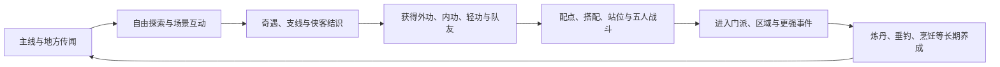

# 《剑隐侠踪录》系统设计拆解与《大曜江湖》适配参考

> 名称说明：用户所写《剑影侠踪录》，公开资料对应作品的正式名称为《剑隐侠踪录》。本文按正式名称拆解。
>
> 文档用途：作为后续人物车卡、武学组合、战斗、奇遇、世界探索与内容生产的竞品参考，不作为剧情或数值照搬依据。
>
> 核对日期：2026-07-15。

## 1. 结论先行

《剑隐侠踪录》试图把传统武侠手游常见的“主角养成＋队伍回合制”扩展成一个更完整的江湖生活循环：



它最值得《大曜江湖》参考的不是“五人阵”或“无缝地图”，而是以下四点：

1. **外功、内功、轻功不是三个独立数值栏，而是共同决定一套武学怎样运作。**
2. **同一外功受不同内功影响时，效果与视觉也应发生变化。**
3. **战前搭配、站位和针对敌人弱点，应比单纯堆高战力更重要。**
4. **地点、天气、昼夜、奇遇和生活技艺共同塑造“人在江湖中生活”的感觉。**

但它也集中暴露了服务型武侠RPG常见的风险：

- 武学、属性、经脉、装备、天赋、站位和队友同时生效，胜负原因容易变得不透明；
- 体力、精力、现实时间突破和主线等级门槛，会把主动游历切割成等待与打卡；
- 五人队伍和多套功法放大了手机界面的信息压力；
- “百业”若只提供重复材料和数值，会把江湖生活做成每日劳动；
- 宣传中的“没有最强套路”很容易被实际数值乘区、稀有度和版本平衡破坏。

对本项目的总判断是：

> **采用它的武学交叉反应、敌人弱点与场景活性；压缩队伍、成长层和日常消耗；拒绝现实等待、体力门槛与服务型数值追赶。**

---

## 2. 版本状态与证据边界

《剑隐侠踪录》尚未正式上线，不能像已发售单机游戏一样把现有系统视为定案。

### 2.1 当前可确认状态

- 2026年3月27日至3月31日进行了第一次小规模、不计费、删档技术测试；
- 官方明确称首测版本处于早期研发阶段，主要用于验证核心玩法和技术稳定性；
- 2026年6月底启动第二次“淬锋测试”招募；
- 第二次测试已公开的调整包括战斗界面重做、绝招力道分配、角色表现优化，以及新门派、新地图和新剧情；
- 因此，首测中的具体数值、武学槽位、升级时间和资源消耗都可能变化。

### 2.2 本文的三类信息

| 标记 | 来源 | 使用方式 |
| --- | --- | --- |
| 官方方向 | 官方详情页、公告、制作人和官方论坛 | 可用于判断产品目标与稳定结构 |
| 首测观察 | 首测玩家攻略、评价和实机反馈 | 可用于还原已出现的具体玩法，但不能视为最终规格 |
| 适配推断 | 基于前两类资料做出的设计分析 | 只服务《大曜江湖》，不是对竞品事实的宣称 |

本文不根据宣传语反推不存在的完整系统，也不把二测尚未公开验证的改动写成已经实现的事实。

---

## 3. 产品定位：传统武侠幻想的系统化集合

官方为游戏建立了六个主要卖点：长篇武侠叙事、视听氛围、策略回合战斗、自由探索、指定侠客结识和江湖百业。

它对应的是一组非常经典的武侠幻想：

| 武侠幻想 | 系统承载 |
| --- | --- |
| 无名少年被卷入大局 | 云波村少年、重伤神秘人、八脉天书主线 |
| 云游四方 | 无缝地图、地区、昼夜与天气 |
| 偶遇高人与秘籍 | 搜索互动、奇遇和隐藏武学 |
| 结交豪侠 | 指定邀约、剧情入队、五人阵 |
| 拜入山门 | 华山、少林以及后续门派与支系 |
| 自创武学路数 | 外功、内功、轻功、属性与天赋搭配 |
| 体验市井生活 | 炼丹、垂钓、烹饪、音律等百业 |
| 以弱胜强 | 敌人弱点、站位、换招和队伍组合 |

这种定位的强处是“武侠梦覆盖面广”，玩家很容易找到自己向往的一部分。弱点是每一种幻想都需要独立系统支撑；若内容密度不足，就会出现地图很大但事件少、生活技艺很多但用途浅、武学很多但最优解单一的问题。

《大曜江湖》不应追求覆盖全部武侠幻想。第一版只需要把以下一条做深：

> **在具体事件里认识一个人，为一门真本事支付代价，再立即用这门本事改变原本必败的局面。**

---

## 4. 开局与人物车卡

### 4.1 首测观察到的车卡结构

首测资料显示，人物开局包含多层选择：

- 基础属性倾向，例如根骨、身法、内息等；
- 拳、剑、刀、枪棍等武学资质；
- 先天心得或天赋；
- 读书、炼药、佛法、酒艺等初始技艺；
- 装备、基础功法、药物或银两等初始物品。

这种车卡的优点是能够迅速表达“我准备走哪种武学路线”；缺点是玩家尚未经历第一场战斗，就必须判断大量陌生数值和长期收益。若各选项强度差异明显，角色扮演选择会迅速退化成攻略中的唯一最优解。

### 4.2 对《大曜江湖》的启示

当前“出身＋初心＋逆天改命”比一次性选择武器、技艺和天赋更适合文字冒险。后续车卡应坚持：

1. 选择先描述人物经历，再显示带来的能力与债务；
2. 开局只选择玩家此刻能理解的内容；
3. 武器和武学倾向应在见到第一位传授者后选择；
4. 技艺必须在当前篇章有可操作对象，不能只是未来加成；
5. 不设置明显高于其他选项的“万能悟性天赋”。

可以采用“两段式车卡”：

```text
第一段：出身、初心、随身之物
经历首场困境
第二段：面对真实传承时选择武学方向
```

这样，玩家是在理解刀、针、桩功或心法的实际用途后做选择，而不是在名词表里猜答案。

---

## 5. 世界探索：视觉活性与玩法活性必须分开评估

### 5.1 官方方向

官方强调自由探索的大地图、昼夜流转、天气变化、场景搜索和无处不在的奇遇。其目标是让同一地点在不同时段和天气下拥有不同氛围，并使玩家相信偏离主路也可能有所得。

这里包含两种不同的“活世界”：

| 类型 | 作用 | 常见误区 |
| --- | --- | --- |
| 视觉活性 | 光照、天气、人群、环境声改变 | 只有画面变化，行动和结果不变 |
| 玩法活性 | NPC、路线、奇遇、资源与危险改变 | 变化很多，但玩家无法理解或预测 |

### 5.2 对本项目的适配

文字冒险不需要无缝地图，但必须保留玩法活性。每种时间或天气变化至少改变以下一项：

- 当前可见人物；
- 可执行行动；
- 行动代价；
- 奇遇条件；
- 敌人行为；
- 路线是否安全；
- 可获得的见闻。

例如：

| 场景变化 | 仅有氛围时 | 真正游戏化后 |
| --- | --- | --- |
| 紫金河涨水 | 文案说河水湍急 | 水路更快但落水风险提高，鱼跃龙门诀提供特殊行动 |
| 金陵夜雨 | 背景变暗并播放雨声 | 行人减少、足迹消失、针法受风影响、追踪者更难发现玩家 |
| 破庙月夜 | 增加月光描述 | 贡品窗口开启、灵猴行动变化、火光暴露来客 |

第一版继续使用“地点卡＋路线选择＋日期窗口”，不制作连续移动大地图。探索的重点是判断和代价，不是移动时长。

### 5.3 搜索与隐藏内容

竞品使用场景搜索、宝箱和隐藏互动制造发现感。文字游戏可以采用，但必须避免“逐像素点击”。

建议把搜索分为三层：

1. **自然可见：** 进入场景即可发现；
2. **主动搜索：** 支付时间、体力或暴露风险；
3. **能力识破：** 因见闻、技艺、关系或武学发现更深内容。

逆天改命可以显示“这里仍有一项未满足条件的机会”，但不直接指出答案和奖励。

---

## 6. 奇遇：需要条件、代价与长期回流

### 6.1 竞品方向

官方把坠崖遇高人、场景搜索、地图奇遇和侠客互动作为自由探索的重要回报。这类设计满足的是武侠读者熟悉的“偏离正路反而得奇缘”。

但随机发现本身不等于优秀奇遇。若奇遇只提供高品质装备或稀有武学，它最终仍会变成地图清单。

### 6.2 《大曜江湖》的奇遇规格

后续奇遇至少应包含：

| 组成 | 要求 |
| --- | --- |
| 前兆 | 玩家事前能够看见不完整但可信的异常 |
| 条件 | 日期、地点、属性、武学、关系或见闻中的两项以上 |
| 主动动作 | 玩家必须做出一次具体尝试，而非走到地点自动获得 |
| 代价 | 时间、伤势、银钱、关系、错过或命灯 |
| 多结果 | 至少包含获得、错过、失败、关系变化中的两类 |
| 即时兑现 | 所得在两幕内改变一次行动 |
| 长期入口 | 人物、地点、势力或武学仍可继续发展 |

奇遇不依赖纯随机。随机只能决定“本次出现哪种前兆”，真正能否取得结果由玩家准备和选择决定。

---

## 7. 武学系统：最值得借鉴的是交叉反应

### 7.1 官方结构

官方将武学分为外功、内功和轻功：

- **外功**决定如何出招和制敌，一套外功包含多个具体招式；
- **内功**提供行气、属性、伤害类型和攻防根基；
- **轻功**处理速度、身法、进退与探索移动；
- 不同内功配合外功时，外功的视觉表现也会发生变化。

首测观察还显示，武学存在品质、等级、修为门槛、突破、被动和绝招等成长层，并与臂力、根骨、内息、身法等属性产生不同倍率关系。

### 7.2 设计价值

最重要的并不是拥有三类槽位，而是形成了清楚的组合语法：

```text
外功回答“我做什么”
内功回答“我以什么方式发力”
轻功回答“我从什么位置、以什么节奏做”
```

同一套外功可以因为内功和轻功不同而产生新用法，比单纯新增另一门更高稀有度武学更有角色塑造力。

### 7.3 对《大曜江湖》的压缩方案

不增加多套装备槽，只为武学增加少量标签：

```text
招式标签：针、杆、拳、控制、穿透、牵拉
根基标签：水行、枯守、定海、养生
身法标签：换位、潜水、站定、借势
```

结算时最多触发一条交叉反应：

| 组合 | 新行动或深化结果 |
| --- | --- |
| 春风针＋鱼跃龙门诀 | 借水汽辨风，雨中针路不受第一次干扰 |
| 春风针＋枯木桩 | 站定压腕，带伤出针时降低失手代价 |
| 打鱼杆法＋定海桩 | 在水边固定重心，可把强敌牵离原位 |
| 五禽戏＋春风针 | 更懂关节与呼吸，可由伤人转为封穴救人 |
| 鱼跃龙门诀＋神猿残势 | 水中换位后借岩壁发力，打开新的洞内路线 |

控制组合规模的规则：

1. 每门武学只有一个核心动作；
2. 每对标签最多产生一个特殊结果；
3. 特殊结果优先改变行动和代价，不单纯增加伤害；
4. 界面明确说明本次是哪两项能力发生呼应；
5. 新组合必须在剧情中被亲手验证，而不是只写在说明页。

### 7.4 不应采用的部分

- 入门、进阶、上乘、绝学同时成为固定数值阶梯；
- 每门功法都必须反复升到几十级；
- 高品质功法完全替代低品质功法；
- 属性倍率复杂到必须查表才能知道该加什么；
- 学武或突破依赖现实时间等待；
- 加入门派后重置大量已有投入。

本项目的低阶武学也应因场景、人物和组合而长期有用。

---

## 8. 战斗系统：五人阵的价值与代价

### 8.1 首测可观察结构

首测采用策略回合制，可组成五人阵。玩家需要调整人物、武学、配点、装备和站位，并针对敌人的内外功、防御与招式特征改变方案。官方最新二测信息还提到战斗界面整体迭代，以及新增“绝招力道分配”机制。

这形成了多层决策：

```text
战前：选人 → 选武学 → 配属性 → 排站位
战中：观察敌人 → 选择招式 → 分配绝招资源 → 调整目标
战后：升级 → 突破 → 换装备 → 再挑战
```

### 8.2 五人阵的设计价值

- 让人物性格和武学职责进入同一场战斗；
- 前排、后排、保护、控制和输出能形成分工；
- 同一首领可以通过换人、换位和换功法反复尝试；
- 玩家获得新侠客后能立即看见队伍变化；
- 失败通常能提供“下一次换什么”的明确方向。

### 8.3 五人阵的成本

- 五名角色各自拥有血量、内力、状态和技能，手机屏信息量很高；
- 队伍最弱成员、站位和速度顺序会增加失败原因；
- 角色、装备、武学、天赋组合数快速爆炸；
- 为避免玩家手操过慢，系统容易走向自动或快速战斗；
- 一旦存在明显强势队友，人物喜好会让位于版本答案。

### 8.4 《大曜江湖》的取舍

第一版不做五人编队。战斗仍以主角为唯一直接操作者，同伴只提供一个清楚的临时行动：

```text
曹青同行：可替你辨认一次毒性，但会记录你如何处置病人
王五同行：可牵制一名近水敌人，但需要你守住他的退路
龙青鱼同行：可调动一次帮会门路，但会暴露你与她的关系
```

这样保留“人物改变战术”的价值，同时避免管理五套属性和技能。

战斗继续采用：

- 三档距离；
- 可见敌人意图；
- 每回合三至五个行动；
- 一项属性加一门功法进行判定；
- 制伏、封穴、缴械、逃离和环境利用；
- 连续血条、小数值伤害和简单动画作为理解反馈。

不增加“绝招力道”作为第二套战斗资源，除非普通行动与绝招已经形成至少三种真实取舍。

---

## 9. 敌人设计：兑现“针对弱点方能制胜”

官方反复强调没有绝对最强武功，要针对敌人弱点调整套路。这个目标只有在敌人真正改变规则时才成立。

一个合格敌人应包含：

| 字段 | 作用 |
| --- | --- |
| 可见意图 | 玩家本回合必须处理的问题 |
| 武学特征 | 敌人主要依赖的发力和距离 |
| 可观察弱点 | 通过行动逐步确认，而非开局完整公开 |
| 错误应对 | 哪种常见打法会被反制 |
| 环境关系 | 场景如何帮助或妨碍双方 |
| 非击杀解 | 制伏、逼退、说服、救人或破坏目标 |
| 死亡见闻 | 死亡后玩家具体学会了什么 |

对当前夜战刀客，可以继续深化为：

- 右手明刀是可见意图；
- 左袖短刃是隐藏杀招；
- 观察、灭灯、拉开距离和春风针分别提供不同深度；
- 根骨高不是简单多挨一刀，而是允许带伤完成封穴；
- 鱼跃龙门诀在雨巷或水边改变换位；
- 杀死、制伏、逃离改变后续关系和见闻。

这里已经能获得竞品“拆招”的核心体验，不需要五人阵或复杂伤害乘区。

---

## 10. 队友与侠客：指定结识优于盲盒，但仍需避免功能化

官方明确宣传不使用盲盒式侠客获取，人物可以指定邀约，或通过奇遇和互动结识。这比随机抽取更符合武侠题材，因为“谁愿意与你同行”能够由剧情和关系解释。

但即使不抽卡，也可能出现另一种功能化：

- 主线走到节点自动送队友；
- 新队友只是更高数值的职业替代；
- 人物入队后不再拥有个人目标；
- 玩家只按强度选择，人物关系不影响战斗；
- 后续角色为了促成追赶而不断抬高强度。

《大曜江湖》中的核心人物需要同时具有：

1. 自己正在处理的麻烦；
2. 愿意暂时与玩家同行的具体原因；
3. 一项能改变当前事件的能力；
4. 一个同行时产生的限制或风险；
5. 可能离开、背叛或转变立场的条件；
6. 不入队也会继续发展的人生。

人物不应因为没有加入主角队伍就停止存在。

---

## 11. 门派：把内容、身份和武学打包

竞品首测开放华山和少林，后续加入当阳等门派，并通过门派支系区分武学和角色方向。门派系统的设计优势是能够把多种内容组织成一套明确身份：

```text
门派地域
＋人物关系
＋行为规范
＋武学路线
＋任务与晋升
＋与其他势力的立场
```

如果只保留“入门后买功法”，门派就会退化成技能商店。对本项目而言，一个可玩的门派至少需要：

- 为什么愿意或不愿意收主角；
- 玩家承担什么身份义务；
- 门规在具体事件里限制哪些行动；
- 同门怎样评价玩家的选择；
- 武学如何反映门派处世方式；
- 退出、逐出或背叛会失去什么；
- 门派是否允许玩家利用制度漏洞。

第一版不开放正式拜入大型门派。沈家、药王谷、漕帮先承担“小型制度样本”，验证身份、门路、债务和传承是否真的相互影响。

---

## 12. 长期养成：内容成长与等待成长的冲突

### 12.1 首测观察

首测中出现了武学等级、修为、突破、经脉、装备、属性、天赋、体力、精力和现实时间等待等长期养成层。它们适合维持网络游戏的持续游玩，但会改变玩家的核心问题：

```text
内容型问题：我该如何解决这件事？
等待型问题：我还要多久才能把数值练够？
```

当等待型问题占主导时，奇遇与人物就会变成产出材料的渠道。

### 12.2 《大曜江湖》的规则

- 不使用现实时间倒计时；
- 不设置每日体力恢复和重复打卡；
- 修炼消耗故事内的日期、食物、银钱和安全窗口；
- 每次修炼都可能错过人物、任务或危险窗口；
- 重复练功应快速结算，只在首次、突破或出错时展开场景；
- 境界提升必须改变可承受的行动和世界身份，而非只抬数值；
- 不用稀有度颜色替代武学差异。

当前沈家日常已经使用时段、体力和饱腹，但它必须持续连接曹青关系、医术、炼丹和密会，不能扩张成无目的日常刷取。

---

## 13. 江湖百业：用生活技艺制造选择，不制造作业

官方公开的百业包括炼丹、垂钓、烹饪、音律和读书等。它们的正面作用是：

- 让主角不只靠杀人变强；
- 给城市、乡村和普通人提供内容；
- 让物产、天气和地方文化进入玩法；
- 提供与人物交往的非战斗方式；
- 给紧张主线安排节奏缓冲。

风险则是每项百业都形成独立等级、材料、配方和每日次数，最终变成并列的工作清单。

本项目只在满足以下条件时新增技艺：

1. 至少连接一名核心人物；
2. 至少解决一个剧情问题；
3. 至少产生一次有代价的选择；
4. 至少与一种已有武学或关系发生交叉；
5. 不依赖重复操作提升熟练度。

| 技艺 | 可以加入的玩法 | 暂不加入的部分 |
| --- | --- | --- |
| 医术 | 诊断、救人、识毒、关系与伦理选择 | 重复看诊刷经验 |
| 炼丹 | 火候、药序、药材渠道和品质后果 | 大批量日常生产 |
| 垂钓 | 地点窗口、人物结识、宝鱼风险 | 长时间重复小游戏 |
| 烹饪 | 旅途准备、待客、缓和关系 | 菜谱图鉴和餐厅经营 |
| 音律 | 暗号、人物记忆、安抚或扰乱 | 独立音游与等级树 |
| 读书 | 见闻、制度、医书与武学理解 | 单纯增加悟性数值 |

---

## 14. 叙事结构：宏大谜团必须落到眼前人物

竞品使用“三十年前夺天之战＋八脉天书＋六大高手失踪”建立长期谜团，再由云波村少年救下一名重伤者进入主线。这是典型的“历史悬案牵引个人成长”结构。

优点：

- 很快建立长线目标；
- 高手和秘宝提供力量上限；
- 每个地区都可以埋入旧事线索；
- 队友和门派容易与历史谜团建立关系。

风险：

- 开场大量讲述三十年前的人和事；
- 主角只是被宏大阴谋拖着走；
- 地方人物只负责交线索；
- 一切支线最终都指向同一秘宝，世界反而变窄。

《大曜江湖》应坚持“先有眼前人，再有旧时代”：

```text
先认识曹青如何活
再知道药王谷为什么追他
先看见沈家怎样用人
再理解世家和金龙会的利益
先与龙青鱼建立一段单向记忆
再进入漕帮与陆连山的旧怨
```

长线谜团必须通过人物当下的欲望和代价展开，不使用开场旁白灌输。

---

## 15. 视听与界面：招式差异必须服务判断

官方强调水墨场景、定制音乐、不同招式视觉效果，以及内功改变外功视觉。首测反馈同时指出战斗待机、动作流畅度、状态文字大小和手机信息密度仍需优化；官方也已公开表示重做角色表现和战斗界面。

这里的重要教训是：

> **动画不仅负责“好看”，还必须让玩家看懂谁出手、为何命中、造成什么状态、下一步该处理什么。**

《大曜江湖》的视觉层级应为：

1. 当前敌人意图；
2. 双方气血与伤势；
3. 当前距离和环境；
4. 玩家行动按钮及胜算；
5. 招式命中、闪避、封穴、缴械等短反馈；
6. 战报和详细来源按需展开。

同一外功受不同根基影响时，可以改变：

- 招式名后的短标签；
- 动画颜色、方向或轨迹；
- 结果文案中的发力方式；
- 一个明确状态或环境效果。

不需要为每种组合制作长动画。0.2至0.5秒的位移、轨迹和状态变化已经足够解释结果。

---

## 16. 竞品主要风险清单

| 风险 | 为什么会发生 | 本项目的防线 |
| --- | --- | --- |
| 系统层过多 | 属性、资质、武学、经脉、装备、天赋、队友同时成长 | 一个行动只引用一项属性和一门功法 |
| 属性最优解 | 招式倍率和天赋收益差距明显 | 属性主要改变行动方案，不只改变伤害 |
| 现实等待 | 服务型长期留存需要 | 只使用故事内时间与机会成本 |
| 体力打卡 | 重复战斗和百业需要消耗门槛 | 无每日体力，重复内容快速结算 |
| 地图空旷 | 无缝大地图制作成本高 | 小地点高密度，每处都有事件与回流 |
| 奇遇攻略化 | 隐藏触发过于精确 | 显示前兆、缺口和关闭风险，不给完整答案 |
| 队友强度替代人物 | 五人阵追求效率 | 同伴以关系和特殊行动进入事件 |
| 高品质替代低品质 | 线性稀有度成长 | 武学保持独特规则和场景用途 |
| 百业作业化 | 每个技艺独立升级和产出 | 技艺必须服务人物、事件与选择 |
| 战斗观赏化 | 自动／快速战斗削弱操作 | 短战斗、少按钮、每回合明确意图 |
| 宣传策略、实为数值 | 复杂乘区产生版本答案 | 敌人弱点直接改变规则而非只减伤 |

---

## 17. 采用、改造与舍弃清单

| 竞品设计 | 判断 | 《大曜江湖》的处理 |
| --- | --- | --- |
| 无名少年因救人入局 | 采用结构 | 保持个人行动先于宏大背景 |
| 长线武林旧案 | 改造采用 | 从具体人物与地方制度逐层揭开 |
| 自由探索与搜索 | 抽象采用 | 地点卡、主动搜索和条件板 |
| 昼夜与天气 | 条件采用 | 只有改变行动、代价或人物才加入 |
| 场景奇遇 | 采用 | 必须有前兆、代价、多结果和回流 |
| 外功、内功、轻功分工 | 简化采用 | 招式、根基、身法三类职责 |
| 内功改变外功表现 | 重点采用 | 使用标签交叉，每次最多触发一条反应 |
| 针对弱点制胜 | 重点采用 | 意图、观察、错误应对和非击杀解 |
| 五人阵与站位 | 舍弃规模 | 主角直接行动＋一名临时同伴行动 |
| 绝招力道分配 | 暂不采用 | 不增加第二战斗资源 |
| 指定侠客邀约 | 采用原则 | 人物通过剧情和关系同行，不抽取 |
| 门派支系 | 延后采用 | 先用沈家、药王谷、漕帮验证身份规则 |
| 经脉和多品质装备 | 暂不采用 | 境界、五维、伤势和武学熟练已足够 |
| 武学现实时间突破 | 舍弃 | 使用故事日期和机会成本 |
| 体力、精力日常门槛 | 舍弃 | 不做服务型打卡循环 |
| 江湖百业 | 个别采用 | 只保留能改变人物和事件的技艺 |
| 招式差异动画 | 采用 | 轻量位移、轨迹、血条和状态反馈 |

---

## 18. 对现有系统文档的直接影响

| 系统 | 应吸收的内容 | 不应增加的内容 |
| --- | --- | --- |
| SYS-01 叙事事件与奇遇 | 前兆、搜索层级、天气条件、长期回流 | 纯随机秘籍和逐像素搜索 |
| SYS-02 人物成长与武学 | 招式／根基／身法职责、标签交叉、组合首次兑现 | 品质替代、几十级重复升级、现实突破时间 |
| SYS-03 战斗伤势与死亡 | 弱点、错误应对、环境反应、临时同伴行动、短动画 | 五人阵、复杂站位、绝招资源和多乘区伤害 |
| SYS-04 医毒物品与经济 | 百业必须服务病例、人物和选择 | 并列生产职业与每日采集 |
| SYS-05 关系势力与身份 | 剧情结识、同行原因、门派义务与离开条件 | 角色收集和强度替代 |
| SYS-06 世界时间与调查 | 昼夜天气改变行动、主动搜索、地点高密度 | 无缝大地图和无意义移动 |
| SYS-07 界面存档与质保 | 意图优先、血条、状态、组合来源、手机信息分层 | 五人全部状态同屏常驻 |
| SYS-08 内容生产与校验 | 校验奇遇前兆、组合回报、天气作用和同伴代价 | 只校验奖励数值与节点可达 |

---

## 19. 可直接用于后续制作的模板

### 19.1 武学组合卡

```text
外功／动作：玩家具体做什么
根基／发力：为什么能这样做
身法／位置：从哪里、以什么节奏做
主要属性：只选一项
敌人弱点：什么情况下效果最深
环境反应：水、雨、火、黑暗、狭窄等
组合结果：改变行动、代价或后果
首次兑现：获得后两幕内出现
长期盲点：它明确解决不了什么
```

### 19.2 地点活性卡

```text
白日有什么人和行动
夜间有什么变化
天气改变哪项规则
普通搜索能发现什么
能力识破能发现什么
一项眼前事件
一项可错过奇遇
一项以后返回的理由
```

### 19.3 临时同伴卡

```text
为什么同行
提供一个什么特殊行动
会带来什么限制
最关心的战斗外目标
什么选择会增加信任
什么选择会令其离开
战后关系和世界状态如何变化
```

### 19.4 敌人拆招卡

```text
第一眼意图
隐藏后手
可观察弱点
会被反制的常规行动
可利用的环境
至少一个非击杀结果
失败或死亡后保留的见闻
```

---

## 20. 落地优先级

### A级：下一轮战斗与剧情设计就采用

1. 为现有武学补“动作、根基、身法”标签；
2. 每场重要战斗增加一个可观察弱点和一个错误应对；
3. 为春风针、鱼跃龙门诀、桩功和打鱼杆法设计首批交叉反应；
4. 时间和天气只在能改变行动时进入界面；
5. 下一名同行NPC采用“一项帮助＋一项限制”的临时同伴结构。

### B级：完成简明战斗表现后

1. 地点的昼夜差异；
2. 主动搜索与能力识破；
3. 同一外功受不同根基影响的视觉变化；
4. 门派或势力身份带来的行为义务；
5. 人物不同行时仍会继续推进的事件。

### C级：长期再评估

1. 多名长期同伴；
2. 正式门派加入与支系选择；
3. 多套武学装配；
4. 经脉和装备路线；
5. 更完整的生活技艺体系。

明确不进入计划：现实时间突破、每日体力、角色抽取、武学售卖、多人排行和五人阵微操。

---

## 21. 验收问题

后续内容若声称参考了《剑隐侠踪录》的优点，应能回答：

- 玩家是否先遇见具体困境，再听见江湖旧事？
- 一个地点的昼夜或天气是否真的改变行动？
- 奇遇是否有可观察前兆，而不是查攻略触发？
- 新武学是否改变“能做什么”，而不是只提高伤害？
- 外功与根基组合时，玩家能否看懂发生了什么呼应？
- 敌人是否有可验证的弱点和错误应对？
- 同伴是否同时带来帮助、目标和限制？
- 失败后是否知道下次可以换什么，而不是只知道战力不足？
- 百业是否改变人物或剧情，而不是制造每日作业？
- 是否删除了现实等待、重复刷取和无意义地图移动？

若其中三项答不上来，说明只借了竞品名词或表现，没有吸收其系统价值。

---

## 22. 资料来源

### 官方资料

1. [《剑隐侠踪录》TapTap官方详情页](https://www.taptap.cn/app/798735/all-info)：世界前提、外功／内功／轻功组合、视听、奇遇、侠客邀约与江湖百业。
2. [《剑隐侠踪录》正式首曝介绍](https://www.taptap.cn/moment/782545742479753248)：策略回合战斗、敌人弱点、无缝地图、昼夜天气、奇遇与生活技艺。
3. [“剑鸣首测”官方招募说明](https://www.taptap.cn/moment/781254250435970243)：首测性质、平台、测试目标与早期研发状态。
4. [“剑鸣首测”结束公告](https://www.taptap.cn/moment/788104119352033637)：首测结束时间和后续优化状态。
5. [官方武学体系说明](https://www.taptap.cn/moment/790640292846896897)：外功、内功与轻功的基本分工。
6. [首测后官方优化规划](https://www.taptap.cn/moment/791045761453261074)：首测反馈归档和后续优化方向。
7. [“淬锋测试”官方招募说明](https://www.taptap.cn/moment/819275173663344895)：战斗界面、绝招力道分配、角色表现、新门派、新地图与新剧情等二测调整。

### 首测观察资料

8. [首测武学搭配与属性攻略](https://www.taptap.cn/moment/786548010535358049)：武学槽位、品质、属性关系、修为与突破的首测表现。
9. [首测开局车卡攻略](https://www.taptap.cn/moment/786548864860554543)：基础属性、武学资质、先天心得、技艺和初始物品。
10. [首测玩家关于武学、站位与首领尝试的评价](https://www.taptap.cn/review/48208761)：反复配点、内外功搭配与队伍站位的实际体验。
11. [首测玩家关于时间、地图、队友与战斗的评价](https://www.taptap.cn/review/48195830)：现实等待、地图操作、剧情队友和战斗反馈等风险信号。

首测观察只用于理解当时版本，不代表第二次测试或正式版本仍保留相同数值与规则。本文不复制竞品剧情文本、人物、门派、武学名称或任务内容。
