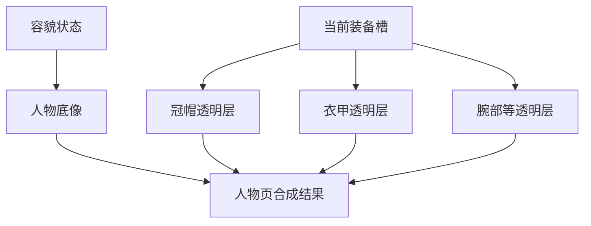

# 《鬼谷八荒》创建角色与捏人系统拆解

> 文档用途：拆解《鬼谷八荒》如何用低操作成本完成外貌、性格与开局能力建立，并提炼适合《武道》人物创建与2D换装系统的设计方法。本文只研究结构与体验，不照搬角色素材、气运名称、魅力公式或修仙设定。
>
> 核对日期：2026-08-03。
>
> 资料口径：产品定位与正式版信息以Steam商店为准；创建流程、部件分类和现行玩法由近期社区攻略与多份图文资料交叉核对。外貌部件权重、气运池和具体数值会随版本、DLC与模组变化，本文不把攻略表中的编号与最优组合视为稳定规则。
>
> 相关文档：[SYS-11 三出身与独立序章](systems/11_ORIGIN_PROLOGUES.md)、[SYS-09 装备系统与统一战斗公式](systems/09_EQUIPMENT_COMBAT_FORMULA.md)、[D-012 容貌与换装决策](DECISION_LOG.md#d-012容貌使用少量整套预设服装由装备透明层负责)。

## 1. 结论先行

《鬼谷八荒》的创建角色系统看起来有很多选项，但它没有让玩家雕刻三维骨骼。它用的是一套很节制的二维组合方式：


它真正高效的地方有五点：

1. **编辑对象始终可见。** 人物立绘固定在画面中央，任一部件变化都立即反馈到整个人身上。
2. **大部分操作只是换一套。** 帽子、前发、后发、脸型、衣服等使用离散编号切换，玩家不需要理解骨骼与材质参数。
3. **只给少数五官微调。** 眼、眉、嘴、鼻保留小范围位置或比例调整，提供“这是我捏的”感觉，却没有复杂三维编辑器的学习成本。
4. **角色身份分层完成。** 外貌回答“我长什么样”，性格回答“别人怎样理解我”，先天气运回答“这一世擅长什么”。
5. **随机按钮承担两种入口。** 不想细调的玩家可以快速获得可用角色；喜欢优化的玩家可以把随机结果当作继续筛选的起点。

这套设计最值得《武道》借鉴的不是十一类外貌部件，而是：

> **把复杂度藏在美术组合和规则数据里，让玩家只做少量、即时可见、随时可撤回的选择。**

同时，它最明显的问题也来自数值化：魅力与部件权重绑定、先天气运可以反复刷新，最终容易把“我想成为谁”变成“照攻略刷出最高档”。

---

## 2. 创建角色的三层身份

《鬼谷八荒》没有只做一张捏脸页。完整人物建立由三层连续完成。

| 层级 | 玩家回答的问题 | 主要操作 | 进入游戏后的意义 |
| --- | --- | --- | --- |
| 视觉身份 | 我长什么样 | 性别、姓名、发型、五官、衣服、饰物 | 角色辨识、魅力评价、关系第一印象 |
| 社会身份 | 我通常怎样待人 | 一项内在性格、两项外在性格 | NPC互动倾向、关系与行为判断 |
| 玩法身份 | 这一世先天擅长什么 | 刷新基础属性与候选气运，从中选定三项 | 资质、悟性、幸运、战斗或资源倾向 |

这种分层有两个好处：

- 玩家不必在同一页同时理解外貌、价值观和战斗流派；
- 每完成一层，角色都会从“空白人偶”更接近一个可以进入世界的人。

它也有一个隐患：三个层级都含有实际收益，新玩家会担心任何一步选错，从而在正式开局前开始查攻略。

---

## 3. 外貌编辑器的结构

### 3.1 固定构图

典型界面使用横向画卷构图：

- 中央是半身或近全身人物；
- 外貌类别围绕人物分布；
- 每个类别用左右箭头切换编号；
- 角色信息、魅力与性格位于另一侧；
- 随机按钮与开始按钮保持独立，不与部件选择混在一起。

这让玩家的视线顺序非常自然：

```text
看人物整体 → 注意不满意的部位 → 点击附近箭头 → 立即回看人物整体
```

玩家不需要先从左侧目录选“头部”，再进入第二层目录找“前发”。部件名直接贴近人物相应区域，空间位置本身就是导航。

### 3.2 十一类离散部件

社区资料长期稳定记录的外貌分类包括：

1. 帽子；
2. 前发；
3. 后发；
4. 眼睛；
5. 眉毛；
6. 嘴巴；
7. 鼻子；
8. 脸型；
9. 后背；
10. 衣服；
11. 脸饰。

它们并不是同等重要。

| 影响层级 | 典型部件 | 实际作用 |
| --- | --- | --- |
| 第一眼轮廓 | 帽子、前发、后发、衣服、后背 | 决定远距离辨识和人物气质 |
| 面部风格 | 脸型、眼睛、眉毛、嘴巴、鼻子 | 决定近看差异和魅力组合 |
| 个性点缀 | 脸饰 | 为已经成立的轮廓增加记忆点 |

因此系统虽然列出十一类，玩家实际最先感知的仍是发型、帽子、服装和脸型。细小五官更多负责“我确实参与制作了这张脸”。

### 3.3 离散预设为主，连续参数为辅

绝大多数部件只需在若干成品之间切换。眼、眉、嘴、鼻等少数部件另有小范围微调条。

这是一种低维捏人：

- **离散预设**保证每个结果都由美术确认过，不容易出现穿模或畸形；
- **少量连续微调**提供个人参与感；
- **固定视角**免去旋转镜头、灯光与多角度检查；
- **二维叠层**让组合结果成本远低于高精度三维骨骼系统。

玩家获得的是“选择与搭配”的自由，不是“从零雕刻”的自由。

### 3.4 即时整身预览

每次切换部件，中央人物直接更新。这里没有“应用”按钮，也不要求离开子菜单后才看到结果。

即时预览同时解决了三个问题：

1. 玩家不用记住上一件部件长什么样；
2. 单个好看的部件可以立即检查与整身是否协调；
3. 反复试错的成本接近一次点击。

这也是这套系统比缩略图大列表更轻的原因。它牺牲了横向同时比较很多候选的效率，换来始终围绕“当前这个人”做判断。

---

## 4. 魅力：把外貌接入世界的办法

### 4.1 系统做法

外貌组合会生成魅力数值，并映射为从负面到正面的多档评价。魅力会参与NPC对角色的态度与部分社会互动。

它解决了一个常见问题：

> 捏脸完成以后，如果所有NPC都完全无视外貌，玩家此前的选择就只剩截图价值。

通过魅力，创建页与沙盒关系系统发生了连接。外貌不再是孤立装饰。

### 4.2 爽点

- 每换一个部件，玩家不只看到视觉变化，还能看到评价变化；
- “仙姿”等高档词语把数值包装成世界内身份；
- 高魅力在后续NPC互动中得到承认，形成长期回响；
- 追求特殊外貌或故意低魅力也能成为角色扮演目标。

### 4.3 主要问题

魅力由隐藏部件权重叠加后，审美很容易被优化目标取代：

- 玩家会搜索固定编号组合；
- 帽子、脸饰或衣服不再因好看而选，而因权重高而选；
- 明明喜欢当前人物，也会因少一档评价而重捏；
- “独特角色”逐渐收敛为社区共享的少数高分模板。

因此魅力最值得借鉴的是“外貌会被世界承认”，而不是“每个鼻子都有隐藏分数”。

---

## 5. 性格：用三个词快速建立社会行为

### 5.1 一内两外

创建页允许玩家选择一项内在性格和两项外在性格。

- 内在性格更接近价值取向与根本立场；
- 外在性格更接近待人方式与关系倾向；
- 词条可查看说明，但主界面只保留短标签。

这种结构比填写传记更快，也比单一阵营轴更具体。三个词能够组合出“立场相近、表现不同”的人物。

### 5.2 设计价值

性格不是战斗职业。它主要服务NPC生态，让人物之间的亲近、冲突和行为选择有初始倾向。

它完成了从“好看的纸片人”到“会怎样与人相处”的过渡，并为沙盒NPC系统提供可计算标签。

### 5.3 局限

- 玩家在真正认识世界之前就要决定长期性格；
- 词条实际影响不够透明时，仍会变成攻略选择；
- 玩家后续行为如果长期违背初始性格，标签可能比亲历更有权威；
- 性格和魅力同时放在外貌页附近，容易让信息层级显得拥挤。

对重叙事游戏而言，更自然的做法是让一部分性格由开场选择逐渐显现，而不是全部在进入世界前宣告。

---

## 6. 属性与先天气运：把随机开局变成一次抽取

### 6.1 候选池与选择

属性页会随机生成基础状态和一组先天气运候选，玩家再从候选中选定三项。社区资料对不同历史版本的候选总量记录并不完全一致，但“刷新整组候选，再从中选三项”是稳定结构。

这个流程包含两种随机：

1. 系统决定这次出现什么；
2. 玩家决定在这次候选里拿走什么。

因此玩家并非完全被随机支配，而是在不完整选择集中做取舍。

### 6.2 为什么有爽感

- 高品质词条出现时有抽取惊喜；
- 多条气运共同暗示一套开局流派；
- 词条带有身世和传说色彩，比单纯“攻击＋5”更像一段命；
- 重开时很快就能得到不同角色，而不必重写整份人物卡。

### 6.3 为什么会变成“骰子模拟器”

刷新没有形成真正稀缺代价时，理论上的“从候选中取舍”会退化为：

```text
反复刷新 → 等高品质或目标词条同时出现 → 才允许自己开局
```

问题不是随机本身，而是玩家可以在世界之外无限重试，且高低品质直接可比。结果是时间成本代替了策略成本。

---

## 7. 信息优先级

《鬼谷八荒》的创建页虽然项目多，但单次关注点仍然明确。

### 外貌阶段

1. 当前人物整体；
2. 正在切换的部件；
3. 魅力档位；
4. 姓名、性别与性格；
5. 随机和继续。

### 属性阶段

1. 先天气运名称、品质和效果；
2. 已选三项；
3. 悟性、幸运、体力等基础状态；
4. 各类资质；
5. 再随机与开始游戏。

它没有把所有内容塞进一张总表，而是让“现在要做的决定”占据最大空间。

---

## 8. 二维美术与技术结构推断

以下是根据界面表现作出的设计推断，不是开发团队公开的源码说明。

### 8.1 固定人物标尺

所有可替换部件共享同一个人物姿势、画布尺寸和挂点。系统只需按稳定层级组合素材：

```text
身体底层
→ 后背装饰
→ 衣服
→ 后发
→ 脸型与五官
→ 前发
→ 帽子
→ 脸饰
```

固定标尺带来的收益：

- 切换无需重算姿态；
- 美术可以逐件校准遮挡；
- NPC也能复用同一组部件生成大量差异角色；
- 新衣服和新发型可以作为内容扩展，而不修改编辑器结构。

### 8.2 低动画依赖

创建页人物只需维持一个稳定展示姿态。它不需要证明每件衣服在跑、跳、翻滚、受击时都正确变形，因而能用较低成本提供大量组合。

### 8.3 素材数量的真实压力

二维组合并不等于没有成本。压力从三维蒙皮转移到：

- 男女或不同体型是否要各画一份；
- 长发、帽子与后背装饰的遮挡关系；
- 衣服袖口与手臂姿势的对齐；
- 面部部件在不同脸型上的兼容；
- NPC随机生成时如何避免荒谬组合。

因此它适合固定姿势与风格化立绘，不适合直接等比例套到高写实、多动作人物上。

---

## 9. 这套系统做得好的地方

### 9.1 三分钟能开局，三十分钟也有事可调

快速玩家可以随机后直接开始；爱捏人的玩家可以逐件切换。两类玩家共用一套界面，不需要“简单模式／专家模式”。

### 9.2 操作结果始终可预测

左右箭头只会换到上一件或下一件。没有参数联动，也不会因为拉动鼻梁导致整张脸失真。

### 9.3 轮廓优先于细节

发型、帽子、服装和后背装饰能在很小的角色显示尺寸下保持差异。这符合游戏实际镜头，而不是只为创建页特写服务。

### 9.4 外貌与NPC生态连接

魅力让玩家的外貌选择在进入世界后仍被承认，避免捏脸成为一次性页面。

### 9.5 随机结果具有叙事暗示

先天气运并非只有裸数值。名称与效果共同暗示某种身世或天赋，玩家容易据此想象“这一世是谁”。

---

## 10. 主要问题

### 10.1 十一类并不等于十一类都值得调

实际游戏镜头较远，鼻、嘴、眉等细节的辨识度有限。玩家付出的选择时间可能大于后续能看见的价值。

### 10.2 编号缺少语义

“前发23”“鼻子7”便于攻略传播和数据保存，却不帮助玩家理解风格。玩家只能反复点击或记编号。

### 10.3 魅力压倒审美

隐藏权重与明显档位会诱导玩家放弃喜欢的组合，追求固定高分答案。

### 10.4 性格先验过强

玩家尚未经历第一件事，就要声明稳定性格。对强调“选择塑造人物”的叙事RPG并不自然。

### 10.5 无限刷新稀释取舍

只要愿意花时间，玩家就能把随机候选刷到满意。它形成开局仪式，也形成重复劳动。

### 10.6 服装与装备职责容易混淆

如果创建页衣服只是永久外观，它与后续装备外观会冲突；如果衣服带数值，玩家又会在捏脸阶段提前做装备选择。

---

## 11. 与复杂三维捏脸的差异

| 维度 | 《鬼谷八荒》 | 复杂三维捏脸 |
| --- | --- | --- |
| 核心操作 | 切换成品部件 | 调整骨骼、比例、材质与妆容 |
| 学习成本 | 低 | 中到高 |
| 结果稳定性 | 高，组合由美术预先控制 | 可能出现畸形、穿模或光照差异 |
| 自由度 | 组合自由 | 连续参数自由 |
| 美术扩展 | 增加部件即可扩池 | 需兼容模型、蒙皮、动画与材质 |
| 手机适配 | 容易做成箭头和预设 | 滑杆、镜头与精细点选较难 |
| 游戏内辨识 | 依靠轮廓部件 | 细节可能只在特写中可见 |
| 适合项目 | 2D、固定姿态、大量NPC组合 | 高预算3D、近景演出、外观创作为核心 |

《鬼谷八荒》的关键判断是：创建角色服务于进入沙盒，而不是把创建器本身做成一款独立游戏。

---

## 12. 对《武道》的采用判断

### 12.1 直接采用

| 做法 | 原因 |
| --- | --- |
| 人物始终在右侧或中央完整可见 | 每次选择都有即时整体反馈 |
| 使用离散预设和左右箭头 | 手机横屏容易点按，玩家无需理解参数 |
| 保留整组随机 | 为只想快速进入剧情的玩家提供出口 |
| 名称与序号同时显示 | 名称传达风格，序号帮助确认当前位置 |
| 固定人物标尺和透明装备层 | 新装备不用为每种面容重画整张立绘 |
| 外貌与玩法步骤分开 | 当前只判断好不好看，不同时计算战斗构筑 |

### 12.2 改造后采用

| 原作做法 | 《武道》改法 |
| --- | --- |
| 十一类部件 | 首版收束为体貌、整套面容、发式、肤色 |
| 部分五官滑杆 | 不做滑杆；每张面容由美术直接确认 |
| 衣服属于捏脸部件 | 衣服、冠帽和护腕只读取装备纸娃娃层 |
| 魅力数值和档位 | NPC对外貌的反应由少量可读特征或具体事件承认，不做通用美丑战力 |
| 初始性格三词 | 让人物倾向在开场行动中逐渐形成；必要时只显示已经由行为证明的特性 |
| 无限刷新先天气运 | 天赋候选应有限、可解释，并限制重抽或直接让玩家明确选择 |

### 12.3 不采用

- 不拆眼、眉、鼻、嘴和面部比例；
- 不做十一类编号攻略；
- 不让鼻子或发型提供隐藏社交加分；
- 不因选了“更好看”的脸提高战斗属性；
- 不在人物进入世界前要求理解完整NPC性格规则；
- 不允许无限刷新直到出现全高品质天赋；
- 不让创建页服装覆盖人物页装备外观。

---

## 13. 《武道》适用的简化创建规格

本节是从参考中转化出的目标规格。当前已发布状态仍以`web/appearance-core.mjs`、`web/paperdoll-system.mjs`、`web/wudao-app.mjs`与测试为准。

### 13.1 页面流程

```text
出身 → 容貌与姓名 → 天赋 → 属性 → 入世
```

其中容貌页只负责：

- 姓名；
- 男身／女身；
- 面容预设；
- 发式预设；
- 肤色预设；
- 整组随机；
- 确认容貌。

### 13.2 单项交互

每一项都使用同一结构：

```text
〈  当前缩略图  预设名称  2 / 6  〉
```

规则：

- 左右切换循环首尾；
- 切换后人物立即更新；
- 不打开第二层弹窗；
- 不使用连续滑杆；
- 不同时展开所有缩略图；
- 键盘和触控走同一按钮；
- 随机只改变容貌组合，不改姓名、出身、天赋或属性。

### 13.3 信息优先级

1. 当前完整人物；
2. 姓名与当前外貌选项；
3. 创建进度；
4. 随机与确认；
5. 返回。

不显示：

- 魅力分数；
- 初始装备清单；
- 战斗属性；
- 天赋预告；
- 出身任务；
- 服装选择；
- 产品说明或开发术语。

### 13.4 外貌与装备的职责边界



- 容貌页关闭全部装备层，只展示人物底像；
- 人物页读取当前装备并按稳定层级叠加；
- 换帽子不会改变面容和发式存档；
- 未制作透明层的装备仍可穿戴并提供数值，只是不改变立绘；
- 新装备资源围绕共同人物标尺制作，不为每张脸重复生成完整人物。

---

## 14. 美术生产建议

### 14.1 首版资产上限

| 类型 | 建议数量 | 生产原则 |
| --- | ---: | --- |
| 体貌 | 2 | 共用同一姿势与人物标尺 |
| 面容预设 | 每种体貌4～6 | 整脸确认，不拆五官 |
| 发式 | 每种体貌4～6 | 优先改变轮廓，不做过长辫发 |
| 肤色 | 4～5 | 保持自然范围与统一光照 |
| 冠帽层 | 随当前装备内容扩充 | 先解决头发遮挡 |
| 衣甲层 | 随当前装备内容扩充 | 对齐肩、腰、袖口和膝部 |
| 腕部／佩饰层 | 少量高辨识装备 | 不为细小物品强行做可见层 |

### 14.2 先做远看差异

美术验收顺序应是：

1. 844×390手机横屏还能分辨轮廓；
2. 人物页正常大小能看出装备变化；
3. 桌面创建页近看不穿帮；
4. 最后才检查面部细节。

如果一个部件只有放大到面部特写才能看出差异，它不应成为首版独立选项。

### 14.3 遮挡规则先于数量

新增部件前先稳定：

- 头发是否被兜帽遮挡；
- 斗笠在前发之前还是之后；
- 衣甲是否覆盖基础衣服；
- 护腕是否压在袖口上；
- 双手兵刃是否需要前后两层；
- 男女体貌是否使用同一资源或分别校准。

没有遮挡规则时，素材越多，组合错误越多。

---

## 15. 验收清单

### 创建页

- 未选出身前不显示主角形象；
- 姓名输入经过转义并遵守长度限制；
- 男身／女身、面容、发式、肤色都能即时更新预览；
- 页面不存在眼眉鼻嘴独立选择和范围滑杆；
- 页面不存在服装选项；
- 随机不会改变出身、姓名或后续玩法状态；
- 1280×720、390×844、844×390均可完成创建；
- 当前选项不能只靠颜色表达。

### 换装

- 人物底像由容貌状态决定；
- 装备详情打开时立绘不提前变化；
- 点击装备／替换后只改变对应部位层；
- 点击卸下后对应层消失；
- 换装前后面容与发式状态不变；
- 没有透明资源的装备不影响穿戴和战斗数值；
- 装备层资源进入发布契约与浏览器回归。

---

## 16. 最终转化结论

《鬼谷八荒》证明了一件很重要的事：二维角色创建不需要靠几十个滑杆制造“深度”。它的有效体验来自四个连续动作：

> **看见完整人物 → 换一个明确部件 → 立即看到整体变化 → 带着这个人进入世界。**

对《武道》而言，最合适的版本比《鬼谷八荒》还要再收一步：

> **面容使用少量整套预设，发式负责轮廓，肤色负责基础差异，服装完全交给装备。**

这样做会牺牲精细捏脸自由，但能换来：

- 更快进入剧情；
- 更低手机操作成本；
- 更可控的美术质量；
- 更容易持续增加装备外观；
- 不让审美选择与战斗最优解互相污染。

首版的目标不是让玩家复刻任何一张现实面孔，而是让玩家在一分钟内得到一个“这是我的江湖人物”的明确感觉，并在之后每次换装时继续认得他。

---

## 17. 资料来源

- [Steam《鬼谷八荒》商店页](https://store.steampowered.com/app/1468810/?l=schinese)：核对正式版发行、单人沙盒RPG定位、NPC生态和持续更新状态。
- [游民星空：《鬼谷八荒》捏脸技巧及详细系统解析](https://www.gamersky.com/handbook/202101/1359456.shtml)：核对创建角色分为外貌与属性、魅力档位等基础结构。
- [游民星空：《鬼谷八荒》新手入门攻略·创建角色](https://www.gamersky.com/handbook/202101/1359482_3.shtml)：核对一个内在性格、两个外在性格与创建页信息。
- [TapTap：男女性角色装扮部件魅力值增减差异](https://www.taptap.cn/moment/622972222658577482)：交叉核对部件分类与魅力权重现象。
- [九游：捏脸数据与部件说明](https://www.9game.cn/news/5058571.html)：交叉核对十一类部件及少数五官的微调方式。
- [17173：创建角色与先天气运](https://news.17173.com/z/ggbh/content/03092021/141702796.shtml)：核对属性页从候选先天气运中选定三项的结构。
- [TapTap：近期新手攻略](https://www.taptap.cn/moment/682584949995342900)：核对移动版／近期攻略仍保留随机候选与三项选择的核心流程。

资料只用于确认系统骨架。具体魅力权重、部件编号、气运品质和所谓“最优开局”不进入本项目规则。
