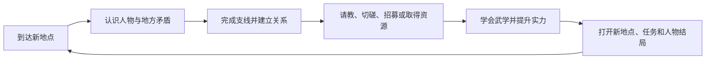

# 《逸剑风云决》设计拆解与《大曜江湖》适配参考

> 文档用途：作为后续世界、人物、武学、支线、战斗与界面设计的竞品参考，不作为剧情仿写依据。
>
> 核对日期：2026-07-15。
>
> 资料口径：优先采用官方商店页、官方公告和开发者／发行商答复；文中的“设计判断”和“适配建议”是基于这些事实做出的项目推断。

## 1. 结论先行

《逸剑风云决》最有价值的并不是某一套战斗公式，而是把传统武侠成长拆成了一条互相供给的循环：



这条循环有三个关键价值：

1. **人物就是成长入口。** 玩家想学某门武学、取得某件东西或进入某个门派，必须先认识具体的人。
2. **成长会反向推动探索。** 新武学不是收藏品，而是下一场战斗、下一片区域和下一段人物关系的通行能力。
3. **支线承担世界塑造。** 主线负责方向，支线负责让地方、门派和队友变得可信，并在部分节点反过来改变主线结果。

对《大曜江湖》最值得采用的是：

- “人物关系 → 传授／门路 → 新能力 → 立即兑现”的短循环；
- 每个地点同时拥有眼前事件、人物关系、能力收益和再访理由；
- 队友或重要人物的个人事件能改变其后续身份与主线位置；
- 武学在操作和视觉上有明确差异，而非只增加数值；
- 战斗中用血条、动作反馈、距离和敌人意图降低理解门槛。

第一版不应照搬：

- 棋盘移动与即时／回合双模式；
- 数百门武学、完整经脉盘和多武器养成；
- 锻造、裁缝、炼丹、烹饪等并列的大型制造体系；
- 单一好感条加重复送礼；
- 未预警的限时支线、隐藏前置和永久错过；
- 十余名长期队友与完整编队管理。

一句话归纳：

> **借它的江湖联动结构，不借它的内容规模和系统重量。**

---

## 2. 可核对的产品骨架

根据官方商店页和官方答复，可确认以下基础事实：

| 层面 | 官方可核对事实 | 对设计的意义 |
| --- | --- | --- |
| 主角起点 | 主角卷入争斗、濒临死亡，随后踏上求武与游历之路 | 先给个人危机，再逐步展开江湖 |
| 世界规模 | 五个地区、超过七十五个地点 | 探索依靠大量地方内容维持 |
| 战斗 | 棋盘战场；开战前可选回合制或即时模式，战斗中不能切换 | 距离、范围和站位是原作战斗的重要信息 |
| 武学 | 多种兵器、数百种武学、内外功和经脉成长 | 长期追求来自“我还能学什么” |
| 人物 | 最多可招募十四名独特江湖人物，并有关系与部分情感发展 | 人物既是剧情对象，也是队伍和成长系统 |
| 关系用途 | 送礼提高好感；部分人物还要求实力或支线条件；关系可用于请教、切磋、招募或取得物品 | 关系直接连接玩法收益 |
| 叙事 | 主线之外有大量支线，选择影响多结局 | 支线不是纯填充，而是结局变量 |
| 制造与交易 | 后续版本明确包含锻造、裁缝、炼丹、烹饪和交易 | 完整游戏使用广泛资源循环支撑长流程 |

这些事实说明，《逸剑风云决》的真正规模来自三种“广度”叠加：地点多、人物多、武学多。三者彼此交叉后，一个地点可以同时容纳任务、队友、秘籍、装备和门派入口，因此具有很强的游历感；代价则是前置关系、错过窗口、养成菜单和内容维护都会快速膨胀。

---

## 3. 世界入场：先让玩家受困，再解释江湖

### 3.1 原作采用的结构

原作不是先罗列门派、境界和江湖史，而是让低位主角先卷入一场具体冲突并濒死。玩家先理解“我很弱、有人能杀我、我必须活下来”，之后才理解更大的地方和门派秩序。

这种开局同时完成四件事：

- 给出眼前生死目标；
- 用强者表现遥远武力上限；
- 给主角离开原地、追求武学的理由；
- 允许教程以疗伤、练功、赶路和第一次战斗的形式出现。

### 3.2 对《大曜江湖》的适配

破庙开局方向正确，但必须继续坚持以下顺序：

1. 先让玩家知道自己冷、饿、弱，今晚必须找活路；
2. 再通过旅人遗物、沈氏铜钱和青衣妇人认识江湖；
3. 只有当一门武学能够解决眼前问题时，才解释心法、境界或传承；
4. 宗师、山门和朝廷只作为远景，不在首屏变成名词表。

应避免“主角命格特殊，所以世界主动发奖”。逆天改命只应让条件和代价变得可见，真正所得仍来自行动、关系和承担风险。

---

## 4. 地点设计：每个地方都应是一组相互勾连的机会

### 4.1 地点不是地图格

超过七十五个地点的价值不只是地图变大，而是让不同地方承担不同的生活、势力和成长功能。一个有效地点通常至少包含：

- 一眼能辨认的地方气质；
- 一个只会在这里发生的矛盾；
- 一名与地方利益相连的人物；
- 一项可获得的武学、门路或物品；
- 一个以后变强或关系改变后再来的理由。

这让探索形成“看见暂时做不到的事 → 记住地方 → 获得条件 → 返回兑现”的节奏。

### 4.2 《大曜江湖》的地点内容模板

后续新增地点时，每个地点至少填写：

| 字段 | 必须回答的问题 |
| --- | --- |
| 地点印象 | 玩家进入十秒内看见、听见或闻到什么？ |
| 眼前困境 | 此刻不处理会发生什么？ |
| 地方人物 | 谁在这里生活、获利或受害？ |
| 可见机会 | 玩家现在知道可能得到什么？ |
| 条件缺口 | 当前明显缺少哪项能力、关系、物品或时间？ |
| 即时所得 | 这次行动能获得什么真实变化？ |
| 两幕兑现 | 新所得会在哪两幕之内被亲手使用？ |
| 再访理由 | 以后为什么值得回来？ |
| 关闭原因 | 什么选择会令此地永久变化或关闭？ |

第一版不需要自由行走大地图。手机文字冒险可以用“地点卡＋两到四个当前行动＋一项未来机会”表达同样的探索结构。

### 4.3 当前内容的对应关系

| 当前地点 | 已有核心功能 | 后续应强化的再访价值 |
| --- | --- | --- |
| 破庙 | 生存、固定奇遇、龙青鱼、命灯、灵猴 | 让供桌贡品、灵猴水洞和旧关系随日期变化 |
| 紫金河 | 赶路、钓鱼、王五、黄金钱鳞 | 让水路、船帮和水行武学继续产生新入口 |
| 沈家丹房 | 医术、炼丹、曹青、沈家制度 | 让医术同时打开救人、查毒和利益冲突 |
| 金陵东门 | 城市危险、首次针法战斗 | 后续连接帮会、官差、药铺和夜间秩序 |

---

## 5. 任务设计：主线给方向，支线改变人和路

### 5.1 值得采用的部分

《逸剑风云决》的支线价值主要不在奖励数量，而在于它们承担了三类内容：

1. **地方故事：** 解释某座城、村、门派正在发生什么；
2. **人物故事：** 解释队友为何同行、会在何时离开或站队；
3. **主线变量：** 让提前建立的关系、完成的事件或带在身边的人改变后续场面。

当支线同时改变人物状态和主线处理方式时，玩家会觉得“游历过的江湖记得我做过什么”。

### 5.2 必须规避的风险

复杂支线最容易产生三种问题：

- 不知道任务为何没有触发；
- 不知道推进主线会永久错过什么；
- 完成了前置，却因顺序、同行人物或隐藏状态不符而无法继续。

官方补丁中曾出现主线、门派任务与支线前置互相阻塞的问题。这不是单个漏洞，而是内容依赖图过密后的典型维护风险。

### 5.3 本项目的任务状态

建议所有事件统一使用以下状态：

```text
未听闻 → 听闻 → 可介入 → 已改变 → 已解决
                         ↘ 已错过／已关闭
```

玩家不需要看见完整攻略，但必须能理解：

- 谁告诉了自己这件事；
- 现在缺什么明显条件；
- 为什么暂时不能做；
- 哪个行动可能推进时间并关闭它；
- 错过后世界发生了什么，而不是任务凭空消失。

建议在界面中把信息分为：

| 信息层级 | 展示内容 |
| --- | --- |
| 江湖传闻 | 只说明地点、人物和异常 |
| 人物挂念 | 说明谁希望玩家完成什么 |
| 眼前门槛 | 展示已经确认的能力、关系、物品或日期缺口 |
| 将逝之机 | 在不可逆推进前给出世界内预警 |
| 已成因果 | 记录已经改变、错过或关闭的结果 |

---

## 6. 人物与关系：让人既是关系对象，也是能力来源

### 6.1 原作的系统联动

官方答复确认，人物好感可以通过赠送其喜欢的物品提升，但部分人物还要求玩家达到一定实力或完成相关支线。达到条件后，人物可能开放请教、切磋、招募或物品收益；可招募人物有专门标识。

这套设计的强处是：

- 玩家看见一门想学的武学，就会主动寻找它的主人；
- 想招募某人，就会关心其个人事件；
- 想从某人取得物品，可以通过交往、切磋或帮助解决问题；
- 人物不会在交完任务文本后完全失去用途。

### 6.2 单一好感的局限

如果关系主要依靠送礼数值，会产生三个副作用：

- 人物像等待投喂的商店；
- “理解人物”退化为查喜好表；
- 重大背叛和救命之恩与普通礼物落在同一刻度上。

### 6.3 《大曜江湖》的适配

继续使用多维关系，不合并成单一好感：

| 维度 | 说明 | 可打开的内容 |
| --- | --- | --- |
| 情分 | 相处和互相照顾 | 私下对话、同行、生活帮助 |
| 信任 | 相信玩家会守约 | 秘密、托付、关键合作 |
| 人情债 | 谁欠谁一次 | 请求、引荐、替玩家承担代价 |
| 戒心 | 认为玩家有多危险 | 隐瞒、监视、试探或先发制人 |
| 立场 | 在具体利益冲突中站哪边 | 势力行动与终局选择 |

每名核心人物至少要有：

- 想从玩家这里得到的东西；
- 愿意教或给玩家的东西；
- 绝不接受的底线；
- 会在何种情况下牺牲玩家；
- 至少两种可能的后续身份。

第一版暂不做长期队伍编成。需要同行时，把NPC作为一段事件中的临时参与者：他能提供一个特殊行动，也会带来一个必须照顾的目标或限制。

---

## 7. 武学成长：学习来源比技能数量更重要

### 7.1 原作的成长层

原作把成长分散在多种兵器、主动招式、内功、经脉、技能等级、队友请教和门派传承中。其长期吸引力来自：

> 世界中到处有人掌握我还不会的东西。

这会自然形成“见到高人—建立关系—请教武学—投入资源—用新武学挑战更强内容”的长期追求。

### 7.2 海量武学的代价

数百门武学适合长流程RPG，却会带来：

- 同用途技能大量重复；
- 新玩家无法判断什么值得学；
- 低阶武学很快失去存在意义；
- 技能、经脉、装备和属性同时成长，难以判断胜负原因；
- 每次新增内容都要验证大量组合。

### 7.3 本项目的武学规格

第一版每门武学只需要证明一个新的行动规则。每门武学必须填写：

| 字段 | 设计要求 |
| --- | --- |
| 来源人物 | 为什么是这个人会教？ |
| 关系代价 | 玩家为传承付出了什么或答应了什么？ |
| 核心动作 | 它让玩家新增哪一种按钮？ |
| 适用距离 | 贴身、适中或远离中的哪一档？ |
| 属性关系 | 主要受哪一项五维影响？ |
| 首次兑现 | 学会后两幕内在哪里用？ |
| 后续成长 | 熟练后是更稳定、更深入还是改变用途？ |
| 克制与盲点 | 它明确做不到什么？ |

当前武学可以形成清楚分工：

| 武学 | 战斗／事件身份 | 不应退化成的效果 |
| --- | --- | --- |
| 鱼跃龙门诀 | 水行、闭气、换位、耐力根基 | 单纯加生命或速度 |
| 春风化雨针 | 远距精确、封穴、救人与制敌两用 | 普通远程伤害 |
| 打鱼杆法 | 控距、牵拉、借力和水边地形 | 长兵器伤害换皮 |
| 枯木桩 | 稳守、承伤、利用地面站定 | 被动加防御 |
| 定海桩 | 水边定身、行气、对抗冲力 | 枯木桩的数值升级 |

第一版不单独制作经脉树。境界、五维、功法熟练和少量永久所得已经足够表达成长；只有当至少六门武学需要共同的内力路线时，才重新评估经脉系统。

---

## 8. 战斗：借可读性，不借双模式和棋盘规模

### 8.1 原作提供的体验

棋盘让距离、范围、包围、队伍位置和招式动画可见；回合制让玩家逐步计划，即时模式则提供更快节奏。官方说明两种模式在开战前选择，战斗中不能切换。

其优点是同一批武学既能满足策略玩家，也能满足偏快节奏的玩家；缺点是每个招式、敌人和首领都要同时兼顾两种操控节奏。官方答复也承认，进入首领战时沿用所选模式会带来意外和反馈问题。

### 8.2 本项目的取舍

《大曜江湖》只保留以下信息：

- 敌人本回合意图；
- 贴身、适中、远离三档距离；
- 三至五个可选行动；
- 属性、境界、功法、优势／劣势和伤势共同形成胜算；
- 招式命中后立刻用小动画、血条或姿态变化说明结果。

不采用：

- 棋盘格和逐格移动；
- 即时战斗；
- 同时控制多人；
- 大量技能栏、冷却和叠层状态；
- 依靠长战报解释发生了什么。

### 8.3 血量与成长的界面建议

如果后续给SYS-03加入血条，不应让所有人物都拥有相同的“四格生命”。四格只能表达阶段，无法表达根骨、境界和功法带来的成长。

建议采用：

```text
气血上限 = 境界基础值 + 根骨修正 + 护体功法修正 + 永久伤病修正
```

- 用连续血条表示比例，用小数字显示当前值／上限；
- 普通招式伤害维持小数值，避免进入百位数膨胀；
- 75%、50%、25%只作为“尚稳、负伤、危殆”的表现阈值，不是固定四格；
- 境界主要抬高基础气血和承伤方式，属性与功法在同境界内拉开差异；
- 制伏、失衡、封穴、缴械和逃离仍可绕开清空血条，保留武侠战术感；
- 气血归零表示失去战斗能力，是否死亡由事件、伤势和选择决定。

这样，玩家能一眼看见成长，又不会把所有战斗退化成互相削血。

### 8.4 最小动画反馈

手机端只需少量CSS动画即可建立动作感：

| 事件 | 反馈 |
| --- | --- |
| 出手 | 人物卡向目标轻移，招式名短暂浮现 |
| 命中 | 目标卡轻震，血条平滑减少 |
| 闪避 | 目标横移，显示“避开”而非减血 |
| 封穴／缴械 | 对应状态图标落到目标卡上 |
| 重伤 | 画面压暗、呼吸变慢、按钮风险文案变化 |
| 胜负 | 停止抖动与闪烁，先给结果，再给战后选择 |

动画用于解释结果，不延迟玩家操作，也不替代文字。

---

## 9. 制造、物品和经济：只保留能制造事件的部分

原作的锻造、裁缝、炼丹、烹饪和交易适合长流程，因为大量地点能持续提供材料、商人、配方和装备替换。但对当前项目而言，同时制作这些系统会让资源收集和菜单管理压过人物与奇遇。

第一版只保留医术、炼丹、毒物和关键物品，因为它们能够直接产生：

- 病例推理；
- 救人与杀人的道德压力；
- 药材取得路线；
- 世家和药王谷关系；
- 战前准备与战后伤势；
- 可被敌人利用的制度和渠道。

普通材料不应为了“合成循环”存在。每种药材至少要连接一个病例、一个人物或一个取得风险。武器和衣物第一版以事件所得、人物赠予和店铺购买为主，不制作独立锻造与裁缝树。

---

## 10. 视觉呈现：用地方气质和动作反馈支撑文字

原作把像素人物放进具有景深、光影和天气效果的三维场景中。其核心价值不是“像素”本身，而是：

- 不同地方一眼可辨；
- 角色在场景中真正行动；
- 武学结果通过移动、范围和特效被看见；
- 古典武侠题材拥有现代的视觉阅读效率。

《大曜江湖》不必复制美术形式，可以用代码原生方式取得相同作用：

- 每个地点有独立色温、纹理、前景物和环境声描述；
- 人物卡有位置、距离、伤势和关系变化；
- 奇遇条件板与普通叙事卡在颜色和边框上明确区分；
- 战斗用人物卡位移、招式字、血条和状态图标；
- 一屏只突出一个当前问题，避免世界设定、日志、背包和战斗同时抢占视线。

视觉投入顺序应为：信息层级 → 战斗反馈 → 地点辨识 → 人物肖像 → 装饰特效。

---

## 11. 教学与节奏：系统必须在出现时立刻有用

《逸剑风云决》的大系统规模说明了一条反向原则：系统越多，越不能一次解释。

《大曜江湖》后续仍应遵守：

1. 首次出现一种资源时，当前就有一个可支付对象；
2. 首次学会武学时，两幕内必须亲手使用；
3. 首次出现关系门槛时，玩家能看见怎样改变关系；
4. 首次出现时间窗口时，玩家能预见推进时间的代价；
5. 首次出现境界差时，必须用敌人行为展示，而不只是红色数字；
6. 首次战斗先教意图和一个行动，不同时教距离、状态、物品和同伴。

推荐的内容节拍是：

```text
看见困境 → 做一次普通尝试 → 发现条件缺口 → 认识掌握条件的人
→ 支付代价取得能力 → 立刻用能力改变原本做不到的结果 → 留下再访钩子
```

---

## 12. 采用、改造与舍弃清单

| 竞品设计 | 判断 | 《大曜江湖》的处理 |
| --- | --- | --- |
| 低位主角遭逢生死事件 | 采用 | 保持破庙求生先于世界名词 |
| 多地点江湖游历 | 改造 | 使用地点卡和路线节点，不做自由大地图 |
| 人物好感连接请教、切磋、招募 | 采用核心 | 改为情分、信任、人情债、戒心和立场 |
| 送礼提升关系 | 限制采用 | 只作辅助，重大关系必须来自事件选择 |
| 队友个人支线 | 延后采用 | 先做事件内临时同行，再做长期队伍 |
| 支线改变主线和结局 | 采用 | 事件结果写回人物和势力状态 |
| 数百门武学 | 舍弃规模 | 每门武学必须新增行动规则并立即兑现 |
| 内功、招式、身法分工 | 简化采用 | 一门根基、少量常用招式和特殊行动 |
| 经脉盘 | 暂不采用 | 先用境界、五维与熟练度表达成长 |
| 棋盘距离与范围 | 抽象采用 | 只留贴身、适中、远离三档 |
| 回合／即时双模式 | 舍弃 | 只做可读的短回合战斗 |
| 血条与招式动画 | 采用 | 小数值连续血条＋短动画＋状态变化 |
| 多制造职业 | 舍弃 | 只保留病例驱动的医药、炼丹与毒物 |
| 隐藏限时支线 | 改造 | 保留未知结果，但展示窗口与关闭风险 |
| 图鉴与剧情回顾 | 延后采用 | 先做“已成因果”和人物关系回照 |

---

## 13. 对现有八个系统文档的直接影响

| 系统 | 可吸收的设计 | 明确不增加的内容 |
| --- | --- | --- |
| SYS-01 叙事事件与奇遇 | 任务状态、将逝之机、地点再访钩子、支线写回主线 | 隐藏到必须查攻略的触发顺序 |
| SYS-02 人物成长与武学 | 来源人物、关系代价、首次兑现、武学职责 | 经脉树和海量同质武学 |
| SYS-03 战斗伤势与死亡 | 血条、距离、动作动画、队友临时行动 | 棋盘、即时模式、多人微操 |
| SYS-04 医药炼丹与经济 | 病例驱动材料、人物渠道、配方后果 | 锻造、裁缝、烹饪全套生产链 |
| SYS-05 关系势力与身份 | 关系解锁请教、切磋、门路和同行 | 单一好感条与重复送礼刷取 |
| SYS-06 世界时间与调查 | 地点职责、路线记忆、窗口预警、返回理由 | 为地图规模而堆积空节点 |
| SYS-07 界面存档与质保 | 一屏一问、任务关闭预警、血条与动作反馈 | 同屏堆放完整日志和系统面板 |
| SYS-08 内容生产与校验 | 自动检查前置、关闭原因、武学首次兑现和回流节点 | 只检查能否跳转而不检查设计闭环 |

---

## 14. 后续内容的标准制作单元

每一段新剧情建议以一个“江湖闭环单元”制作，而不是按纯文本章节制作。

一个合格单元应包含：

1. 一个具有地方特征的场景；
2. 一个玩家立即能理解的困境；
3. 一名有自身利益的人物；
4. 至少两种真实后果，其中一种可以错过或失败；
5. 一项能力、关系、物品或情报收益；
6. 新所得在两幕内的首次兑现；
7. 一项被写入长期状态的变化；
8. 一个未来返回或继续追查的理由。

制作验收问题：

- 玩家十秒内能说出现在要解决什么吗？
- 玩家能说出为什么这个人不肯帮自己吗？
- 得到新武学后，是否很快出现只有它能改善的行动？
- 错过事件前，是否有世界内的可理解预警？
- 战斗不看长战报，是否也能看出谁占优势、为何受伤？
- 这个地点以后是否还有至少一个不同条件下的返回理由？
- 删除数值奖励后，这段剧情是否仍然值得玩？

若其中三项答不上来，说明这段内容仍更像文字章节，还没有完成游戏化。

---

## 15. 建议的落地顺序

### A级：下一轮就应使用

1. 为新增地点补齐“人物、能力、再访理由”三项；
2. 为事件加入“将逝之机”和明确关闭原因；
3. 为每门新武学记录来源、代价和两幕内首次兑现；
4. 战斗界面加入连续血条、小数字和最小动作反馈；
5. 让重要关系同时改变可请教内容、同行行动或势力门路。

### B级：完成三个稳定篇章后

1. 临时同行人物；
2. 人物个人事件对主线的回写；
3. 地点传闻、人物挂念和已成因果的统一界面；
4. 少量武学装配与互斥选择；
5. 城市、帮会和世家的长期权限。

### C级：长期再评估

1. 长期队伍编成；
2. 门派加入与退出；
3. 经脉或内力路线；
4. 更完整的武器装备成长；
5. 图鉴、剧情回顾和多结局继承。

---

## 16. 资料来源

以下来源用于核对产品事实，不代表本项目采纳其全部设计：

1. [《逸剑风云决》Steam官方商店页](https://store.steampowered.com/app/1876890/Wandering_Sword/)：主角前提、地点规模、战斗模式、武学、队友、支线与多结局。
2. [发行商关于回合制与即时模式的答复](https://steamcommunity.com/app/1876890/discussions/0/7008219766202148253/)：两种模式及开战前切换规则。
3. [发行商关于即时模式和首领战体验的答复](https://steamcommunity.com/app/1876890/discussions/0/7008219766198366175/)：模式节奏、同伴战斗与不能战中切换。
4. [开发者／发行商关于人物好感条件的答复](https://steamcommunity.com/app/1876890/discussions/0/7008219766198707538/)：送礼、实力和支线前置。
5. [发行商关于请教、切磋、招募和物品收益的答复](https://steamcommunity.com/app/1876890/discussions/0/7008219766203560405/)：人物关系的系统用途。
6. [开发者关于武学学习与角色定制的答复](https://steamcommunity.com/app/1876890/discussions/0/7008219766203425233/)：主角学习限制、队友与门派传承。
7. [官方更新汇总](https://steamcommunity.com/app/1876890/allnews/)：技能等级、招式说明、制造分类、任务前置与后续维护情况。

本文不复制游戏剧情文本、人物台词或具体任务攻略。对《大曜江湖》的建议均是系统层改造，不使用《逸剑风云决》的角色、门派、武学名称或剧情事件。
