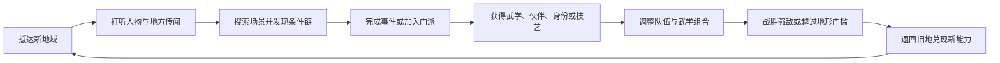

# 《烟雨江湖》系统设计拆解与《大曜江湖》适配参考

> 文档用途：作为后续地域探索、门派师承、武学成长、伙伴、战斗、生活技艺和长线内容设计的竞品参考，不作为剧情仿写依据。
> 核对日期：2026-07-15。
> 资料口径：产品定位和当前运营状态优先采用官方商店页与官方活动页；详细规则采用近期维护的社区 Wiki 和攻略交叉核对。文中的“设计判断”与“项目建议”是基于这些事实作出的分析。

## 1. 结论先行

《烟雨江湖》最值得借鉴的，不是武学、地图或养成项目的数量，而是它把武侠 RPG 的大部分系统都挂回了“游历江湖”这一件事：



这套循环有五个核心价值：

1. **地图承载故事，而不是只承载移动。** 一个坐标可以同时是人物、任务、资源、隐秘入口和未来回访点。
2. **武学同时服务战斗与探索。** 套路、内功、轻功分工明确，其中轻功可以真实改变地图通行能力。
3. **门派是一条制度化成长路线。** 师父、身份、任务、贡献和传承把“拜师学艺”变成长期过程。
4. **伙伴是另一套人物成长。** 出身、天赋、资质、站位和武学选择共同决定其队伍职责。
5. **支线承担江湖密度。** 主线负责远方目标，支线让每个地方拥有恩怨、秘密、代价和可回流的人物。

对《大曜江湖》最值得采用的是：

- “传闻 → 地点 → 搜索／打听 → 条件链 → 所得 → 旧地回流”的地域事件循环；
- 套路、内功、轻功各自回答不同问题，而不是所有武学都只加伤害；
- 门派身份同时带来师承、权限、责任和退出代价；
- 四人队伍的前后职责、阵位和伙伴特性，但压缩成手机上可读的战斗信息；
- 医、毒、丹、钓、烹等技艺直接服务事件、旅行与战斗；
- 新地域持续复用已有规则和人物关系，而不是每章另造一套玩法。

第一版不应照搬：

- 每日门派任务和长期贡献刷取；
- 武学重数、境界、修为、资质、经脉、天赋、秘技、装备词条同时叠加；
- 大量固定坐标、隐蔽时辰和前置顺序迫使玩家查攻略；
- 随机装备词条、精炼、洗脉与重复刷取；
- 付费伙伴、限时返场、体力恢复和现实时间等待；
- 为了“千本武学”而制作大量只换数值的同质技能。

一句话归纳：

> **借《烟雨江湖》把整个江湖连成成长网络的能力，不借它在长线运营中累积起来的刷取和数值层。**

---

## 2. 产品定位：内容型单机体验与长线运营的结合

官方商店页将《烟雨江湖》描述为沉浸式单机武侠 RPG，同时强调大地图探索、主支线、隐藏内容、武学、门派、技艺、伙伴与阵型；当前版本又持续新增地图、伙伴、首领、活动和便利功能，并包含应用内购买。

因此，它的实际结构并非传统意义上的一次性买断单机，而是：

```text
单人剧情与探索体验
+ 长期扩充的地域、武学、伙伴和首领
+ 日常任务、体力、等待和资源回收
+ 付费角色与便利性内容
= 长线运营型单人武侠 RPG
```

这个定位解释了它为什么同时拥有两种看似矛盾的特征：

- 一方面，玩家能安静地探索地图、读剧情、做支线，获得传统单机武侠感；
- 另一方面，门派贡献、武学突破、经脉、装备、伙伴培养和限时活动又要求长期投入。

《大曜江湖》应只吸收前者的内容结构与后者的可扩展架构，不承接现实时间留存和商业化压力。

---

## 3. 核心循环：从“去哪里”自然过渡到“我会什么”

### 3.1 短循环：一个地点内的行动

```text
进入地点
→ 看见人物、建筑、物品或异常
→ 对话、打听、搜索、给予、等待或战斗
→ 获得见闻、道具、关系变化或新入口
→ 回到地点继续验证
```

短循环的重点是“动作具有对象”。玩家不是点抽象的“推进剧情”，而是在具体地点对具体人物或物品做事。

### 3.2 中循环：一条地域支线

```text
听见传闻
→ 在多个地点核对
→ 准备物品、时辰、技艺或实力
→ 进入隐藏场景
→ 作出人物选择
→ 获得武学、身份、伙伴或长期后果
```

优秀支线会同时改变三层状态：

- **眼前结果**：谁活、谁走、得到什么；
- **地点状态**：某处开放、关闭、换人或出现新功能；
- **长期回流**：人物好感、后续支线、商店、武学或主线对白变化。

### 3.3 长循环：角色成长与更大世界

```text
完成地域内容
→ 获得阅历、武学和资源
→ 调整主角及伙伴职责
→ 通过门派、势力或隐士取得更深传承
→ 攻克新首领与地域门槛
→ 进入下一片江湖
```

它的长线驱动力不是单纯升级，而是“还有地方没去、还有人没懂、还有武学没学、还有组合没成形”。

### 3.4 对本项目的判断

《大曜江湖》已有破庙、紫金河、沈家丹房和灵猴水洞，地点数量不多，但已经具备一条清晰回流链。后续应优先增加地点之间的横向联系，而不是继续只向结尾追加场景：

- 破庙贡品应在漕帮、猴群或沈家事件中产生后续解释；
- 紫金河应继续连接船帮、药材、水路追踪和水行武学；
- 沈家丹房应让医术、毒术、身份权限反向开启城内事件；
- 灵猴水洞应在获得新轻功、酒艺或兽类见闻后可再次深入。

---

## 4. 地图与探索：坐标只是表面，真正产品是“可操作地点网”

### 4.1 原作的地图语法

《烟雨江湖》的地域通常由格点、建筑、NPC、资源点、山洞和出口组成。玩家通过移动和场景交互发现内容，常见动作包括：

- 与人物对话并选择打听主题；
- 在特定格点搜索、挖掘、查看或触发剧情；
- 使用轻功跨水、越墙、登高或抵达隐藏区域；
- 在某个时辰、天气或前置完成后再次来访；
- 携带指定物品开启机关、换取信息或完成委托；
- 从当前地图进入洞窟、塔楼、密道等子区域。

地图因而承担了四个功能：

| 功能 | 玩家感受 | 系统意义 |
| --- | --- | --- |
| 定位 | 我知道自己在江南、雪山还是大漠 | 建立地域差异 |
| 搜索 | 这块石壁、井口或屋顶可能有东西 | 形成主动观察 |
| 门槛 | 我现在过不去，以后学轻功再来 | 制造能力回流 |
| 记忆 | 某个人和某段恩怨只属于这里 | 让地点拥有情感 |

### 4.2 最成功的设计：轻功真实改变地图

官方介绍专门强调“水上漂真实可见”，社区资料也显示轻功同时影响战斗速度、闪避、移动与地图通行。这是一种高价值的能力兑现：

```text
得到轻功秘籍
→ 修炼
→ 地图上的水面／高墙从阻挡变为路线
→ 进入新地点
→ 获得事件与奖励
```

玩家不是在面板里看到“移动力 +10%”，而是亲手走到此前到不了的地方。

### 4.3 坐标探索的代价

当地图、前置和时辰持续增加后，会产生明显问题：

- 无法区分“尚未满足条件”和“此处什么也没有”；
- 关键内容藏在缺乏场景暗示的固定坐标；
- 玩家必须逐格搜索或查攻略；
- 地图增大后，来回跑腿挤占人物和决策时间；
- 手机小屏幕上，坐标记忆和精细移动不一定带来更强代入感。

### 4.4 《大曜江湖》的适配方式

不制作自由行走格点图，而使用“地域卡 → 地点卡 → 可操作对象”的三级结构：

```text
金陵东郊
├─ 破庙：供桌、火堆、神像、后墙、水迹
├─ 紫金河：渡口、浅滩、芦苇荡、旧桩
└─ 沈家：前院、丹房、药房、议事厅、偏门
```

每个地点卡必须回答：

1. 玩家十秒内看见、听见或闻到什么；
2. 当前可操作的两到五个对象是什么；
3. 哪项异常提示了隐藏内容；
4. 当前缺失的条件是否可以被理解；
5. 获得新能力后为什么值得回来；
6. 哪个选择会永久改变这里。

---

## 5. 任务与奇遇：自由来自条件网，不来自无限分支

### 5.1 任务的基础结构

《烟雨江湖》的事件常由多种条件组合触发：

```text
主线或支线前置
+ 地点
+ NPC 对话主题
+ 物品
+ 时辰／天气／等待
+ 战斗或技艺门槛
+ 过去选择
= 当前可见行动
```

这比“等级到达后领取任务”更像江湖：玩家需要知道该问谁、去哪里、带什么、等到何时。

### 5.2 选择的三种层级

| 层级 | 作用 | 常见结果 |
| --- | --- | --- |
| 表达选择 | 定义主角态度 | 对话变化、少量关系变化 |
| 路线选择 | 改变解决步骤 | 战斗、追查、交付对象不同 |
| 因果选择 | 改变人物与世界状态 | 人物生死、后续关系、奖励、地点权限不同 |

原作并非每个选项都会生成全新剧情线。它的“高自由度”更多来自大量可并行内容与不同进入顺序，而非单条任务拥有无限解法。这一点对控制制作规模非常重要。

### 5.3 优点

- 任务与地点、人物、物品和技艺相互咬合；
- 搜索和打听使发现过程具有参与感；
- 一些旧选择会在很久之后改变人物结局或地点状态；
- 支线可以传授武学、开放势力、招募伙伴，不只是发钱；
- 地域故事能独立成立，也能向主线回流。

### 5.4 风险

- 条件过密后，“秘密”会退化成“隐藏触发器”；
- 缺少提示时，失败不是推理错误，而是没点对坐标；
- 现实时间等待容易打断剧情情绪；
- 永久错过若无预警，会鼓励玩家在每个选项前查攻略；
- 奖励差距过大时，角色扮演选择会退化为唯一正确答案。

### 5.5 本项目的事件状态

建议统一采用：

```text
未听闻 → 已听闻 → 已定位 → 可介入 → 已改变 → 已解决
                                 ↘ 已错过／已关闭
```

玩家不需要提前看见全部答案，但必须能理解：

- 线索从哪里来；
- 当前缺少哪类条件；
- 什么行动会推进时间；
- 错过后世界发生什么；
- 学到的新能力在哪一幕能够兑现。

---

## 6. 人物成长：深度来自多层交叉，也最容易失控

### 6.1 原作主要成长层

根据社区规则资料，角色成长至少涉及：

| 层级 | 主要作用 |
| --- | --- |
| 等级与基础属性 | 决定基础战斗数值和可用属性点 |
| 臂力、身法、根骨、内息 | 影响攻击、速度、气血、真元及招式效果 |
| 武学资质 | 影响拳脚、剑、刀、枪棍、轻功、内功修为收益 |
| 角色资质 | 通过培养提高属性成长并关联天赋槽 |
| 先天与后天天赋 | 提供角色独特机制和长期加成 |
| 套路、内功、轻功 | 当前装备的三项核心武学 |
| 武学修为 | 提高当前对应武学的属性影响并作为学习门槛 |
| 经脉 | 提供属性、聚气、真元、免伤等长期加成 |
| 秘技 | 额外的规则或数值补强 |
| 装备与词条 | 提供基础属性、附加属性和特殊效果 |

### 6.2 深度的来源

多层系统带来的正面价值是“同一名伙伴可以被培养成不同职责”。例如，一个前排不只由高血量决定，还可能来自：

- 根骨和韧性；
- 偏防守的内功；
- 招架型套路；
- 前排阵位加成；
- 经脉免伤；
- 伙伴天赋；
- 装备和秘技。

这使培养具有长期规划感，而不是等级越高自动变强。

### 6.3 叠层的代价

当九层成长同时存在时，玩家很难回答“我为什么打不过”：

- 是等级不足；
- 属性加错；
- 武学不合适；
- 修为过低；
- 经脉没开；
- 真元不足；
- 阵位不对；
- 装备词条不好；
- 还是伙伴本身资质不适合。

这会把培养从“理解人物和武学”变成“对照攻略补齐隐形及格线”。

### 6.4 《大曜江湖》的成长预算

第一版只保留五个长期层级：

1. 五维属性；
2. 武道境界；
3. 当前武学及熟练度；
4. 少量规则型特质；
5. 伤势、物品与关系等情境状态。

原则是：新增一层成长前，必须证明现有层无法表达，而且玩家能在一次失败后明确判断该补哪一层。

---

## 7. 武学体系：套路、内功、轻功各司其职

### 7.1 原作的三件套

社区 Wiki 将主要武学分为三类：

| 武学类别 | 战斗职责 | 世界职责 |
| --- | --- | --- |
| 套路 | 攻击、招架、主动与被动招式；按刀、剑、拳脚、枪棍区分 | 决定战斗动作与兵器身份 |
| 内功 | 气血、聚气、真元、恢复及特殊运气效果 | 支撑疗伤、耐力和特殊修炼 |
| 轻功 | 速度、闪避和移动 | 越水、登高、进入隐藏地点 |

秘技则位于三件套之外，用于补充门派知识、身体能力或特殊规则。

### 7.2 为什么这个拆分有效

它让玩家的武学搭配回答三个直观问题：

```text
我怎样打人？       → 套路
我怎样运气和活下来？ → 内功
我怎样移动和避开？   → 轻功
```

三个位置彼此联动，却不会完全互相替代。一套高伤套路如果没有合适内功，可能缺少释放节奏和续航；优秀轻功既改变出手与闪避，也能打开地图路线。

### 7.3 品阶、重数与修为

原作还通过品阶、十重修炼、每重境界、阅历消耗、突破等待和对应武学修为建立长期成长。它的优点是：

- 同一本秘籍不是读完就毕业；
- 武学招式随修炼逐步解锁；
- 长期使用某类兵器会积累该类修为；
- 高阶武学要求前置积累，形成师承阶梯。

问题是成长反馈被拆得过细：阅历、境界、重数、突破时间和修为可能同时上升，但单次提升不一定改变玩家行动。

### 7.4 《大曜江湖》的简化规格

每名角色最多同时确定：

- **一门根本法**：决定运气方式、资源和被动反应；
- **两到四个招式**：当前可主动使用的战斗动作；
- **一项身法**：决定换位、脱离与地图通行；
- **零到两项技艺／秘传**：只保留能够改变事件规则的知识。

武学成长统一为三段：

| 阶段 | 玩家获得的变化 |
| --- | --- |
| 入门 | 获得一个新行动 |
| 熟练 | 行动更稳定、代价更低或适用场景更广 |
| 贯通 | 改变用法，并与另一门武学或环境产生联动 |

不制作十重和三十层小节点。每次提升必须让按钮、战斗节奏、路线或事件结果发生可见变化。

---

## 8. 师承与门派：成长、身份、制度和代价的统一入口

### 8.1 原作门派循环

```text
满足入门条件
→ 拜入门派
→ 完成门派任务取得贡献
→ 学习当前层级武学和秘技
→ 修炼并挑战／出师
→ 拜更高层师父
→ 获得更深传承、设施和身份
```

门派任务数量和贡献收益会随弟子层级变化；武学、师父、出师条件、门派商店和特殊设施共同组成成长主轴。玩家也可能离开门派再拜别派，但会承担贡献损失、冷却或关系后果。

### 8.2 它为什么比普通技能树更有武侠味

普通技能树只说“点数够了”。门派系统则把能力放回人和制度：

- 谁愿意教；
- 你在门中是什么身份；
- 你为门派做过什么；
- 哪位师父承认你；
- 学习后要承担什么责任；
- 离开会失去什么。

能力来源因此有故事记忆。

### 8.3 日常贡献的问题

重复门派任务可以稳定控制传承速度，但也会导致：

- 玩家为贡献重复做缺乏新决策的小差事；
- 现实天数取代角色行为成为主要门槛；
- 高阶传承的兴奋被长期打卡稀释；
- “忠于门派”退化为完成次数；
- 更换门派容易变成效率规划，而非立场选择。

### 8.4 本项目的门派方案

以“关键职责”替代每日贡献：

| 身份阶段 | 需要证明的事 | 获得的权限 | 新增责任 |
| --- | --- | --- | --- |
| 门外求学 | 有资格活下来并守规矩 | 旁听、基础差事 | 不泄露所见 |
| 记名弟子 | 完成一次真实委托 | 基础传承、住处 | 接受召回 |
| 入室弟子 | 在利益冲突中作出选择 | 核心技法、档案 | 代表师门承担后果 |
| 执事／传人 | 处理一场制度危机 | 调度人手、资源和名义 | 决定他人命运 |

晋升不要求做十次同类任务，而要求完成一件能证明身份的事件。判门不是等待冷却，而是师父、旧友、追索、秘籍正当性和新门派信任共同变化。

---

## 9. 势力系统：门派之外的利益网络

门派解决“我向谁学武”，地方势力解决“谁允许我在这里做事”。《烟雨江湖》的官府、帮会、隐秘组织和地方小势力通常通过任务、好感、商店、武学、伙伴或阵法提供长期回报。

它的价值在于让身份形成交叉：

```text
门派身份：我是谁的弟子
势力身份：谁把我当自己人
地域身份：当地人记得我做过什么
人物关系：具体的人是否愿意帮我
```

《大曜江湖》应避免把这些合并成单一“声望”。建议继续使用多维关系，并为势力增加三个明确字段：

- 当前许可：能进入哪里、查什么、调用谁；
- 当前义务：下次危机中必须回应什么；
- 当前风险：敌对势力如何识别和针对玩家。

---

## 10. 伙伴系统：人物身份与战斗职责互相证明

### 10.1 原作伙伴的构成

官方介绍强调伙伴来自不同出身，通过事件结交，拥有各自天赋，并能配合阵型上阵。社区资料显示，伙伴还存在固定武学资质、角色资质、属性加点和武器适性。

因此一名伙伴通常由四层构成：

1. **剧情身份**：为什么同行；
2. **先天天赋**：与别人不同的机制；
3. **培养倾向**：适合前排、输出、控制、治疗或特殊用途；
4. **可配置武学**：玩家怎样进一步塑造其职责。

### 10.2 正面价值

- 招募事件让获得新战斗单位具有故事重量；
- 不同资质和天赋形成角色轮廓；
- 同一门武学交给不同伙伴会产生不同价值；
- 队伍构成促使玩家关心敌人机制和站位；
- 伙伴成长可以反向推动其个人事件。

### 10.3 风险

- 伙伴强度和稀有度可能压过人物喜好；
- 付费或限时伙伴造成错过压力；
- 培养资源不可逆时，试错成本过高；
- 阵容位置有限，旧伙伴容易永久坐冷板凳；
- 大量同质伙伴会把人物变成数值容器。

### 10.4 本项目的适配

第一版不制作长期自由编队，但可以先采用“事件同行者”：

```text
人物目标
+ 一项战斗专长
+ 一项场景行动
+ 一项必须照顾的限制
+ 一个可能离队或背叛的条件
```

例如龙青鱼同行时，不只是增加伤害；她可以识别漕帮暗号、让部分水路开放，但也会被漕帮耳目认出，并坚持处理自己的旧债。这样人物在战斗、探索与剧情中保持同一身份。

正式四人队伍应等至少三名长期伙伴都有完整个人事件后再启用，避免先做空壳编队界面。

---

## 11. 战斗系统：战前搭配重于回合内按钮数量

### 11.1 可核对的战斗骨架

《烟雨江湖》采用回合制队伍战斗。社区规则显示：

- 常见队伍以四名角色上阵；
- 阵法把角色安排到不同前后位置并提供位置效果；
- 普通攻击的顺序受速度影响；
- 套路提供主动和被动招式；
- 真元决定开局内力，聚气在战斗中恢复内力；
- 主动招式消耗内力点；
- 命中、闪避、招架、破招架、破闪避、韧性和状态构成攻防关系；
- 内功、轻功、阵法、伙伴天赋和装备共同改变战斗表现。

### 11.2 主要策略发生在哪里

原作的主要策略并不全在每回合选技能，而集中在战前：

```text
选择四名角色
→ 决定前排与后排
→ 配置套路、内功、轻功
→ 选择阵法和阵位
→ 确保真元与聚气节奏
→ 针对首领机制调整输出、承伤和控制
```

回合内的核心问题则相对集中：什么时候攒够内力、什么时候开主动招式、谁先倒下、哪一条阵线被打穿。

### 11.3 优点

- 四人队伍足以形成承伤、输出、控制与支援分工；
- 阵位使“站哪里”比纯面板战力更有意义；
- 内力条让强招释放时机可见；
- 招架、闪避和状态能表现不同武学风格；
- 首领机制可以迫使玩家换阵容而非只堆攻击。

### 11.4 风险

- 战斗结果受太多战外系统共同影响；
- 概率招架、闪避、连击和状态可能让败因不清楚；
- 阵法效果大量使用小百分比时难以形成直观决策；
- 自动普通攻击削弱逐回合控制感；
- 后期首领若依赖隐形数值线，会鼓励照抄阵容。

### 11.5 对当前战斗系统的直接启示

当前《大曜江湖》应吸收四点：

1. **战前准备必须可见。** 境界、属性、根本法、招式和伤势要明确进入战斗结算。
2. **位置只保留前／后与目标关系。** 不制作九宫格拖动，使用“贴身、适中、远离”及前后排标签即可。
3. **招式资源统一。** 继续使用一条可见内息／架势资源，不另加真元、聚气和怒气三套条。
4. **首领机制用意图表达。** 玩家应能看见下一步是蓄力、封穴、突进还是攻击同伴，再选择对应行动。

战斗后必须解释：

- 属性和境界分别贡献了什么；
- 哪门武学改变了行动；
- 敌人意图是否被打断；
- 哪个伤势或状态造成失败；
- 如果重试，最直接可改变的一件事是什么。

---

## 12. 阵法与站位：用空间制造职责，而不是制造拖动操作

《烟雨江湖》的阵法会为特定前后位置提供防御、攻击、聚气、速度、命中或协同效果；部分阵法还要求特定门派武学、阵眼或完整人数。

它真正有价值的不是“每格加百分之几”，而是三种结构：

1. **保护关系**：前排替后排承担风险；
2. **阵眼关系**：关键人物存活时全队规则成立；
3. **协同关系**：一人出招为另一人积累收益。

本项目可以把阵法压缩为战斗关系卡：

| 阵势 | 可见规则 | 破阵方式 |
| --- | --- | --- |
| 护心 | 前位替后位承受第一次贴身攻击 | 击退前位或绕后 |
| 引潮 | 后位施术后，前位下次换位不耗架势 | 封住后位运气 |
| 断尾 | 一人撤退时另一人立即反击 | 同时压迫两人 |
| 困兽 | 阵眼存活时敌人无法安全脱离 | 制伏阵眼或破坏地形 |

每个阵势最多一条主规则和一条破法。玩家应能看懂“为什么有效”和“怎样拆”，不应只看到战力上涨。

---

## 13. 装备、经脉与秘技：丰富构筑的代价是败因模糊

### 13.1 装备

原作装备包含基础属性、附加词条和特殊效果，并有打造、材料、精炼或随机序列等长期追求。它让玩家不断寻找提升，但也带来：

- 同名装备品质差异难以叙事化；
- 随机词条把成长变成资源消耗和概率优化；
- 低级装备快速淘汰，物品缺少故事记忆；
- 玩家需要外部表格判断词条价值。

《大曜江湖》只采用命名装备和规则效果：

```text
沈字铜钱：证明门路，开启沈家入场
打鱼杆：水边战斗可牵拉目标
春风针：远距封穴，也可用于救治
回春丹：稳定恢复并处理特定伤势
```

物品首先是世界中的东西，其次才是数值载体。

### 13.2 经脉

经脉能很好地表达武侠身体成长，也可以支持正逆路线、聚气、真元和属性差异。但在原作的多层成长中，经脉更多成为长期数值底盘。

本项目暂不制作经脉树。若未来加入，只允许三到五个具有身体后果的关键节点，例如：

- 强开手太阴：针法更快，但旧伤遇寒发作；
- 逆行气海：可在濒死时再出一招，但战后必留内伤；
- 通水分脉：水中运气稳定，燥地恢复变慢。

### 13.3 秘技

秘技最适合承载“会了以后看世界不同”的知识：识毒、听声、辨骨、阵理、暗号、易容。若只提供属性百分比，则与装备和经脉重复。

---

## 14. 生活技艺：把江湖职业变成解决问题的方法

官方页面列举了钓鱼、酒艺、炼丹、庖丁、锻造等日常技艺；社区资料还显示烹饪可提供体力，炼丹可制作治疗或培养用品，钓鱼既能换钱也能提供食材。

### 14.1 原作的资源循环

```text
采集／购买材料
→ 学习与提升技艺
→ 制作食物、丹药、装备或任务物品
→ 恢复体力、提高战力或完成事件
→ 进入更难地点取得更稀有材料
```

### 14.2 最值得借鉴的部分

- 技艺由具体人物和地点传授；
- 同一资源可以连接赚钱、任务和战斗准备；
- 非战斗成长提供另一种角色身份；
- 医、毒、丹、烹与武侠世界自然相容；
- 技艺可以成为支线入口，而非菜单小游戏。

### 14.3 最需要舍弃的部分

- 重复读书、制作或采集只为刷等级；
- 技艺很多但大部分仅提供一次性门槛；
- 玩家必须先看攻略才知道哪项值得学；
- 为恢复体力而做饭，最终变成战斗次数兑换；
- 每项技艺都拥有独立等级和材料表。

### 14.4 本项目的技艺规则

每项技艺必须至少连接三个场景：

| 技艺 | 调查用途 | 生存／经济用途 | 危机用途 |
| --- | --- | --- | --- |
| 医术 | 判断伤势与病因 | 处理旧伤、换取信任 | 在倒计时内救人 |
| 炼丹 | 识别药序和火候 | 制作有限药物 | 改变毒发或突破结果 |
| 钓术 | 识水流和鱼情 | 取得食材与河上门路 | 使用杆法牵拉敌人 |
| 酒艺 | 辨酒、套话 | 进入酒宴与帮会关系 | 识破药酒或影响心境 |
| 锻造 | 看兵器损伤 | 修复具名装备 | 改造现场机关或破阵 |

技艺采用“入门／熟练／精通”三段，不单独刷数百级。升级来自新情境中的成功实践，而不是重复按钮。

---

## 15. 资源、体力与等待：长线节奏工具也是沉浸风险

《烟雨江湖》通过体力、阅历、银两、门派贡献、真气、材料、武学突破时间等资源控制成长速度。当前官方更新还专门降低了传功成本、增加离线读书并下调部分主线难度，说明长线系统累积后，减负本身会成为持续维护工作。

### 15.1 这些限制解决了什么

- 控制玩家一天内刷怪和获取资源的速度；
- 让门派传承和武学修炼具有时间感；
- 让食物、丹药、银两和技艺持续有用；
- 延长版本内容寿命；
- 为付费便利提供空间。

### 15.2 它们损伤了什么

- 角色“苦练三月”可能表现为玩家现实等待；
- 重复劳动成为必经门槛；
- 失败不再只是策略问题，还可能浪费体力；
- 玩家倾向于存资源、查最优路线，不敢自由试验；
- 故事高潮会被日常资源卡住。

### 15.3 本项目的处理

只使用故事内时间和明确机会成本：

- 每个行动消耗时段、体力、饱腹或具体材料；
- 掌握后的安全劳动允许快速结算；
- 等待必须让人物、地点或事件状态发生变化；
- 失败后的重试不要求现实等待；
- 关键剧情不被每日次数阻断；
- 不引入充值货币、会员加成或体力购买。

限制玩家的应该是“这一日先救谁、学什么、错过什么”，而不是“今天的次数用完了”。

---

## 16. 叙事方法：用地方恩怨建立江湖，不先讲天下设定

《烟雨江湖》的江湖感主要来自：

- 一个地域拥有自己的天气、生活、帮会、门派和隐患；
- NPC 对话可以打听不同主题；
- 任务经常跨越客栈、药铺、民居、山洞和官府；
- 大人物通过传闻、弟子、遗物和后果逐步出现；
- 武学和物品有明确来源；
- 过去选择可能改变后来的人物状态。

这与当前项目“先世界观、人物车卡、眼前困境，再逐步出现名词”的规则一致。最值得坚持的叙事顺序是：

```text
先看见一个具体的人有麻烦
→ 再知道这件事牵涉一个地方组织
→ 再发现组织背后的制度和利益
→ 最后才理解更大的江湖格局
```

必须避免的则是：

- 把人物当成武学商店；
- 任务结束后人物永久静止；
- 选项只改变奖励，不改变人；
- 主角在重大悲剧中失去可操作性，只能旁观；
- 为了展示世界规模，在开场连续罗列门派、榜单和武学名词。

---

## 17. 长线内容生产：地域包比系统包更可持续

《烟雨江湖》的长期更新常以新地图、小势力、伙伴、首领、支线、武学和活动组合出现。它证明了地域可以成为内容模块：

```text
新地域
+ 新地点与通路
+ 一组地方人物
+ 一条主事件和若干支线
+ 一项地方势力
+ 一门武学／阵法／技艺
+ 一个首领或遗迹
+ 与旧人物、旧选择的回流
```

《大曜江湖》的后续篇章也应按“地域包”生产，而不是按“新增功能”生产。每个地域包至少复用：

- 现有五维和境界规则；
- 统一效果 ID；
- 物品、见闻、假设与关系状态；
- 通用战斗意图；
- 伤势、时间和地点变化；
- 既有武学的非战斗用途。

每个新地域最多新增一个真正的新通用系统。其他新鲜感应来自人物、条件和规则组合。

---

## 18. 它为什么让人觉得“像在闯江湖”

### 18.1 能力有来源

武学不是升级自动发放，而是由门派、隐士、任务、势力或地点交到玩家手中。玩家记得“谁教了我”。

### 18.2 地方值得记忆

地图不是章节选择器。资源、任务、人物、设施和隐藏入口共同让地方可重复使用。

### 18.3 弱小时就能看见远方

玩家很早就能听见高阶武学、强者、门派和遥远地域，但需要通过具体成长逐步接近。

### 18.4 战斗之外仍然有武侠身份

炼丹、钓鱼、酒艺、庖丁、锻造、门派职责和地方关系，让“侠客”不只是战斗职业。

### 18.5 队伍是一群有来历的人

伙伴不是抽象职业栏位，而是通过事件结识、带有出身和天赋的具体人物。

---

## 19. 主要设计问题与形成原因

| 问题 | 表面症状 | 根本原因 | 本项目规避方式 |
| --- | --- | --- | --- |
| 攻略依赖 | 不查坐标和前置难以推进 | 条件多但游戏内反馈不足 | 见闻、条件板、错过预警 |
| 养成叠层 | 不知道为何打不过 | 多套长期数值同时影响战斗 | 限定成长层，战后解释败因 |
| 日常劳动 | 重复门派任务、读书、采集 | 用现实时间控制内容消耗 | 关键职责、掌握后快结算 |
| 武学膨胀 | 大量技能用途近似 | 长期版本需要持续发新追求 | 每门武学必须新增行动规则 |
| 伙伴功利化 | 强度压过人物喜好 | 阵容位有限且培养成本高 | 事件同行、人物目标与专长绑定 |
| 选择焦虑 | 每个选项前查攻略 | 永久后果和奖励差距缺少提示 | 世界内预警，奖励不设唯一最优 |
| 装备赌博 | 反复打造、洗词条 | 长期资源回收与随机追求 | 具名装备、固定来源、规则效果 |
| 单机／运营冲突 | 剧情被体力、等待和活动打断 | 内容体验承担留存与商业化目标 | 只使用故事内机会成本 |
| 主角失能 | 重大剧情只能看 NPC 行动 | 作者剧情优先于玩家能动性 | 每个危机至少给观察、介入、撤退之一 |

---

## 20. 与此前三份参考的互补关系

| 作品 | 最值得借鉴的核心 | 对《大曜江湖》的独特贡献 |
| --- | --- | --- |
| 《逸剑风云决》 | 地点—人物—关系—请教—武学—新地点 | 人物关系与武学来源形成成长网 |
| 《剑隐侠踪录》 | 外功、内功、轻功组合；弱点与场景 | 武学交叉和战斗可读性 |
| 《北大侠客行》 | 房间—动词规则；激发武学；门派制度 | 可扩展的规则语法和师承门槛 |
| 《烟雨江湖》 | 地域探索、门派长线、四人阵型、生活技艺 | 把多套武侠系统组织成持续游历循环 |

四者合并后的项目原则是：

```text
用《北大侠客行》的稳定规则搭骨架
用《逸剑风云决》的人物与地点关系填内容
用《剑隐侠踪录》的武学交叉提高战斗可读性
用《烟雨江湖》的地域回流和门派身份组织长线
```

不能合并的是它们的内容规模：不同时制作大地图、数百武学、长期四人养成、复杂经脉、百业和每日任务。

---

## 21. 采用、改造与舍弃清单

| 《烟雨江湖》设计 | 判断 | 《大曜江湖》的处理 |
| --- | --- | --- |
| 多地域自由游历 | 分阶段采用 | 先做地点卡网络，再扩展地域选择 |
| 搜索与打听 | 重点采用 | 作为通用场景动作，必须有自然提示 |
| 固定坐标隐藏触发 | 舍弃 | 改为可观察对象和已知条件 |
| 轻功改变地图通行 | 重点采用 | 身法直接开放水路、高处、脱离与捷径 |
| 主线、支线和隐藏事件 | 采用 | 使用统一事件状态与条件板 |
| 时辰／天气条件 | 有限采用 | 只在能形成决策和预警时使用 |
| 套路／内功／轻功三分 | 简化采用 | 根本法、招式、身法三个职责位 |
| 品阶与十重武学 | 舍弃 | 入门、熟练、贯通三段 |
| 武学修为与资质 | 抽象采用 | 悟性、境界、真实使用经历决定进展 |
| 门派师父层级 | 重点采用 | 身份、关键职责、权限与责任 |
| 每日门派任务 | 舍弃 | 一次性制度事件与可快结算差事 |
| 贡献商店 | 改造 | 人情、功劳和身份许可换具体传承 |
| 判门与转投 | 采用因果 | 不设现实冷却，保留人物和制度后果 |
| 四人伙伴队伍 | 后续采用 | 先做事件同行者，人物弧完整后再编队 |
| 阵法和前后站位 | 简化采用 | 一条阵势主规则、一条破法 |
| 真元／聚气／内力点 | 合并采用 | 一条可见战斗资源 |
| 经脉树 | 暂不采用 | 未来只做少数有身体代价的关键节点 |
| 秘技 | 重点改造 | 只保留改变调查、场景或战斗规则的知识 |
| 装备随机词条 | 舍弃 | 具名装备与固定规则效果 |
| 炼丹、钓鱼、烹饪等技艺 | 重点采用 | 每项至少连接调查、生存和危机三类场景 |
| 体力与现实时间等待 | 舍弃 | 故事时段、材料和错过窗口 |
| 限时伙伴和活动返场 | 舍弃 | 永久可追溯的单人内容 |
| 持续新增地域包 | 重点采用 | 内容包、稳定 ID、迁移与自动校验 |

---

## 22. 对现有八份系统文档的直接影响

| 系统 | 应吸收的内容 | 不应增加的内容 |
| --- | --- | --- |
| SYS-01 叙事事件与奇遇 | 传闻入口、搜索对象、条件链、旧地回流、因果选择 | 固定坐标谜语和无预警错过 |
| SYS-02 人物成长与武学 | 根本法／招式／身法职责；入门／熟练／贯通 | 十重武学、六类修为和多层资质 |
| SYS-03 战斗伤势与死亡 | 四人职责、前后关系、阵眼、统一内息、首领意图 | 九宫格拖动和多条战斗资源 |
| SYS-04 医毒物品与经济 | 技艺跨调查、生存、危机；具名物品；材料回流 | 随机装备词条和重复材料刷取 |
| SYS-05 关系势力与身份 | 门派师承、关键职责、许可／义务／风险、判门因果 | 单一声望和每日贡献商店 |
| SYS-06 世界时间与调查 | 地域卡、地点卡、搜索／打听、轻功回访、时辰预警 | 逐格大地图和无意义跑腿 |
| SYS-07 界面存档与质保 | 当前地点对象、已知条件、队伍职责、战斗败因摘要 | 把完整 Wiki 搬进界面 |
| SYS-08 内容生产与校验 | 地域包、稳定 ID、条件可达性、回流点、首次兑现检查 | 每个新篇章新增独立数值系统 |

---

## 23. 可直接使用的设计模板

### 23.1 地域包

```text
地域名称：
十秒印象：
主要生计：
控制此地的势力：
五到八个地点：
本地核心困境：
三条传闻入口：
一条主事件：
两到四条人物／地方支线：
一个能力门槛：
一项新武学、技艺或身份：
一个强敌／遗迹：
两个旧内容回流点：
一个永久变化：
```

### 23.2 地点卡

```text
地点 ID：
自然可见描述：
可操作对象：
可打听人物与主题：
当前异常：
进入路线：
时辰／天气变化：
已知条件：
隐藏条件：
新能力回访入口：
地点永久状态：
```

### 23.3 门派身份阶梯

```text
当前身份：
承认此身份的人：
可进入地点：
可调用资源：
可学传承：
当前职责：
晋升证明事件：
晋升后的新权限：
晋升后的新义务：
违约或判门后果：
```

### 23.4 武学三件套

```text
根本法：资源、被动反应、身体代价
招式一：普通可靠行动
招式二：针对敌人意图的行动
招式三：高代价决定性行动
身法：换位、脱离、地图用途
主属性：
境界门槛：
师承来源：
第一次兑现：
贯通后的规则变化：
```

### 23.5 伙伴同行卡

```text
人物目标：
为什么同行：
战斗专长：
场景专长：
当前限制：
最在意的玩家行为：
愿意承担的风险：
可能离队／背叛条件：
个人事件回流地点：
```

### 23.6 技艺事件链

```text
技艺名称：
传授者与地点：
入门事件：
调查用途：
生存／经济用途：
危机用途：
第一次兑现：
熟练事件：
精通事件：
失败会留下什么：
与哪门武学／人物／势力联动：
```

---

## 24. 对当前项目最有价值的落地优先级

### A 级：下一段内容即可采用

1. 为破庙、紫金河、沈家和灵猴水洞建立地点卡及可操作对象；
2. 将后续事件入口分成传闻、人物挂念和眼前异常；
3. 为鱼跃龙门诀、春风化雨针、打鱼杆法明确根本法／招式／身法职责；
4. 让至少两项旧能力开启旧地点的新路线；
5. 为每场战斗显示属性、境界、功法和伤势如何影响结果；
6. 把医术、炼丹和钓术各连接到一个调查、一个生存收益和一个危机选择；
7. 给沈家身份写出许可、义务和风险，而不只记录好感。

### B 级：地域回流稳定后

1. 地域选择与地点卡总览；
2. 一名完整事件同行者；
3. 前／后位置和一条阵势规则；
4. 师承身份阶梯与关键职责；
5. 武学入门／熟练／贯通；
6. 掌握后的日常行动快速结算；
7. 支线选择对后续地点和人物的可见回流。

### C 级：至少两个地域包完成后再评估

1. 正式四人队伍；
2. 多套根本法切换；
3. 门派加入、晋升、判门和转投；
4. 更大的地域总图；
5. 少量身体代价型经脉节点；
6. 内容作者使用的地域包检查与可视化工具。

明确不进入计划：每日门派任务次数、现实时间突破、体力购买、随机装备词条、洗脉、付费伙伴、限时返场、多人比武和排行榜。

---

## 25. 验收问题

后续设计若声称参考了《烟雨江湖》，应能回答：

- 一个新地点是否同时拥有眼前困境、人物、可操作对象和回访理由？
- 传闻是否把玩家带向具体地点和人物，而不是直接生成任务清单？
- 搜索行为是否有场景暗示，而不是要求逐格乱点？
- 新轻功是否真的打开路线、换位或脱离方式？
- 套路、根本法和身法是否回答不同问题？
- 武学提升是否改变行动规则，而不只是增加百分比？
- 师承是否同时包含传授、身份、责任和退出代价？
- 伙伴的剧情身份是否与战斗专长一致？
- 阵势是否能用一句话说明主规则和破法？
- 失败后玩家是否知道应该调整属性、功法、伤势、位置还是行动时机？
- 技艺是否至少在三类场景中有用？
- 旧地点是否会因新能力、人物或时间变化而值得再访？
- 重复劳动在掌握后是否可以快速结算？
- 永久错过前是否有世界内预警？
- 删除体力、日常、付费和限时内容后，这段玩法是否仍然成立？

若其中四项无法回答，说明只模仿了“大地图、多武学、多系统”的表面，没有吸收其游历循环。

---

## 26. 资料来源

### 官方与发行渠道

1. [TapTap《烟雨江湖》官方页面](https://www.taptap.cn/app/169054)：官方账号、版本动态与社区入口。
2. [Google Play《烟雨江湖》页面](https://play.google.com/store/apps/details?hl=zh_TW&id=com.wuxia.novastar)：当前产品定位、探索、主支线、武学、门派、技艺、伙伴、阵型、内购与 2026 年更新信息。
3. [App Store《烟雨江湖》页面](https://apps.apple.com/us/app/%E7%85%99%E9%9B%A8%E6%B1%9F%E6%B9%96/id1559873812?l=zh-Hans-CN)：单人 RPG 定位、地图探索、伙伴与阵型等官方介绍。
4. [繁中版官方网站](https://www.novastargame.net/yanyu/)：官方世界、门派与产品宣传资料入口。
5. [TapTap“沧浪明珠·东海群岛”版本页](https://www.taptap.cn/game-event/2068)：新地图、小势力、首领、支线、伙伴和长期版本扩充方式。

### 系统规则与玩家实践

6. [BWIKI：武学篇](https://wiki.biligame.com/yanyu/%E6%B8%B8%E6%88%8F%E6%94%BB%E7%95%A5/%E3%80%90%E7%83%9F%E9%9B%A8%E6%B1%9F%E6%B9%96%E3%80%91%E6%AD%A6%E5%AD%A6%E7%AF%87)：套路、内功、轻功、品阶、重数、境界和修为。
7. [BWIKI：游戏内名词详解](https://wiki.biligame.com/yanyu/%E6%B8%B8%E6%88%8F%E5%86%85%E5%90%8D%E8%AF%8D%E8%AF%A6%E8%A7%A3)：四维、两类资质、武学修为、天赋、速度、招架、闪避、真元、聚气与内力点。
8. [BWIKI：阵法](https://wiki.biligame.com/yanyu/%E6%B8%B8%E6%88%8F%E6%94%BB%E7%95%A5/%E9%98%B5%E6%B3%95)：四人阵位、阵眼、前后位置、门派与势力来源及协同效果。
9. [BWIKI：天刀门](https://wiki.biligame.com/yanyu/%E5%A4%A9%E5%88%80%E9%97%A8)：师父层级、门派任务、贡献、出师和传承实例。
10. [灰机 Wiki：门派任务](https://yanyu.huijiwiki.com/wiki/%E9%97%A8%E6%B4%BE%E4%BB%BB%E5%8A%A1)：每日门派任务与贡献循环。
11. [BWIKI：游戏主线任务](https://wiki.biligame.com/yanyu/%E4%B8%BB%E7%BA%BF)：地点搜索、等待、物品、时辰、选项与后续人物状态的实例。
12. [TapTap：中前期技艺说明](https://www.taptap.cn/moment/273110144320016205)：炼丹、钓鱼、烹饪、采集与体力循环的玩家实践。
13. [TapTap：前期武学选择](https://www.taptap.cn/moment/300947833681346825)：套路、内功、轻功在前后排培养中的实际优先级。
14. [TapTap：修为详解](https://www.taptap.cn/moment/404059443194497127)：武学修为、资质与当前装备武学的关系。

社区 Wiki 和攻略用于核对实际规则，不代表官方设计意图；具体数值可能随版本调整。本文不复制游戏大段剧情、任务答案或受版权保护文本。《大曜江湖》的世界、人物、武学和事件仍须保持原创转述与纯单人高武边界。
