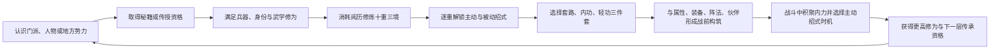

# 《烟雨江湖》武学系统完整拆解与《大曜江湖》设计参考

> 文档用途：专门拆解《烟雨江湖》的武学分类、单本结构、修炼、战斗资源、师承、搭配、传功和后期精进，作为《大曜江湖》武学内容设计的参考，不作为数值照搬或剧情仿写依据。
>
> 核对日期：2026-07-29。
>
> 资料口径：产品定位优先采用官方商店与官网信息；具体规则采用近期维护的 BWIKI、灰机 Wiki 与玩家实测交叉核对。社区资料用于确认运行规则，不代表官方设计意图，精确数值可能随版本调整。
>
> 相关文档：[《烟雨江湖》完整系统拆解](YANYU_JIANGHU_DESIGN_REFERENCE.md)、[SYS-02 武学系统完整设计](systems/02_CHARACTER_MARTIAL.md)、[SYS-03 战斗、伤势与死亡](systems/03_COMBAT_INJURY_DEATH.md)。

## 1. 结论先行

《烟雨江湖》的武学设计不是一棵供玩家逐点解锁的职业技能树，而是一个由传承来源、角色资质、长期修炼和战前三件套共同组成的成长网络：



这套系统最成功的五点是：

1. **武学有正交职责。** 套路回答怎样出手，内功回答怎样运气和承伤，轻功回答怎样行动和闪避。
2. **武学有社会来路。** 门派、师父、势力、支线和副本决定玩家从谁手里学到什么。
3. **招式不是一次性全部交付。** 一本武学在修炼过程中逐步显露完整打法。
4. **战斗深度主要发生在战前。** 玩家先决定谁学唯一秘籍、如何分配属性、站在哪里、携带哪三门武学，战中再决定少量主动招式的释放时机。
5. **轻功真正跨越战斗与探索。** 它既提供速度、闪避，又改变赶路与地形通行。

它的主要问题也来自同一套结构：

- 基础、一般、进阶武学大多会被上乘和镇派纵向替换；
- 阅历、十重三境、突破等待、修为、资质、传功、经脉、天赋与精进长期叠层；
- 后期武学描述、状态和联动越来越复杂，玩家很难从战斗反馈反推败因；
- 很多最优策略需要查询攻略，而不是从游戏界面自然学会；
- 获取、修炼和改配的时间成本会抑制试验。

对《大曜江湖》的核心结论是：

> **借它“来源有故事、分类有职责、成长分阶段、搭配先于操作”的结构，不借十重刷取、隐藏公式、传功损耗和数百本纵向替换。**

---

## 2. 可核对的系统骨架

| 项目 | 《烟雨江湖》的现行结构 | 设计意义 |
| --- | --- | --- |
| 武学顶层分类 | 套路、内功、轻功 | 一个角色同时获得攻击方式、运气底座与行动方式 |
| 套路子类 | 拳脚、剑术、刀术、枪棍 | 连接兵器、修为与角色定位 |
| 品阶 | 基础、一般、进阶、上乘、镇派 | 建立长期替换和获取阶梯 |
| 单本进度 | 通常十重，每重又有三层境界；残本可能例外 | 把一本秘籍扩展为长期投入对象 |
| 招式解锁 | 主动与被动招式随指定重数开放 | 修炼过程中逐步显露完整机制 |
| 战斗携带 | 每名角色激发一套路、一内功、一轻功 | 三项选择共同决定一个角色的打法 |
| 武学修为 | 拳脚、剑术、刀术、枪棍、内功、轻功六类 | 既是属性成长，又是高阶武学学习门槛 |
| 武学资质 | 每名角色在六类武学上有固定差异 | 同一本武学在不同角色身上收益不同 |
| 战斗资源 | 真元、聚气、内力点与调息 | 控制主动招式何时可用 |
| 来源 | 武馆、门派师父、江湖支线、势力商店、副本、伙伴与活动 | 武学同时承担世界探索奖励 |
| 后期扩展 | 武学精进、内劲、罡气等 | 让满重镇派继续成长，也增加理解成本 |

截至社区武学总表的近期维护版本，游戏已经收录数百项武学。这里的“数量”只证明其长期内容规模，本文不把具体总数当作稳定规则，也不建议本项目追求相同体量。

---

## 3. 原作术语与本项目术语的关系

| 《烟雨江湖》术语 | 原作含义 | 《大曜江湖》处理 |
| --- | --- | --- |
| 套路 | 当前兵器或拳脚的攻击、招架、主动与连携招式 | 归入“招式”，允许同时携带三项主动选择 |
| 内功 | 气血、聚气、恢复、防御和运气规则 | 统一称“心法” |
| 轻功 | 战斗速度、闪避、移动距离和地图通行 | 保留“轻功” |
| 锻体 | 原作没有独立顶层槽，相关效果散在内功、秘技与门派内容中 | 本项目保留为独立大类，承担身体、伤势和武境 |
| 武学品阶 | 基础至镇派的传承强度 | 本项目固定为粗浅、寻常、上乘、绝学、镇派 |
| 武学重数 | 单本武学一至十重的掌握阶段 | 本项目使用造诣档位和关键节点，不做十重 |
| 境界 | 每重内部的三段阅历进度 | 本项目不再为每一造诣拆三条小进度 |
| 武学修为 | 六类武学的累计练度、学习门槛与属性乘数 | 本项目不建立第二条隐藏属性乘区 |
| 武学资质 | 角色对六类武学修为加成的固定效率 | 本项目用五维、人物特性和明确条件表达 |
| 阅历 | 升级武学的通用资源 | 保留“阅历” |
| 真元 | 入场时的局内资源基础；也会在战斗中累积 | 本项目统一显示为“真气” |
| 内力点 | 真元按固定比例折算后的主动招式消耗单位 | 本项目直接消耗真气，不再二次换算 |
| 聚气 | 随普通攻击／调息推进的资源回复速度 | 本项目作为心法或境界提供的真气回复规则 |
| 调息 | 主动招式冷却的计算单位，主要由普通攻击推进 | 本项目用回合、行动或明确场景条件表示 |
| 传功 | 将一本武学从一名角色有损转移给另一名角色 | 单主角首版不采用 |
| 精进 | 满重镇派在后期继续分配稀缺点数的专精层 | 本项目优先用造诣节点和剧情领悟吸收 |

这张表的价值不是翻译名词，而是防止在本项目重新长出一套平行概念。例如“心法、内功、根基”不能同时作为三种系统，“真元、内力点、真气”也不能同时成为三条玩家资源。

---

## 4. 一本武学的完整数据结构

《烟雨江湖》的一本武学通常由六层信息共同组成。

### 4.1 身份层

```text
名称
+ 品阶
+ 所属门派／势力／江湖来源
+ 拳脚／剑术／刀术／枪棍／内功／轻功分类
+ 阴、阳、混元等内功性质
```

这层首先说明“它是谁家的本事”，而不是先说明伤害倍率。门派武学、势力武学与江湖散修武学会因此拥有不同的社会意义。

### 4.2 学习门槛层

常见门槛包括：

- 对应武学修为；
- 门派身份和师父层级；
- 拳、剑或刀等分支选择；
- 前置武学是否学完；
- 门派贡献、银两、声望或人物好感；
- 支线、首领或副本是否完成；
- 是否取得完整口诀而非残页；
- 个别人物、性别、伙伴或事件条件。

这些门槛使“学会一门武学”本身成为一段江湖经历，也让错过、判门和路线选择具有长期后果。

### 4.3 基础面板层

| 类型 | 常见基础面板 |
| --- | --- |
| 套路 | 攻击、招架、兵器要求 |
| 内功 | 气血、聚气、内功性质 |
| 轻功 | 速度、闪避、移动距离与赶路效率 |

这些面板会继续受到角色属性、武学修为、武学资质、装备和其他系统影响，因此武学页面写出的基础值并不是最终战斗值。

### 4.4 招式节点层

每个节点通常包含：

- 招式名称；
- 主动或被动；
- 解锁重数；
- 内力消耗；
- 调息时间；
- 基础效果；
- 受臂力、身法、根骨、内息或门派技艺影响的部分；
- 触发概率；
- 状态、标记、层数或持续时间；
- 与其他武学、人物或装备的联动。

高阶武学真正的复杂度通常不在基础攻击，而在后五项。

### 4.5 修炼状态层

```text
已取得口诀范围
+ 当前重数
+ 当前重的境界进度
+ 已解锁招式
+ 已提供的对应修为
+ 是否允许传功
+ 是否进入后期精进
```

“得到秘籍”“学会一重”“练满十重”和“完成精进”是四种完全不同的状态。

### 4.6 战斗状态机层

后期武学常常还隐藏着一套小型状态机：

```text
使用主动招式
→ 添加自身层数或敌方印记
→ 普攻、招架、闪避、受击或伙伴出手触发被动
→ 满足层数后变招、追击、反击、治疗或清除状态
→ 进入下一轮循环
```

这让一本镇派武学接近一套微型职业，但也会让四名角色、十二本武学同时运转时的信息量迅速失控。

---

## 5. 三大分类为什么成立

### 5.1 套路：决定“怎样出手”

套路提供当前角色的攻击方式、招架底座和主要主动招式。它按拳脚、剑术、刀术和枪棍区分，并通常要求装备对应武器。

套路的常见机制族不是严格按兵器划分，而是跨兵器复用：

| 机制族 | 玩家在构筑时回答的问题 |
| --- | --- |
| 单段爆发 | 我能否在一个窗口打穿高价值目标 |
| 连击／追击 | 怎样把一次出手扩展为多次伤害 |
| 协战 | 伙伴出手时我是否跟进 |
| 反击／招架 | 被攻击后能否把防御变成输出 |
| 标记／叠层 | 需要先积累什么，才能触发完整招式 |
| 控制／削弱 | 能否眩晕、破防、降攻、减速或限制聚气 |
| 群体／行列 | 能否越过前排、攻击一列或波及多人 |
| 变招 | 普通攻击或主动招式在条件满足后换成另一形态 |
| 斩杀／残血 | 对低血目标或自身低血时是否改变收益 |

因此，兵器类型首先决定装备和修为线，真正的战斗身份仍由具体招式决定。把“剑必定灵巧、刀必定爆发、拳必定控制”写成硬规则，会比原作更僵化。

#### 套路的典型节点顺序

```text
第一重：交付核心主动招式
→ 中段：补命中、连击、追击、招架或状态
→ 后段：让前述节点产生组合
→ 十重：完成变招、终结或完整循环
```

这种顺序的优点是玩家学会一重便能使用，继续投入又不断发现新作用；缺点是前几重常常只得到一个残缺打法。

### 5.2 内功：决定“怎样运气和活下来”

内功不是一条纯粹的血量被动。它既提供气血和聚气，也可以包含主动治疗、护盾、净化、资源恢复、复活、反噬和套路联动。

| 内功机制族 | 常见作用 |
| --- | --- |
| 基础养身 | 气血、回复、攻击或防御 |
| 稳定承伤 | 减伤、护盾、招架后收益、受击叠层 |
| 资源循环 | 初始真元、聚气、主动招式回转 |
| 主动支援 | 治疗、祛毒、强化伙伴、清除状态 |
| 残血反转 | 低血增益、濒死保护、复活或死亡回响 |
| 内劲附着 | 让套路命中、招架或闪避时产生额外效果 |
| 套路配套 | 与指定拳、剑、刀或门派传承形成完整套装 |

例如，《元引归心诀》不仅提供气血和回复，还能主动为伙伴疗伤并让施术者进入虚弱；这类设计把“治疗”从免费按钮变成了一项有代价的局内决定。

原作内功仍有一个明显问题：大量早期内功只是“气血＋回复＋攻击／防御”的不同排列，高阶内功才逐渐获得足够鲜明的规则。

### 5.3 轻功：决定“怎样移动和避开”

轻功同时服务两个世界。

#### 战斗内

- 速度；
- 闪避；
- 招架或命中修正；
- 追击、连击和反击概率；
- 队伍状态、人数或阵位联动；
- 少量主动脱身或增益。

#### 战斗外

- 赶路速度；
- 跳跃距离；
- 跨水、登高、越墙；
- 到达隐藏格点或支线入口；
- 减少地形阻挡。

《轻纵术》这样的早期轻功直接让跳跃距离发生变化；近期镇派轻功则可能同时提供多组可切换倾向、队伍人数判断和战斗联动。

轻功是原作最值得借鉴的武学类别，因为玩家能在地图上直接看见“我现在到得了以前到不了的地方”。它证明成长反馈不必只写在伤害数字里。

### 5.4 秘技、经脉、阵法与天赋

这些并非三件套的一部分，但会改变武学表现：

| 外围系统 | 对武学的影响 |
| --- | --- |
| 秘技 | 增加特定兵器、属性、触发或门派规则 |
| 经脉 | 增加基础属性、真气和长期成长 |
| 阵法 | 改变前后排、聚气、命中、防御和协作 |
| 角色天赋 | 决定伙伴更适合哪类武学与站位 |
| 装备 | 提供武器类型、攻击、防御和额外触发 |
| 合道／精进 | 在后期继续强化镇派节点 |

这些系统共同创造了深度，也使“为什么这套武学在别人攻略里很强、在我这里却不强”变得难以回答。

---

## 6. 品阶：长期目标与纵向替换

| 品阶 | 主要作用 | 常见获得阶段 | 设计问题 |
| --- | --- | --- | --- |
| 基础 | 教会拳、剑、刀、枪棍等基本结构 | 初始武馆 | 很快淘汰 |
| 一般 | 建立门派或兵器的初始手感 | 初入江湖、低阶师父 | 多数只是过渡 |
| 进阶 | 第一次出现较完整的招式组合 | 中前期门派、武馆、势力 | 开始形成流派，但寿命有限 |
| 上乘 | 可以承担一段长流程的角色定位 | 支线、势力、门派高阶 | 获取条件明显增多 |
| 镇派 | 多状态、多联动的后期核心传承 | 门派顶层、长支线、副本 | 描述和搭配复杂度最高 |

品阶系统带来三个正面价值：

1. 玩家很早就能看见更高层传承，产生长期追求；
2. 门派师父和贡献阶梯具有清楚的成长方向；
3. 武学来源能够自然匹配剧情难度。

但它也造成明显的“传送带”：

```text
基础满重
→ 被一般替换
→ 被进阶替换
→ 被上乘替换
→ 被镇派替换
```

低阶武学练满后留下的主要价值常常只是修为、前置和过渡体验，而不是长期战术选择。少数低阶武学因为特殊联动、地图功能或低消耗仍有位置，但不是普遍情况。

这说明“品阶”如果同时决定基础数值、节点数量和机制完整度，就很容易把横向选择重新压成纵向升级。

---

## 7. 十重三境：一本秘籍怎样成为长期项目

### 7.1 修炼结构

多数完整武学拥有十重，每重内部再通过阅历推进三层境界；当前重境界练满后，还需要等待突破到下一重。残本武学可能不满足完整十重。

```text
取得武学
→ 第一重初始状态
→ 消耗阅历推进本重三层
→ 当前重练满
→ 等待突破
→ 进入下一重
→ 解锁指定招式并增加对应武学修为
→ 重复至十重
```

### 7.2 它解决的问题

- 让一本秘籍不是点击后立即毕业；
- 给阅历提供长期稳定出口；
- 允许招式逐步教学；
- 让“练功”在时间上具有过程；
- 让高阶武学的获得与真正掌握分离。

### 7.3 它制造的问题

- 同一本武学被拆成三十个小进度；
- 大部分进度只增加数值，没有新行动；
- 突破等待不能创造新的决策；
- 玩家刚取得期待已久的武学时，常常还无法使用完整机制；
- 四人队伍同时换装时，阅历需求急剧增加；
- 长线版本会不断加入减负、加速和离线修炼功能。

### 7.4 设计判断

十重三境适合需要长期留存和日常资源回收的产品，不适合本项目当前的叙事纵切。它表达了“练功需要时间”，但没有保证每次等待都产生武侠故事。

《大曜江湖》应把练功时间改造成事件：

```text
研习
→ 在近期场景真实使用
→ 遇到失败或特殊条件
→ 获得领悟
→ 解锁新节点
```

同样是“逐步掌握”，后者能让成长与剧情互相证明。

---

## 8. 武学修为与资质：越练越会，但败因更难读

### 8.1 六类修为

原作将武学修为分为：

- 拳脚；
- 剑术；
- 刀术；
- 枪棍；
- 轻功；
- 内功。

学习并提升一门武学会增加对应修为。高阶武学通常要求一定修为，修为本身还会加强当前激发武学提供的基础属性。

它形成了一条自我强化链：

```text
学习低阶武学
→ 获得对应修为
→ 当前同类武学属性更高
→ 达到高阶武学学习门槛
→ 学习高阶武学
→ 继续增加修为
```

### 8.2 武学资质

每名角色在六类武学上还有固定资质，它影响修为转化为属性的效率。角色资质中的臂力、身法、根骨、内息又属于另一套概念，两者容易混淆：

```text
武学资质：我练这一类武学时，累计修为的收益怎样
角色属性：这门武学的具体招式受什么能力影响
```

### 8.3 正面价值

- 伙伴拥有天然兵器倾向；
- 长期练剑的人确实比临时改剑的人更擅长；
- 学过的旧武学仍以修为形式留下痕迹；
- 高阶传承需要前置积累，符合武侠师承直觉。

### 8.4 负面价值

- 当前输出同时受到武学面板、重数、属性、修为、资质、装备和其他层影响；
- 玩家很难预测“换这本武学究竟强多少”；
- 改练其他兵器的沉没成本很高；
- 为堆修为而学习大量不会真正使用的武学；
- 伙伴看似自由，实际容易被固定资质锁进少数最优路线。

本项目不应建立隐藏的“武学资质×武学修为”乘区。角色为什么擅长一门武学，应该在属性、特性、师承和界面条件里直接看见。

---

## 9. 真元、聚气、内力点与调息

这是理解原作战中操作的关键。

### 9.1 资源关系

```text
面板真元
→ 决定开战时拥有多少局内资源

战斗中普通攻击／调息推进
→ 按聚气数值获得局内真元

局内真元按固定比例折算为内力点
→ 支付主动招式消耗
```

近期社区名词页将二十五点真元对应为一个内力点。具体上限和各招消耗可能随版本变化，但资源结构稳定：**真元是细粒度数值，内力点是玩家点击招式时看到的离散支付单位。**

### 9.2 调息

调息既是主动招式冷却，也是聚气推进的时间单位。社区战斗解析指出，普通攻击会推进调息，主动招式、暗器或援助通常不等同于一次普通攻击。

这使战斗节奏不是传统的“每回合所有按钮一起减一”：

```text
普通攻击
→ 获得真元
→ 推进主动招式调息
→ 条件满足后释放主动招式
→ 主动招式本身不一定推进下一轮调息
```

### 9.3 它带来的决策

- 是否为了特定敌人保留内力；
- 是否等待标记、层数、残血或伙伴状态；
- 开场真元能否抢先释放关键技能；
- 聚气与主动招式调息是否匹配；
- 主动治疗、控制和爆发谁先支付资源；
- 自动战斗时技能释放顺序是否符合预期。

### 9.4 它为什么仍会“哪里亮了点哪里”

当一门武学只有一个主要主动技、敌人没有明确反制窗口、保留资源也没有其他用途时，最佳策略通常就是技能可用后立即释放。原作的深度更多来自：

- 战前是否选对武学；
- 初始真元和聚气是否够；
- 被动触发是否与伙伴、阵法和敌人匹配；
- 是否在少数首领机制里控制释放时机。

因此它不是高频动作选择型战斗，而是**低操作、重配置、重数值和重触发网络**的战斗。

---

## 10. 战斗中的主动与被动

### 10.1 主动招式

主动招式通常要求：

- 已解锁对应重数；
- 拥有足够内力点；
- 调息结束；
- 当前角色存活且未被控制；
- 部分情况下满足目标、状态或配套武学条件。

主动招式不只来自套路。部分内功可以主动治疗或强化伙伴，部分轻功也能提供主动效果。

### 10.2 被动招式

常见触发时点包括：

| 触发 | 可能结果 |
| --- | --- |
| 普通攻击后 | 连击、追击、附加状态、资源回复 |
| 伙伴出手后 | 协战或追加攻击 |
| 被攻击时 | 招架、反击、护盾、叠层 |
| 闪避后 | 反击、增益、下一击破闪 |
| 招架后 | 反震、下一击破招架 |
| 回合开始／结束 | 回复、毒伤、层数变化 |
| 气血低于阈值 | 增伤、减伤、复活或濒死保护 |
| 敌方拥有印记 | 变招、控制、额外伤害 |
| 己方人数变化 | 团队命中、闪避或速度变化 |

这些被动让玩家只点少数按钮也能看到丰富战斗过程。代价是很多关键结果发生在自动判定中，玩家可能只看见连续飘字而不知道是哪一层触发。

### 10.3 属性影响

招式会分别读取臂力、身法、根骨、内息，以及佛学、道学等门派知识。它的优点是“加点”能够跟武学机制连接；问题是多个招式可能读取不同属性，玩家必须逐条展开说明才能知道一套武学的主属性。

本项目应直接在招式选项显示：

```text
伤害：力道
命中：身法
催动：真气
附加效果：需要雨夜／临水／目标受伤
```

不能只写“受属性影响”。

---

## 11. 三件套搭配：一个角色是一组武学关系

每名角色同时激发：

```text
一门套路
+ 一门内功
+ 一门轻功
= 当前战斗身份
```

三者不是简单相加，而是围绕同一问题互相补足。

### 11.1 常见构筑逻辑

| 角色职责 | 套路倾向 | 内功倾向 | 轻功倾向 |
| --- | --- | --- | --- |
| 前排承伤 | 反击、招架、控制 | 气血、回复、减伤、护盾 | 闪避、免伤、受击收益 |
| 后排输出 | 爆发、连击、追击 | 攻击、真元、低血增伤 | 速度、命中、连击 |
| 控制／削弱 | 标记、眩晕、破防 | 聚气、状态延长或自保 | 先手、命中、调息辅助 |
| 支援 | 协战、群体或低消耗套路 | 治疗、净化、队友强化 | 团队速度、命中、闪避 |

这只是玩家形成的常见倾向，不是系统强制职业。某些武学会主动打破表格，例如高输出内功、团队轻功或带主动治疗的内功。

### 11.2 套装联动

原作既有宽松联动，也有指定配套：

- 某内功提高所有拳脚威力；
- 某轻功提高连击、追击或反击；
- 某套路需要指定内功才能变招；
- 某一门内功与同名套路组合后降低调息或提高触发；
- 某门派三件套共同建立完整状态循环。

指定联动可以强化传承特色，却容易把选择题变成配套题。若一门镇派套路只有搭配唯一内功才完整，所谓自由搭配就只存在于界面上。

### 11.3 对本项目的约束

每门武学最多拥有一项“强配套”和若干“软联动”：

- **强配套**：改变招式规则，但不应让未配套版本残缺到不可用；
- **软联动**：临水、受伤、使用某类兵器、守护同伴等通用条件。

这样既能表现师承体系，又不会把玩家推回标准答案。

---

## 12. 四人队伍、阵法与唯一秘籍

武学设计必须放在四人队伍中理解。

### 12.1 战前核心决策

玩家需要同时决定：

1. 唯一的高阶秘籍交给谁；
2. 该角色的固定武学资质是否合适；
3. 是否已有对应兵器、属性和修为；
4. 在阵法中站前排、后排还是特殊阵眼；
5. 三件套如何互相补足；
6. 其他三名伙伴能否提供协战、保护或状态；
7. 更换后旧角色如何处理原武学。

因此一门秘籍既是技能，也是稀缺的队伍资源。

### 12.2 正面价值

- 伙伴不只是换头像；
- 同一本武学交给不同人会产生不同队伍结构；
- 阵位、人物和武学相互证明；
- 获得唯一镇派时具有真正分配压力。

### 12.3 负面价值

- 玩家容易因早期信息不足而“养错人”；
- 高沉没成本鼓励查攻略；
- 伙伴固定资质会缩小可行搭配；
- 四个人每人三门武学，后期再叠加精进与秘技，理解成本很高；
- 失误的分配需要传功或重新练功解决。

《大曜江湖》第一版没有其他玩家，也不计划建立四人常驻编队，因此不需要复制唯一秘籍分配压力。人物关系可以改变传授资格，但已学武学应由主角自由携带，不用通过有损转移制造决策。

---

## 13. 武学获取：最有武侠味的部分

### 13.1 主要来源

| 来源 | 体验 | 设计作用 |
| --- | --- | --- |
| 武馆购买 | 花银两取得通用武学 | 提供低风险补课与基础路线 |
| 门派师父 | 拜师、出师、贡献与分支 | 把成长、身份和制度绑在一起 |
| 江湖支线 | 调查、人物选择、长线回访 | 让武学成为故事结果 |
| 地方势力 | 声望、商店、任务链 | 让地域内容产生长期回报 |
| 首领／副本 | 击败强敌、收集残页 | 让战斗门槛产出新打法 |
| 伙伴专属 | 人物加入或个人事件 | 用武学证明人物身份 |
| 奇遇／隐藏 | 时辰、地点、物品与前置 | 制造传闻感，也容易迫使查攻略 |
| 活动／付费 | 版本内容或商业入口 | 扩充供给，但会干扰单机平衡 |

### 13.2 门派传承阶梯

太乙、泠月、少林、天刀等门派通常将套路、内功和轻功按师父层级与品阶排列：

```text
入门师父：一般三件套
→ 出师与分支选择
→ 中阶师父：进阶三件套
→ 修为、技艺与任务门槛
→ 高阶师父：上乘三件套
→ 镇派任务与顶层师父
→ 镇派套路、内功、轻功
```

不同门派还会加入独有规则：

- 剑、拳、掌或轻重刀路线选择；
- 内功层数限制套路与轻功学习；
- 出师必须满足道学、佛法或指定武学；
- 判门后失去部分获取和制作权限；
- 返回门派需要等待或付出额外贡献；
- 镇派需要单独任务而非只花贡献。

这种结构的价值是：

> 玩家不是在技能树上点到镇派，而是先成为能被某位师父承认的人。

### 13.3 获取系统的问题

- 每日贡献把师承变成长期签到；
- 隐藏坐标、时辰和前置顺序会让探索退化为查攻略；
- 唯一秘籍与不可逆分支在信息不足时容易惩罚玩家；
- 活动武学和付费角色会改变原有稀缺性；
- 版本越长，新武学越需要更复杂的机制才能显得有价值。

本项目应保留“人传功”的过程，但明确展示条件板：

```text
白栀云愿意继续传授
已满足：替她守住病人
未满足：春风化雨针在实战中成功救治一次
代价：替她承担一桩旧事
```

---

## 14. 传功：改配工具也是试错惩罚

### 14.1 基础规则

社区规则将传功描述为“剪切而非复制”：

- 武学从传功者转移给受功者；
- 已投入阅历按传功效率折算；
- 效率主要受受功者对应修为影响；
- 不完整的阅历进度可能在换算时损失；
- 部分武学不可传功；
- 完整十重和足够修为存在保底规则；
- 特殊付费或门派入口可能降低损耗或疲劳。

### 14.2 它解决的问题

- 唯一秘籍可以重新分配；
- 新伙伴能快速接入旧队伍；
- 早期培养并非完全不可逆；
- 对应修为因此拥有额外价值。

### 14.3 它制造的问题

- 玩家在试验新组合前要先计算损耗；
- 转移不是纯粹的战术改配，而是资源决策；
- 复杂公式进一步鼓励查表；
- 付费无损入口容易让便利性与商业化绑定；
- “我想试试这门武学”变成高成本行为。

对本项目而言，已经学会的武学应留在所学目录；“携带、替换、卸下”不造成修为损失。真正不可逆的代价应放在师承、人物关系和剧情选择上，而不是菜单改配。

---

## 15. 后期精进：给镇派第二条生命

### 15.1 结构

后期境界突破后，满重镇派可以继续通过精进点强化。近期武学页通常列出两到三条精进方向，例如：

- 气血、速度、命中、连击或减伤；
- 强化指定主动招式；
- 提高某种印记、变招或状态的稳定性；
- 让内功获得独特内劲；
- 在残血、死亡、招架或闪避时产生额外效果。

精进点来自等级突破、后期副本、势力内容和特殊物品。精进后的武学还可能影响传功条件。

### 15.2 正面价值

- 让旧镇派不必被新镇派立即替换；
- 玩家可以在同一本武学里选择偏输出、防御或机制；
- 后期内容继续奖励既有构筑；
- 旧武学能够通过精进适应新首领机制。

### 15.3 负面价值

- 又增加一层角色永久成长；
- 部分方向只是数值乘区；
- 精进点稀缺时错误选择代价高；
- 新旧武学的精进质量不一定一致；
- 复杂机制、内劲、罡气与合道继续叠加；
- 为了让老内容保持强度，需要持续维护大量旧武学。

本项目现有“入门、熟练、精通、圆满”已经能够承担专精。若以后需要分支，应通过一次人物事件让玩家在两个用法间作选择，不再追加通用精进货币。

---

## 16. 八个代表性案例

这些案例用于观察设计演化，不建议复制具体名称或数值。

### 16.1 早期内功：简单属性底座

《一气功》以气血、攻击和回合恢复组成。它清楚、易懂，适合教学；问题是没有改变玩家动作，很快会被更高阶内功替代。

**启示：** 新手武学可以简单，但至少应在近期局面中提供一个能被感知的规则，例如“第一次受伤时稳住架势”，而不只是面板加成。

### 16.2 配套内功：两本武学组成闭环

《五行功》在基础防御、回复和真元之外，与指定拳法共同激发时还会降低调息或稳定额外伤害。

**启示：** 指定联动能让传承有整体感，但联动应当增强玩法，而不是把两本书拆成互相补完的半成品。

### 16.3 连击套路：主动招式带出后续链

《星云剑诀》以主动起手、连击概率、命中和破招架／破闪避等方向建立连续进攻。

**启示：** “连击”不是多播几段动画，而是一套围绕稳定性、命中与终止条件的资源链。

### 16.4 叠层套路：先建立掌势，再兑现终结

《般若禅掌》会在施展少林武学时积累掌劲，并通过协战、主动式和后续效果利用这些层数。

**启示：** 叠层必须回答三个问题：怎样获得、何时消费、不消费会发生什么。只显示“层数＋1”不构成策略。

### 16.5 支援内功：治疗伴随自我代价

《元引归心诀》允许主动为伙伴疗伤和祛除部分毒性，但会令施术者虚弱。

**启示：** 非伤害动作只要有清楚代价，就能成为真正的战斗选择。本项目的救治、护人和解毒不应全部变成战后菜单。

### 16.6 初级轻功：直接改变地图权限

《轻纵术》在速度和闪避之外增加跳跃距离。

**启示：** 一条简单而可见的地图权限，比“移动速度＋若干百分比”更能建立轻功成长感。

### 16.7 后期轻功：模式切换与队伍判断

《金雁步》的近期设计包含多组可切换倾向，并根据人数、闪避、招架、连击或追击等条件改变收益。

**启示：** 轻功完全可以成为构筑核心；同时也说明长线内容为了保持新鲜，会把一个原本易懂的类别扩展成多层规则表。

### 16.8 后期内功：濒死、复活与战斗阶段

《天蚕神功》《青蛾功》等后期内功会围绕濒死、死亡回响、反伤或复活建立角色身份。

**启示：** 强力内功最好改变玩家如何面对危险，而不是只把气血条变长。但复活、免死和死亡触发必须有强烈反馈，否则会破坏战斗因果。

---

## 17. 武学信息界面应回答什么

原作高阶武学已经包含大量状态与影响属性，因此一个可读界面至少需要五层信息。

### 第一层：我为什么要看它

```text
名称、分类、品阶
一句话定位
当前是否学会／激发
兵器和学习条件
```

### 第二层：它现在能做什么

```text
当前主动招式
最终伤害、治疗、范围或控制
内力消耗与调息
当前已生效被动
```

### 第三层：它怎样成长

```text
当前重数与境界
下一招何时解锁
需要多少阅历与时间
满重后得到什么
```

### 第四层：它依赖什么

```text
臂力／身法／根骨／内息
武学修为与资质
指定内功／轻功／兵器
状态、阵位与伙伴条件
```

### 第五层：它从哪里来

```text
师父、门派、人物或事件
是否唯一
是否可传功
失去门派后会不会失效
```

原作的社区 Wiki 之所以成为配装必需品，正是因为游戏内很难在一个页面同时清楚回答这些问题。

《大曜江湖》的武学页应优先显示玩家当前会感知的结果，详细公式通过点击展开，不在主视图重复“熟练、修为、解锁”等同一信息。

---

## 18. 最成功的设计

### 18.1 武学有来路

一门武学会让玩家记住师父、支线、地方势力或首领。获取过程本身就是江湖叙事。

### 18.2 三类职责足够清楚

套路、内功、轻功比“所有能力都是技能卡”更符合武侠直觉，也让玩家先理解大方向。

### 18.3 一次配置能产生大量自动反馈

玩家不需要管理几十个按钮，被动、追击、反击和协战仍能表现人物的完整武艺。

### 18.4 轻功兑现到地图

武学不只服务战斗，能力会打开新路线和隐藏地点。

### 18.5 门派是制度化技能树

师父、贡献、出师、分支和判门把成长过程放进社会关系，而不是悬空菜单。

### 18.6 伙伴差异可以被武学证明

资质、天赋、站位和三件套共同塑造角色，不只依赖等级。

### 18.7 高阶武学有自己的战斗语法

优秀镇派不只是倍率更高，而是拥有叠层、变招、反击、复活或协同等标志性规则。

---

## 19. 最主要的问题

### 19.1 复杂度通过叠层增长

```text
品阶
× 十重三境
× 修为
× 武学资质
× 角色属性
× 经脉
× 天赋
× 秘技
× 装备
× 阵法
× 精进
```

每一层单独都合理，合在一起却让败因难以解释。

### 19.2 早期武学寿命短

低阶武学大多是通向镇派的材料，玩家很难与一门初学武学建立长期感情。

### 19.3 战中选择密度不足

大量深度在战前完成。普通战斗中，主动招式亮起后往往缺少保留理由。

### 19.4 自动触发削弱因果感

追击、反击、协战、内劲和状态同时触发时，表现热闹，但玩家未必知道胜负来自哪一项决定。

### 19.5 试错成本过高

唯一秘籍、固定资质、阅历投入、突破等待与传功损耗，使玩家倾向先看攻略再选择。

### 19.6 门派日常把师承变成劳动

贡献循环支撑长期运营，却会削弱“师父因认可而传授”的人物体验。

### 19.7 新武学需要越来越复杂

当已有数百本武学后，新内容若仍采用简单属性组合便没有吸引力，只能加入更多状态、变招和例外规则。

### 19.8 后期说明难以自洽

社区页面会记录描述与实测不符、概率异常或效果 Bug，说明规则复杂度已经反过来增加实现和沟通成本。

---

## 20. 对《大曜江湖》的采用、改造与舍弃

| 原作设计 | 判断 | 本项目处理 |
| --- | --- | --- |
| 套路、内功、轻功正交分工 | 采用 | 使用招式、心法、轻功，并保留独立锻体 |
| 一本武学逐步解锁招式 | 采用 | 通过造诣节点和剧情领悟解锁 |
| 武学来自师父、人物和事件 | 强采用 | 每门武学必须写明传承人物与获得后果 |
| 轻功同时改变地图 | 强采用 | 新轻功必须至少改变一条追逐、脱身或路线 |
| 主动与被动共同构成武学 | 采用 | 每门完整武学至少有一个主动规则或条件被动 |
| 属性影响招式效果 | 改造 | 在界面直接写明影响属性和最终结果 |
| 指定三件套联动 | 有限采用 | 每门最多一个强配套，未配套仍可独立使用 |
| 一角色一套路一内功一轻功 | 改造 | 一心法、三招式、一轻功、一锻体 |
| 四人阵型与唯一秘籍分配 | 暂不采用 | 第一版维持单主角，不建设常驻编队 |
| 基础至镇派纵向替换 | 改造 | 低品阶可因环境和规则长期保值 |
| 十重三境 | 舍弃 | 使用五档造诣与少量关键节点 |
| 突破等待 | 舍弃 | 突破由使用、见闻与人物事件完成 |
| 六类累计修为 | 舍弃 | 不增加隐藏乘区和堆书行为 |
| 固定武学资质 | 舍弃 | 使用五维、特性、师承和明确门槛 |
| 真元再折算内力点 | 舍弃 | 玩家只管理真气 |
| 传功有损 | 舍弃 | 已学武学永久保留，携带可自由调整 |
| 武学精进通用点 | 暂不采用 | 先用造诣节点和一次性领悟分支 |
| 门派贡献日常 | 舍弃 | 师承进展来自具体事件与责任 |
| 数百本武学 | 舍弃 | 每一类先做少数真正改变行动的传承 |

---

## 21. 对当前武学系统的直接修正规则

《大曜江湖》现有 SYS-02 已经完成分类、品阶、造诣、阅历、六个携带位和战斗接入。参考《烟雨江湖》后，不需要重做框架，但后续内容必须加强以下部分。

### 21.1 每门武学先写“玩家问题”

示例：

| 武学 | 玩家问题 |
| --- | --- |
| 鱼跃龙门诀 | 我怎样在临水与高差中改变距离 |
| 春风化雨针 | 我怎样在伤人、救人和点穴之间选择 |
| 五禽戏 | 我怎样用身体准备承担下一次伤势 |
| 打鱼杆法 | 我怎样用生计动作控制中距而非追求高伤 |

如果一门新武学只能回答“伤害比旧武学高多少”，它不值得单独制作。

### 21.2 获得后两个场景内兑现

```text
人物传授
→ 武学页看懂变化
→ 携带
→ 两个场景内出现主动使用机会
→ 结果写入叙事流与状态
```

不能先发秘籍，再等待十章后才出现适用场景。

### 21.3 造诣节点必须改变规则

| 造诣 | 应产生的变化 |
| --- | --- |
| 未入门 | 只拥有见闻或残卷 |
| 入门 | 获得核心行动 |
| 熟练 | 降低代价或提高稳定性 |
| 精通 | 打开第二种用途或环境联动 |
| 圆满 | 改变原行动的因果、目标或后果 |

不为“伤害＋2%、伤害＋3%”单独制作节点。

### 21.4 心法与真气

原作的聚气与调息证明资源节奏能够塑造打法，但本项目不需要同时暴露真元和内力点：

```text
真气上限
+ 当前真气
+ 每回合／条件回复
+ 招式消耗
+ 催动后的额外结果
```

玩家在一个界面内必须能算清“我什么时候能再用”。

### 21.5 战中必须存在保留理由

主动招式如果亮起后总应立刻使用，就只是一段冷却动画。至少加入一种明确理由：

- 等待敌人蓄力；
- 等待进入近距／中距；
- 等待同伴或目标受伤；
- 保留真气用于防御反应；
- 等待雨夜、临水、高处或遮蔽物；
- 提前使用会暴露、受伤或错过追击。

### 21.6 低品阶长期保值

低品阶武学可以用以下方式保值：

- 低真气消耗；
- 特定环境优势；
- 非致命解决；
- 生计与调查用途；
- 更低兵器要求；
- 与人物关系或身份行动联动；
- 在伤势下仍可稳定使用。

品阶决定上限，不决定所有局面的答案。

---

## 22. 新武学设计模板

```markdown
# 武学名称

## 传承身份
- 分类：
- 子类／兵器：
- 品阶：
- 传授者：
- 获得事件：
- 玩家为此承担的代价：

## 核心问题
玩家为什么要携带它，而不是同类另一门武学？

## 核心行动
- 名称：
- 类型：主动／被动
- 距离：
- 目标：
- 消耗：
- 基础结果：
- 影响属性：
- 失败结果：
- 催动变化：

## 造诣节点
| 造诣 | 解锁 | 可见变化 |
| --- | --- | --- |
| 入门 |  |  |
| 熟练 |  |  |
| 精通 |  |  |
| 圆满 |  |  |

## 条件与反制
- 兵器条件：
- 环境条件：
- 状态条件：
- 敌人如何反制：
- 玩家如何看懂反制：

## 跨场景用途
- 战斗：
- 调查：
- 旅行：
- 关系／制度：

## 搭配
- 一个强配套：
- 两个软联动：
- 不配套时是否仍完整：

## 近期兑现
- 获得后第一处用途：
- 获得后第二处用途：
- 叙事流如何反馈：
```

---

## 23. 武学评审清单

后续若声称某门武学参考了《烟雨江湖》，必须回答：

1. 玩家从哪个具体人物、事件或势力取得它？
2. 它属于心法、招式、轻功还是锻体，为什么？
3. 它的核心行动与同类现有武学有何不同？
4. 入门时是否立即获得一个可用动作？
5. 熟练、精通和圆满分别改变了什么规则？
6. 哪个属性影响哪个结果，界面能否直接看见？
7. 玩家为什么可能不在亮起时立即使用？
8. 它在战斗之外至少有什么用途？
9. 它是否只有一个指定配套才能使用？
10. 低品阶版本在后期是否还有一个清楚优势？
11. 敌人如何反制，玩家如何从反馈中学会？
12. 获得后两个场景内在哪里兑现？
13. 是否新增了不必要的修为、资质或资源层？
14. 玩家能否免费调整携带并进行试验？
15. 这门武学怎样改变人物关系或玩家身份？

只要其中三项无法回答，就不应进入内容生产。

---

## 24. 一句话设计原则

《烟雨江湖》最有价值的武学经验可以压缩成四句话：

> **武学要从人和地方手里来。**
>
> **套路、内功与轻功要回答不同问题。**
>
> **一本武学要逐步显露新的用法，而不是只增加数字。**
>
> **真正的自由来自可理解、可试验的搭配，不来自秘籍总数。**

《大曜江湖》应进一步补上原作较弱的一点：

> **玩家必须在战斗和叙事反馈中看懂，刚才究竟是哪门本事改变了结果。**

---

## 25. 资料来源

### 25.1 官方与发行渠道

1. [TapTap《烟雨江湖》官方页面](https://www.taptap.cn/app/169054)：官方账号、版本动态与社区入口。
2. [Google Play《烟雨江湖》页面](https://play.google.com/store/apps/details?hl=zh_TW&id=com.wuxia.novastar)：产品定位、地图探索、武学、门派、伙伴、阵型和长期更新。
3. [App Store《烟雨江湖》页面](https://apps.apple.com/us/app/%E7%85%99%E9%9B%A8%E6%B1%9F%E6%B9%96/id1559873812?l=zh-Hans-CN)：单人武侠 RPG 定位与系统概览。
4. [繁中版官方网站](https://www.novastargame.net/yanyu/)：世界、门派与官方宣传资料入口。

### 25.2 武学总规则

5. [BWIKI：武学篇](https://wiki.biligame.com/yanyu/%E6%B8%B8%E6%88%8F%E6%94%BB%E7%95%A5/%E3%80%90%E7%83%9F%E9%9B%A8%E6%B1%9F%E6%B9%96%E3%80%91%E6%AD%A6%E5%AD%A6%E7%AF%87)：三大分类、四类套路、五档品阶、十重三境、阅历、突破、修为与招式解锁。
6. [BWIKI：武学总表](https://wiki.biligame.com/yanyu/%E6%AD%A6%E5%AD%A6)：近期武学目录、分类与各单本入口。
7. [BWIKI：游戏内名词详解](https://wiki.biligame.com/yanyu/%E6%B8%B8%E6%88%8F%E5%86%85%E5%90%8D%E8%AF%8D%E8%AF%A6%E8%A7%A3)：武学资质、武学修为、聚气、真元、内力点、招架、闪避、内劲和罡气。
8. [BWIKI：战斗解析](https://wiki.biligame.com/yanyu/%E6%B8%B8%E6%88%8F%E6%94%BB%E7%95%A5/%E6%88%98%E6%96%97%E8%A7%A3%E6%9E%90)：调息、聚气、真元和主动招式资源结构；页面较旧，本文只采用与近期名词页一致的稳定结构。
9. [BWIKI：修为详解](https://wiki.biligame.com/yanyu/%E6%B8%B8%E6%88%8F%E6%94%BB%E7%95%A5/%E4%BF%AE%E4%B8%BA%E8%AF%A6%E8%A7%A3)：修为对套路、内功和轻功基础属性的影响。
10. [灰机 Wiki：武学升级经验](https://yanyu.huijiwiki.com/wiki/%E6%AD%A6%E5%AD%A6%E5%8D%87%E7%BA%A7%E7%BB%8F%E9%AA%8C)：各重境界、突破时间和修为获得结构。
11. [BWIKI：传功机制讲解](https://wiki.biligame.com/yanyu/%E6%B8%B8%E6%88%8F%E6%94%BB%E7%95%A5/%E4%BC%A0%E5%8A%9F%E6%9C%BA%E5%88%B6%E8%AE%B2%E8%A7%A3)：有损转移、效率、修为要求和保底规则。
12. [BWIKI：百级攻略](https://wiki.biligame.com/yanyu/%E6%B8%B8%E6%88%8F%E6%94%BB%E7%95%A5/%E7%99%BE%E7%BA%A7%E6%94%BB%E7%95%A5)：后期精进点与精进武学约束。

### 25.3 门派与代表武学

13. [BWIKI：太乙教](https://wiki.biligame.com/yanyu/%E5%A4%AA%E4%B9%99%E6%95%99)：师父层级、拳剑分支、出师、贡献和镇派传承。
14. [BWIKI：泠月宫](https://wiki.biligame.com/yanyu/%E6%B3%A0%E6%9C%88%E5%AE%AB)：剑掌分支、内功前置与师承结构。
15. [BWIKI：少林寺](https://wiki.biligame.com/yanyu/%E5%B0%91%E6%9E%97%E5%AF%BA)：堂口、功德、上乘和镇派任务。
16. [BWIKI：一气功](https://wiki.biligame.com/yanyu/%E6%AD%A6%E5%AD%A6/%E4%B8%80%E6%B0%94%E5%8A%9F)：早期内功的简单属性节点。
17. [BWIKI：五行功](https://wiki.biligame.com/yanyu/%E6%AD%A6%E5%AD%A6/%E4%BA%94%E8%A1%8C%E5%8A%9F)：内功与指定套路联动。
18. [BWIKI：星云剑诀](https://wiki.biligame.com/yanyu/%E6%AD%A6%E5%AD%A6/%E6%98%9F%E4%BA%91%E5%89%91%E8%AF%80)：主动起手、连击与精进方向。
19. [BWIKI：般若禅掌](https://wiki.biligame.com/yanyu/%E6%AD%A6%E5%AD%A6/%E8%88%AC%E8%8B%A5%E7%A6%85%E6%8E%8C)：协战、叠层与终结结构。
20. [BWIKI：元引归心诀](https://wiki.biligame.com/yanyu/%E6%AD%A6%E5%AD%A6/%E5%85%83%E5%BC%95%E5%BD%92%E5%BF%83%E8%AF%80)：主动治疗、祛毒与施术者虚弱。
21. [BWIKI：轻纵术](https://wiki.biligame.com/yanyu/%E6%AD%A6%E5%AD%A6/%E8%BD%BB%E7%BA%B5%E6%9C%AF)：早期轻功、赶路与跳跃距离。
22. [BWIKI：金雁步](https://wiki.biligame.com/yanyu/%E6%AD%A6%E5%AD%A6/%E9%87%91%E9%9B%81%E6%AD%A5)：后期轻功的模式切换、队伍判断与战斗联动。
23. [BWIKI：天一神功](https://wiki.biligame.com/yanyu/%E6%AD%A6%E5%AD%A6/%E5%A4%A9%E4%B8%80%E7%A5%9E%E5%8A%9F)：承伤、护盾与精进分支。
24. [BWIKI：青蛾功](https://wiki.biligame.com/yanyu/%E6%AD%A6%E5%AD%A6/%E9%9D%92%E8%9B%BE%E5%8A%9F)：死亡回响、反伤与内劲。
25. [BWIKI：天蚕神功](https://wiki.biligame.com/yanyu/%E6%AD%A6%E5%AD%A6/%E5%A4%A9%E8%9A%95%E7%A5%9E%E5%8A%9F)：濒死、复活和阶段状态。

社区页面中的评价、推荐配装和实测争议没有作为官方结论；本文只用它们确认可观察规则和分析实际决策。所有专有武学名称仅用于设计研究，《大曜江湖》的传承、人物、招式和文本必须保持原创。
