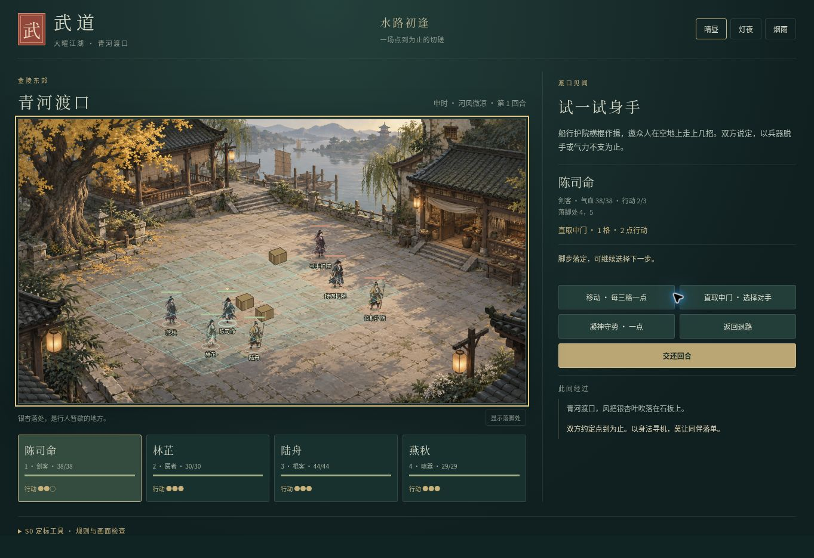

# 武道 · 武侠沙盒 S0 交付

已交付一个可运行的2D定标工作台、原创美术样板、纯战斗规则、数据校验和11项定稿文件。S0的10项交付检查通过；A07目标Windows硬件与真实制作效率实测未完成，整体阶段门未放行。这里是研发工作台，正式web入口保持旧版本。

```bash
npm run serve:s0
# 浏览器打开 http://127.0.0.1:4310/
npm run test:s0
npm run validate:s0
npm run verify:quick
```

工作台：4名队员对3名护院；选择队员、走位、剑／棍／暗器／治疗、守势、敌方回合、胜负与撤退、独立记录；日夜雨与方格／节点、Canvas／WebGL适配器对照。WebGL不可用时保留Canvas路线。底部展开定标工具可看验收演练与CPU采样。角色、场地和技能是S0夹具，不计作完整首发内容。

| 入口 | 内容 |
| --- | --- |
| [产品与世界规则](S0_PRODUCT_RULES.md) | A01—A03 |
| [战斗定标](S0_COMBAT.md) | A04 |
| [视觉契约](S0_VISUAL.md) | A05 |
| [内容与世界交通](S0_CONTENT_WORLD.md) | A06、B01 |
| [技术与迁移](S0_TECHNICAL.md) | A07、T01 |
| [制作与变更](S0_PRODUCTION.md) | A08 |
| [验收记录](S0_ACCEPTANCE.md) | V01与阶段状态 |
| [192项验收矩阵](S0_ACCEPTANCE_MATRIX.md) | 逐包判据、责任与依赖 |
| [研究依据](S0_RESEARCH.md) | 第一方参考、采用和不采用项 |

机器清单：data/sandbox/work-packages.json（192工作包），scope-baseline.json（数量口径），launch-maps.json（36地图设计名册），s0-status.json（阶段门），catalog.json（44实体）；美术源及来源登记位于art_source/sandbox-s0/。



已知边界：无完整多解任务、门派、治安、全方向角色动画、音频或桌面发行包；这些属于S1及以后。旧存档键不变，练武记录使用wudao.s0.workbench.v1。当前交付未部署为线上新版。
