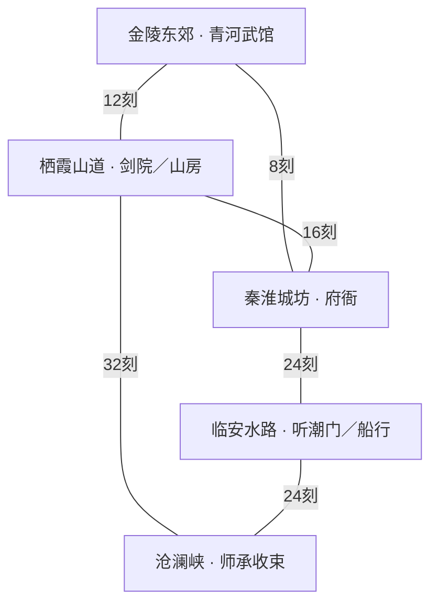

# S0 内容规模与世界交通

范围 A06、B01。首发清单固定数量口径，名称是原创规划占位；不覆盖旧版剧情事实，也不表示已完成内容。唯一数据基线见 data/sandbox/scope-baseline.json；地图清单见 launch-maps.json。

地图按独立空间计数，昼夜／事件变体不另计；任务包包含正常、替代、失败与回流，分支不另计；队友包含在40名命名NPC中；敌兵外观实例不等于新的敌人原型。动画按母版×方向×动作核算，不按插值帧计数。

| 范围 | S0实作 | S1切片 | S2区域 | 首发上限 |
| --- | --- | --- | --- | --- |
| 地图 | 1张定标场地 | 6 | 12 | 36 |
| 命名NPC／队友 | 4队员＋3护院规则夹具 | 10／2 | 20／4 | 40／8 |
| 门派 | 仅定义与战斗样板 | 1 | 2 | 4可加入＋2其他势力 |
| 任务包 | 1份数据定义，未可玩 | 8 | 28 | 88 |
| 武学 | 3伤害＋1治疗样板 | 12 | 30 | 60 |
| 时长 | 单场切磋，不作时长承诺 | 主路径60–90分钟目标 | 由切片实测重估 | 初玩20–30小时目标 |

首发36地图=6街区＋8室内＋8野外＋6势力据点＋8险地；60武学=30招式＋12心法＋8轻功＋10锻体；88任务包=16世界＋24门派＋24地方＋24同伴。另有60背景实例、12常规敌人原型、6首领、12奇遇模板、30秘密、60装备、20消耗品、24材料、16配方。跨区域同一NPC、同一任务与同一物品使用同一个ID，禁止重复填数量。

| 区域 | 核心玩法 | 进入条件 | 回访理由 |
| --- | --- | --- | --- |
| 金陵东郊 | 水路生计与药材失窃 | 初始开放 | 查明药材去向后开放渡船与夜间引荐 |
| 栖霞山道 | 山门考核与护送 | 东郊道路开放；可绕行旧山路 | 入门、退门改变驻地服务和巡山态度 |
| 秦淮城坊 | 商路、官府与证据 | 渡船或陆路入城；被通缉需作保 | 地方案件改变货价修正和联系人 |
| 临安水路 | 漕运、暗渡与同伴旧债 | 掌握船路消息并取得渡江条件 | 势力选择改变渡口权限与救援 |
| 沧澜峡 | 遗迹、师承与世界线收束 | 取得两条地区线索；不要求加入特定门派 | 人物与门派结局在此留下回响 |

交通默认双向；费用在确认出发时结算，动画和落地不得重复扣时。图上为常规基准耗时，不等于所有状态都开放。

| 道路 | 风险 | 替代条件 |
| --- | --- | --- |
| route.east-ridge · 12刻 | 山道伏击 | 可付向导费或凭轻功走近路 |
| route.east-city · 8刻 | 渡口盘查 | 陆路增加四刻；作保可解通缉通行问题 |
| route.ridge-city · 16刻 | 负伤与补给 | 驿站休息分段抵达 |
| route.city-water · 24刻 | 水路追踪 | 护航、藏身货船或取得通行凭据 |
| route.ridge-gorge · 32刻 | 险路与师承冲突 | 用两地见闻取得向导帮助 |
| route.water-gorge · 24刻 | 封渡 | 调停、夜渡或返山路 |

势力差异：青河武馆重守信、近身与护送；栖霞剑院重规矩、剑法与山路；听潮门重人情、水路和暗器；百草山房重救治与采药。船行提供运输与消息，府衙提供治安与证据渠道；两者不提供玩家正式拜师。所有玩法承诺落实到F模块后才算可玩。

首发地图设计名册：

| ID | 名称 | 类型 | 区域 | 状态 |
| --- | --- | --- | --- | --- |
| map.qinghe-courtyard | 青河渡口 | street | region.jinling-east | s0-sample |
| map.qinghe-inn | 青河客栈 | interior | region.jinling-east | planned |
| map.qinghe-clinic | 渡口医馆 | interior | region.jinling-east | planned |
| map.east-road | 金陵东路 | wild | region.jinling-east | planned |
| map.qinghe-school | 青河武馆 | faction | region.jinling-east | planned |
| map.reed-hideout | 芦荡藏货处 | dungeon | region.jinling-east | planned |
| map.ridge-market | 栖霞山集 | street | region.qixia-ridge | planned |
| map.qinhuai-market | 秦淮市街 | street | region.qinhuai-city | planned |
| map.canal-port | 临安船埠 | street | region.lin-an-water | planned |
| map.gorge-settlement | 峡口聚落 | street | region.canglan-gorge | planned |
| map.south-gate | 金陵南门 | street | region.qinhuai-city | planned |
| map.ridge-inn | 山路驿舍 | interior | region.qixia-ridge | planned |
| map.city-teahouse | 秦淮茶楼 | interior | region.qinhuai-city | planned |
| map.city-records | 府衙案牍房 | interior | region.qinhuai-city | planned |
| map.canal-warehouse | 船行仓房 | interior | region.lin-an-water | planned |
| map.canal-tavern | 临水酒家 | interior | region.lin-an-water | planned |
| map.gorge-shrine | 峡口旧祠 | interior | region.canglan-gorge | planned |
| map.ridge-path | 栖霞正道 | wild | region.qixia-ridge | planned |
| map.ridge-shortcut | 旧山近路 | wild | region.qixia-ridge | planned |
| map.city-outskirts | 金陵城郊 | wild | region.qinhuai-city | planned |
| map.canal-bank | 临安堤岸 | wild | region.lin-an-water | planned |
| map.reed-water | 芦苇水道 | wild | region.lin-an-water | planned |
| map.gorge-road | 沧澜栈道 | wild | region.canglan-gorge | planned |
| map.gorge-forest | 峡中林地 | wild | region.canglan-gorge | planned |
| map.ridge-school | 栖霞剑院 | faction | region.qixia-ridge | planned |
| map.water-school | 听潮门庭 | faction | region.lin-an-water | planned |
| map.herb-school | 百草山房 | faction | region.qixia-ridge | planned |
| map.ferry-guild | 船行总堂 | faction | region.lin-an-water | planned |
| map.jinling-office | 金陵府衙 | faction | region.qinhuai-city | planned |
| map.ridge-camp | 山匪旧营 | dungeon | region.qixia-ridge | planned |
| map.ridge-cave | 石壁暗洞 | dungeon | region.qixia-ridge | planned |
| map.city-cellar | 城坊暗窖 | dungeon | region.qinhuai-city | planned |
| map.city-prison | 府牢内道 | dungeon | region.qinhuai-city | planned |
| map.canal-wreck | 沉舟浅滩 | dungeon | region.lin-an-water | planned |
| map.gorge-ruin | 沧澜旧址 | dungeon | region.canglan-gorge | planned |
| map.gorge-vault | 峡底石室 | dungeon | region.canglan-gorge | planned |

预算管理：场景背景、地形套件、交互、NPC、战斗配置和事件变体分开统计制作工时；共享素材只登记一次资源成本，各地图集成仍需工时。S1连续记录至少一张地图、一条多解任务、一个角色完整动作集的制作与返工耗时，再估算量产。当前没有真实团队产能数据，不给总价或完工日期。
